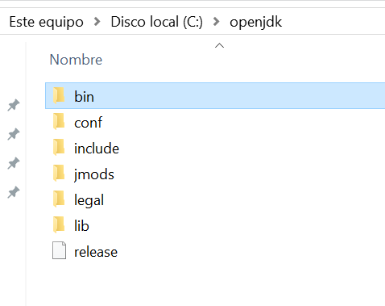
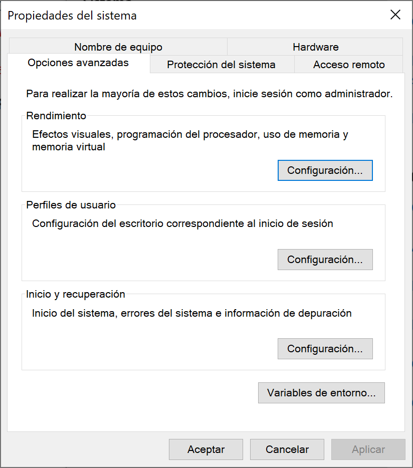
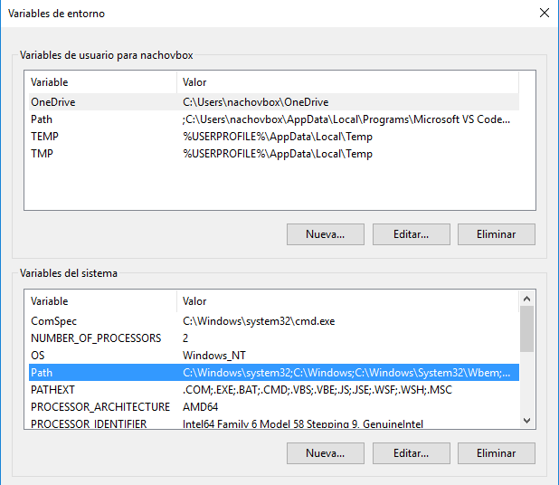
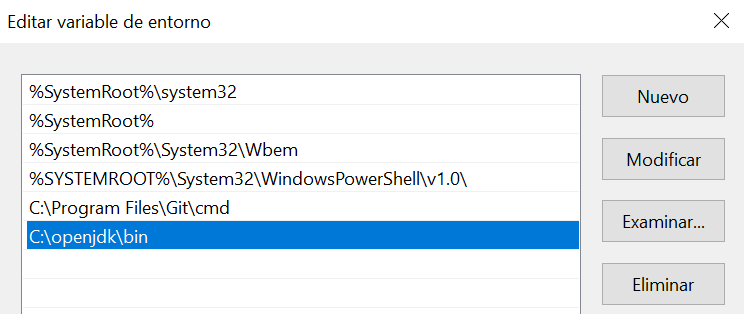
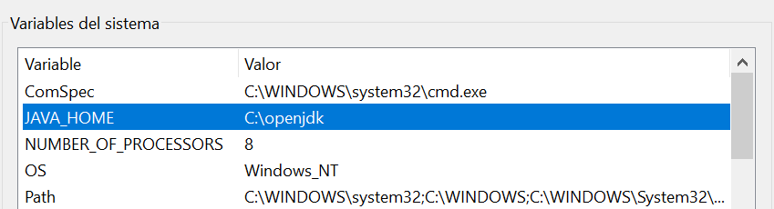

# Programs, languages and compilers

## First steps with Java

<div style="text-align: right">
<a target="_blank" href="slides/01b.html"></a>&nbsp;&nbsp;
<a target="_blank" href="01b.pdf"></a>
</div>

### 1. Java programming language

Java is an object oriented language, created at the beginning of the 90s by *Sun Microsystems*. It has its own virtual machine to run the programs, so Java applications are platform independent, and we can run them either on Linux, Windows, Mac and other systems. In fact, Java was conceived to program several types of electronic devices, including home appliances. But it got so popular that it quickly focused on computer applications.

With Java and some other languages of those years, we started saying goodbye to this "open door" to the low level world. Memory and system access is much more restricted, and the language provides other high level features, such as the *garbage collector*, which is in charge of cleaning the memory periodically, removing every element that is no longer used. This task was completely manual in previous languages (C o C++).

Java has a wide area of application nowadays: we can develop desktop applications with libraries like JavaFX, mobile applications (Android uses Java), web applications (with servlets and JSP pages, or even with more advanced frameworks, such as Spring), etc.

### 2. Installing Java

Java implementations have changed along time. At the beginning, it was Sun Microsystems the company in charge of implementing the earliest versions of the language... until version 6, where Oracle bought Sun Microsystems. Then, there was an official Oracle implementation branch, and an open implementation branch called *OpenJDK* that is an official reference implementation of Java Standard Edition since version 7. From that point, many other additional implementation branches have arised, such as *AdoptOpenJDK*, *Excelsior JET* and so on. Some of them are free, as *OpenJDK*, and some other are commercial, or have a commercial version for some specific purposes, as Oracle has done with the latest versions.

In order to narrow the range of available options, let's focus just on Oracle and OpenJDK implementations. The first one has some license restrictions for some given uses, whereas the second one is absolutely free to use. However, Oracle implementations offer LTS (*Long Term Support*) versions from time to time (version 8 was LTS, and so is version 11 and 17), whereas OpenJDK versions are no longer supported as soon as a new version comes into scene. 

In this module we are going to use **Java version 17**, and we are going to rely on **OpenJDK implementation**, since its installation is cleaner, and it lets us easily deal with multiple installed versions. However, we are going to start by showing how to install official Oracle version for every platform.

**Option 1: Installing Oracle JDK**

If you want to use Oracle's official JDK, then you need to follow these steps:

* Go to the Oracle <a href="https://www.oracle.com/technetwork/java/javase/downloads/index.html">JDK download website</a> (you may be asked to sign up before downloading the software). Download the package according to your operating system and install it.
* In case you are using **Linux**, you may be forced to download a *tar.gz* file from Oracle web site, and unzip it in your chosen folder.
* After following these steps, JDK commands may not work yet, specially under Windows and Linux, until we configure some environment variables, as we will see later.

**Option 2: Installing OpenJDK (*recommended*)**

If we choose OpenJDK implementation (as we are going to do in this module), then we need to download the appropriate *zip* or *tar.gz* package. We can do it from [this website](https://jdk.java.net/archive/). Then, unzip the file in your chosen folder. For instance, it can be `C:\openjdk` for Windows, or `/home/username/openjdk` for your Linux distribution. Anyway, there must be a `bin` subfolder (among others) into your main installation folder after unzipping (for instance, `C:\openjdk\bin` in Windows).

<div align="center">
	
</div>

> **NOTE**: regarding Mac OS X, there will be a `Contents/Home` folder inside JDK main installation folder. Inside this `Home` folder you will find the `bin` subfolder where all JDK commands are placed.

**Setting up the *path* environment variable**

In order for JDK commands to work, we need to add to the system *path* the folder where these commands are placed (typically, a `bin` subfolder inside the main installation folder). This way, the operating system will recognize the compilation commands whenever we type them from a terminal. Let's see how to do these steps in the most common operating systems:

Under **Windows**: 

1. We open Windows search and look for *Editar variables de entorno*. Then, we click on *Variables de entorno* button.

<div align="center">
	
</div>

<div align="center">
	
</div>

2. Then we choose `Path` variable from the lower list and click on Edit button. Next, we add the path to the Java compiler. If we unzipped OpenJDK under `C:\openjdk`, for instance, then we add `C:\openjdk\bin` path to the variable.

<div align="center">
	
</div>

Under **Mac OSX**:

Open a terminal an type these commands. They update `PATH` environment variable by adding a new path to the JDK bin folder. We assume that you unzipped JDK under `/openjdk`, but if not, replace this path with the appropriate one in the first instruction:

```
echo "export PATH=$PATH:/openjdk/Contents/Home/bin" >> ~/.bash_profile
source ~/.bash_profile
```

Under **Linux**: 

Open a terminal an type these commands. They update `PATH` environment variable by adding a new path to the JDK bin folder. We assume that you unzipped JDK under `/home/username/openjdk`, but if not, replace this path with the appropriate one in the first instruction:

```
echo "export PATH=$PATH:/home/username/openjdk/bin" >> ~/.bashrc
source ~/.bashrc
```

**Setting up the *JAVA_HOME* environment variable**

Besides, we may need to add a new environment variable called `JAVA_HOME` (or edit the existing one, if any), to point to the main installation folder of JDK.

* Under **Windows**, we just add a new environment variable from *Editar variables de entorno*, just like we did before with *Path* variable, and set its value to the JDK main installation folder (`C:\openjdk`, for instance).

<div align="center">
	
</div>

* Under **Mac OSX**, type these commands from a terminal (again, replace the JDK main folder with your actual folder):

```
echo "export JAVA_HOME=/openjdk/Contents/Home" >> ~/.bash_profile
source ~/.bash_profile
```

* Under **Linux**, type these commands from a terminal (again, replace the JDK main folder with your actual folder):

```
echo "export JAVA_HOME=/home/username/openjdk" >> ~/.bashrc
source ~/.bashrc
```

**Checking JDK commands**

In order to test that everything is correctly installed, open a terminal and type `javac -version`. You should see something like this in the terminal (the version may vary depending on your actual installation):

```
javac 17.0.2
```

> **Exercise 1**:
>
> Create a new text file called `Test.java` in your working folder, and write this piece of code on it:

```java
public class Test
{
    public static void main(String[] args)
    {
        System.out.println("Hello");
    }
}
```

> It's a program that writes "Hello" on the screen. Compile it from the terminal, by typing this instruction from the same folder in which the source file is placed:

```
javac Test.java
```

> Then, a new file called `Test.class` will have been created. This is the compiled file for the Java Virtual Machine. To run this program, type this command from the same folder than the *.class* file (you should see "Hello" in the screen):

```
java Test
```