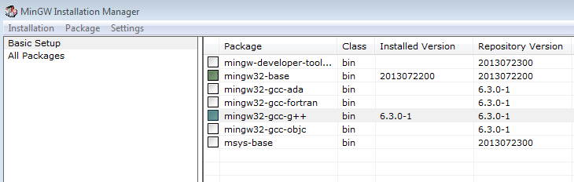
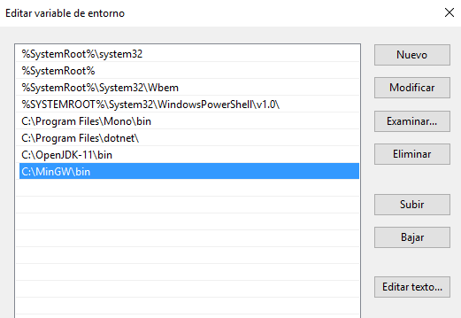

# Programs, languages and compilers

## First steps with C and C++

<div style="text-align: right">
<a target="_blank" href="slides/01c.html"></a>&nbsp;&nbsp;
<a target="_blank" href="01c.pdf"></a>
</div>

### 1. C programming language

If we have to define in a few words what C language is, maybe the most suitable definition would be *the language*, because most of current languages are based on it. In fact, C language is an evolution of an older language, called B, but it was not so popular.

Before C language arrived, programmers used some kind of physical devices to implement their programs, such as perforated cards, or in the best case, some assembly, low level language, hard to understand, write and maintain.

Therefore, we can figure out that the arrival of C language in the beginning of the 70s was a complete success. Despite being a language with high level structures, it also has some low level features, such as direct memory control through pointers.

Nowadays, C language is not very popular when building applications, but it is still used for developing operating systems, libraries and some tools such as compilers for other languages. It is very appreciated because of the efficiency of its code.

### 2. C++ programming language

Next evolution step after C language was C++, at the end of the 70s. It extended C language to let us work with classes and objects. So C++ is a hybrid language (it lets us use either traditional, structured programming and object oriented programming).

Currently, its main area of application is the video game world. We can develop either game engines, such as Unreal Engine, or video games with some libraries, such as Unreal, Cocos2D, SDL... As C++ is an extension of C language, it still lets us control some low level features (such as direct communication with graphical devices), and it has lots of available libraries to make the programmer's task much more comfortable.

### 3. Installing C and C++

C and C++ are compiled languages, so we need to install a compiler to work with them. Let's try with a compiler called *gcc*. In case of Linux distributions, this compiler is installed by default, and in Mac OSX systems you can also have it by installing XCode. Regarding Windows, you can get it by installing *MinGW* package, that can be downloaded from <a href="https://sourceforge.net/projects/mingw/">this website</a>. In the installer, you must choose the C/C++ compiler (*mingw32-gcc-g++*) and the base (*mingw32-base*). 

<div align="center">
	
</div>

Once MinGW has been installed, we need to add the `bin` installation subfolder to the `PATH` environment variable, as we did before with JDK. In this case, we need to add `C:\MinGW\bin` folder to this variable, right as we did before for Java compiler.

<div align="center">
	
</div>

After doing this, if we type `gcc` command in the terminal, we should see something like this:

```
gcc: fatal error: no input files
```

It is an error message that indicates that we haven't specified any input file to the compiler, but the message itself shows that the compiler has been succesfully located.

> **Exercise 1**:
>
> Create a source file called `test.c` in your working folder, and type this code for a program that prints "Hello" in the screen:

```c
#include <stdio.h>

int main()
{
    printf("Hello");
    return 0;
}
```

> Compile it using this instruction from the terminal:

```
gcc -o test test.c
```

> `-o` parameter sets the name of the executable (*test* in this case). After this, a new executable called *test* (or *test.exe* in Windows) will have been created in our working folder. We can run just by typing `test` from our working folder. We should also see the "Hello" message in the terminal.