# Integrated Development Environments

## Using Geany

<div style="text-align: right">
<a target="_blank" href="slides/02b.html"></a>&nbsp;&nbsp;
<a target="_blank" href="02b.pdf"></a>
</div>


Geany is an easy text editor with some basic features of an IDE. It can be downloaded for free from its [official website](https://www.geany.org), where we will find versions for Linux, Windows and Mac.

> **NOTE**: regarding **Linux** (Ubuntu) users, it is better to install Geany from *Synaptic* package manager, which can be run from *System tools* section. Then, you can look for "geany" and install the corresponding package.

### 1. Work environment

<div align="center">
    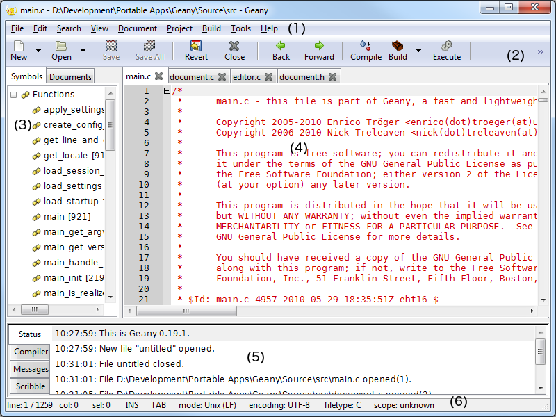
</div>

Geany's work environment has the following sections:
1. Menu.
2. Toolbar (optional)
3. Side bar with tabs:
    1. Documents → List of documents.
    2. Symbols → List of code symbols.
4. Edit window.
5. Message window, with the following tabs:
    1. Status → A list of status messages.
    2. Compiler → Compiler messages.
    3. Messages → General messages. 
    4. Scribble → To make annotations.
6. Status bar, where we can see, among other things, the row and column we are editing, the file type, encoding...

### 2. Main features

#### 2.1. Syntax highlighting

This is a very useful feature when we are typing code, since we can easily detect some basic typographic errors as we type the code. Besides, it helps us understand the whole code with a simple glance.

<div align="center">
    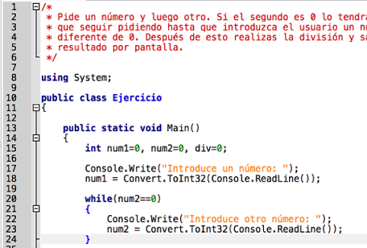
</div>

As we can see in previous image, reserved words are written in a different color (blue). If we type a reserved word and it is not written in blue, then we may have not written it properly, so we can check it immediately, without waiting for the compilation error.

#### 2.2. Code folding

Geany provides a basic code folding. This folding lets us show or hide some parts of the code, so that we can focus only in the parts that we are currently editing. This feature can be enabled or disabled from *Edit/Preferences* menu.

<div align="center">
    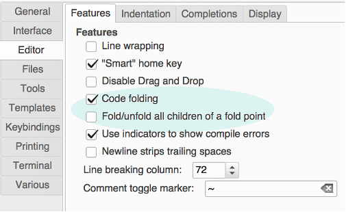
</div>

From this menu, we can also enable the possibility of folding and unfolding every nested foldings that are inside the code block that we are trying to fold/unfold. By default this option is disabled, so we have to fold/unfold every code block independently.

<div align="center">
    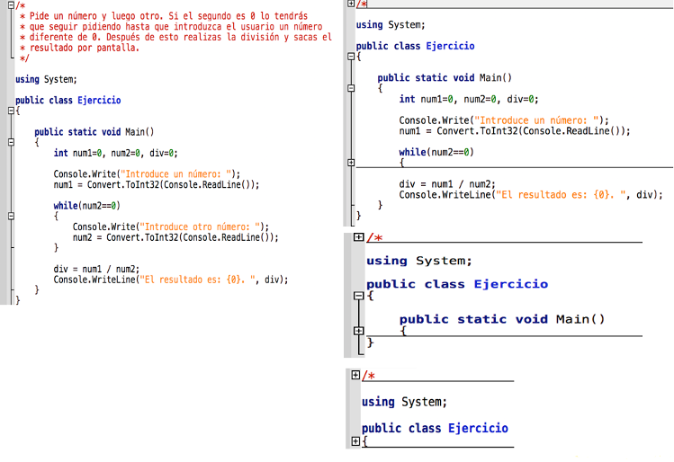
</div>

#### 2.3. Word and symbol auto completion

This option can be configured in *Edit/Preferences* menu, under *Editor* option, in *Completions* tab.

<div align="center">
    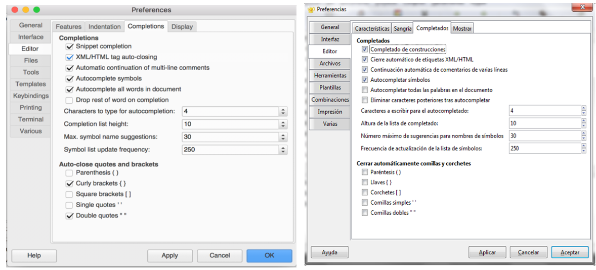
</div>

With this feature enabled, we will see a list of suitable options whenever we type the beginning of a reserved word, so we will be able to complete it just typing Enter. By default it is enabled to show the list when we type the first 4 letters of the reserved word. Besides, we can also configure the automatic completion of parentheses, curly braces, square brackets and so on. This is really useful if we usually forget to close these symbols.

#### 2.4. Some additional useful features

Apart from the main useful features shown before, we can also highlight the following features from Geany:

* **Auto closing XML/HTML tags**: in the *Edit/Preferences* menu, under *Editor* option, we can also activate the auto closing of XML/HTML tags when we type the corresponding opening tag.
* **Multi language support**: Geany lets us choose among many different programming languages, such as C, Java, PHP, HTML, Python, C# and others, with their own auto completion and syntax highlighting. We can select the language from *Document > Set file type* menu, choosing the appropriate programming language.
* **Geany startup**: when we run Geany, every open document from our previous session will be open again. This feature can be configured in *Edit/Preferences* menu, under *General* option, in *Startup* tab.

<div align="center">
    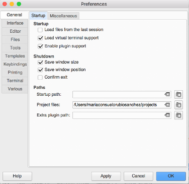
</div>

* **Clone documents**: in the *Document* menu there is a *Clone* option that lets us not only copy the text of current document, but also its properties, such as cursor position. It can be really helpful for creating many source files with a similar structure.

#### 2.5. Keybindings

There are many shortcuts or key bindings available in Geany, as we can also see in many other applications. In the following tables we can see some of the most common ones. These shortcuts can also be configured from *Edit-Preferences* menu, in the *Combinations* tab.

##### File shortcuts

Option|Shortcut|Action
|------|----|-----|
New|Ctrl-N|Creates a new file
Open|Ctrl-O|Opens a file
Save|Ctrl-S|Saves current file
Save All|Ctrl-Shift-S|Saves every open file
Close All|Ctrl-Shift-W|Closes every open file
Close|Ctrl-W|Closes current file
Exit|Ctrl-Q|Exits Geany

##### Edit shortcuts

Option|Shortcut|Action
|------|----|-----|
Undo|Ctrl-Z| Undoes last action
Redo|Ctrl-Y |Redoes last action
Delete current lines|Ctrl-K|Deletes currently selected line(s)
Delete until the end|Ctrl-Shift-Del|Deletes from current position until the end of the line
Delete from the beginning|Ctrl-Shift-BackSpace|Deletes from the beginning of the line until current cursor position
Duplicate line or selection|Ctrl-D|Duplicates current line or selection
Complete fragment|Tab|If we type some known structure such as *if* or *for* and press this key, it will complete the structure.

##### Clipboard shortcuts

Option|Shortcut|Action
|------|----|-----|
Cut|Ctrl-X|Cuts current selection and copies it into the clipboard
Copy|Ctrl-C|Copies current selection into the clipboard
Paste|Ctrl-V|Pastes clipboard's content into current cursor position.
Cut line|Ctrl-Shit-X|Cuts currently selected line(s) and copies it/them into the clipboard
Copy line|Ctrl-Shift-C|Copies currently selected line(s) into the clipboard

##### Selection shortcuts

Option|Shortcut|Action
|------|----|-----|
Select all|Ctrl-A|Selects all the text from current document
Select word|Ctrl-Shift-W|Selects the word in which cursor is currently placed
Select paragraph|Alt-Shift-P|Selects the paragraph in which cursor is currently placed
Select line|Alt-Shift-L|Selects the line in which cursor is currently placed

##### Format shortcuts

Option|Shortcut|Action
|------|----|-----|
Swap Uppercase-Lowercase|Ctrl-Alt-U|Swaps uppercase and lowercase letters in current selection. It there are both uppercase and lowercase letters in the selection, then it turns everythin into lowercase.
Comment-Uncomment line|Ctrl-E|Comments current line, or uncomments it if it is already commented.
Increase indentation|Ctrl-I|Adds a new indentation level to currently selected line(s)
Decrease indentation|Ctrl-U|Removes an indentation level from currently selected line(s)

##### Search shortcuts

Option|Shortcut|Action
|------|----|-----|
Find|Ctrl-F|Opens the *find* dialog
Find next| Ctrl-G|Go to next result
Find previous| Ctrl-Shift-G|Go to previous result
Replace|Ctrl-H|Opens the *replace* dialog
Find in files|Ctrl-Shift-F|Opens the *find in files* dialog
Find usage|Ctrl-Shift-E|Finds every occurrence of current word or selection in every open document.
Find usage in current document|Ctrl-Shift-D|Same as before, but it only checks current document.
Highlight all|Ctrl-Shift-M|Highlights every occurrence of current word or selection in current document.

Besides these shortcuts, you can check all the possible ones [here](https://www.geany.org/manual/current/index.html#keybindings)

### 3. Creating, compiling and testing our code

Once we have finished typing our source code, we can test it from Geany, by using the *Build* menu.

<div align="center">
    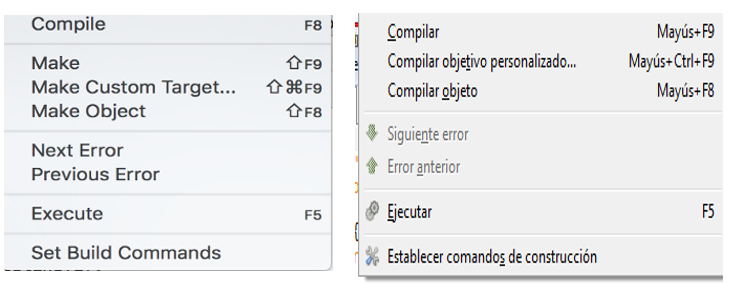
</div>

If we go to *Build/Set Build Commands* option, we can see the compiler that will be run when we try to compile the program. 

Whenever we create a new document with Geany, it is important to save it with an appropriate name and extension before typing any code in it. This way, Geany will fill the corresponding compilation and execution commands automatically with the appropriate tools. Besides, only after detecting the type of source code that we are typing, code highlighting and auto completion will be activated.

There are auto-detected compilers for C# and HTML (this last one is an interpreted language, so it has no compiler):

<div align="center">
    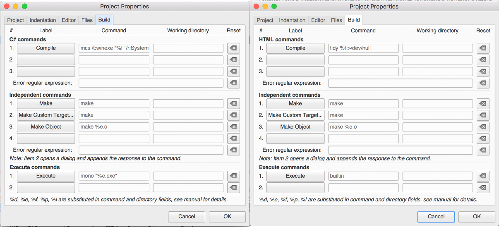
</div>

There are also auto-detected copilers for C and Java:

<div align="center">
    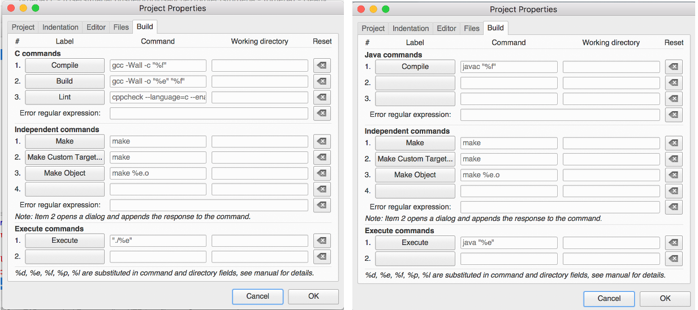
</div>

If we want to use Windows' C# compiler instead of *mono*, we must manually fill the corresponding fields as we can see in the following image. Previously, we must locate the folder in which this compiler called **csc** exists, and copy the full path in the *Compile* field.

<div align="center">
    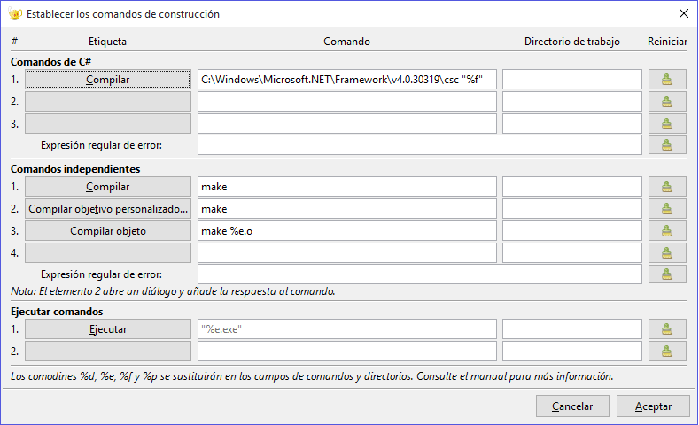
</div>

We can also configure the editor to underline with red color every compilation error. This option is available under *Edit/Preferences* menu, inside *Editor* option, in *Features* tab.

<div align="center">
    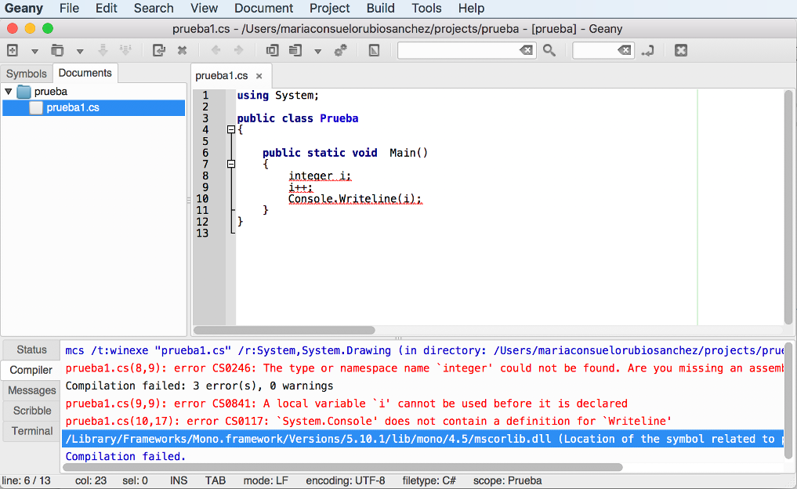
</div>

As we can see in the image above, we can check every compilation error in the compiler messages window at the bottom of the window.

<div align="center">
    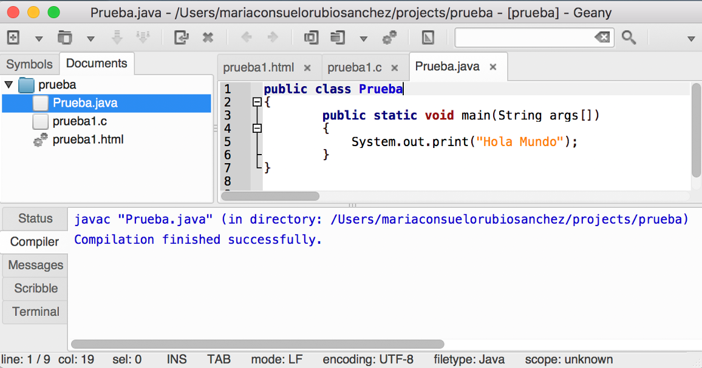
</div>

In previous image we can see how to use different source code types, and each one has its own assigned compiler, so we can compile each document with its associated compiler.

> **Exercise 1:**
>
> Open Geany and create a new source file called `Test.java` with the following source code:

```java
public class Test
{
    public static void main(String[] args)
    {
        System.out.println("Hello");
    }
}
```

> See how Geany highlights the code. Also, check or enable the word auto completion and try it by adding a new line with the code to write "World" (just copy the line that says "Hello" and replace it with "World"). 

> **Exercise 2:**
> 
> Compile the source file of previous exercise. If there has been no errors, run it.

> **Exercise 3:**
> 
> Create a file called `test.c` with Geany. Remember: after choosing *File-New*, then choose *File-Save As* and save it with .c extension, so that code will be highlighted as we type it. Then, write the following code. Check the code auto completion, compile the program (using the *Build* option in case of C or C++) and run it.

```c
#include <stdio.h>

int main()
{
    printf("Hello");
    return 0;
}
```

> **Exercise 4:** 
> 
> Try some of previous Geany keybindings with any of the source files created so far.