# Integrated Development Environments

## Using Visual Studio Code

<div style="text-align: right">
<a target="_blank" href="slides/02c.html"></a>&nbsp;&nbsp;
<a target="_blank" href="02c.pdf"></a>
</div>


Visual Studio Code is a lightweight (but powerful) code editor available for Windows, MacOSX and Linux. It has native support for Javascript, TypeScript and Node.js, and a wide variety of extensions that let us work with (almost) any other programming language, such as C, C#, Java, Python, PHP, Go, etc.

You can download it from its [official website](https://code.visualstudio.com), where you can also find some useful extensions for Java, C, C#...

<div align="center">
    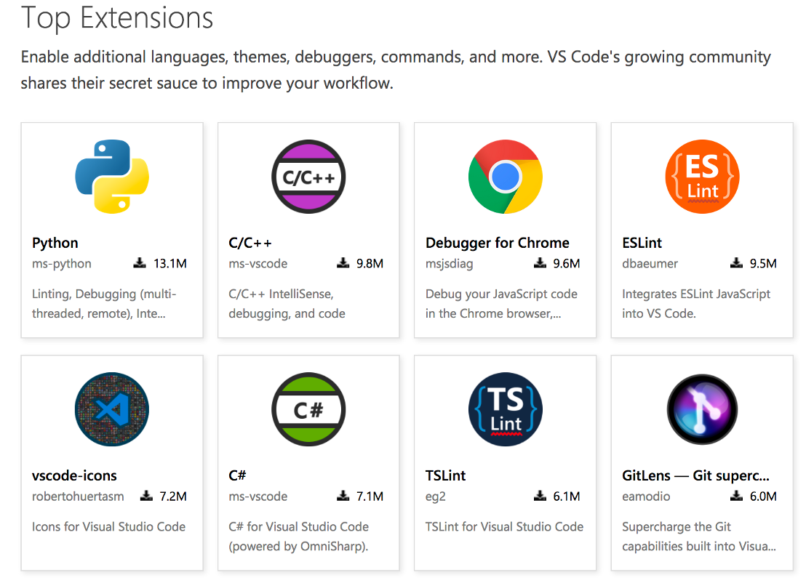
</div>

> **NOTE**: for **Linux** (Ubuntu) users, once you download the *.deb* package from the official web site, you need to open a terminal and go to the download folder. Then, type this command and you will have Visual Studio Code available in the *Programming* section:
>
> `sudo dpkg -i <visual_studio_file_name>`
>
> where `<visual_studio_file_name>` is the file name of the downloaded file.

### 1. Work environment

Once it is installed, you can see the welcome screen with some of the basic options

<div align="center">
    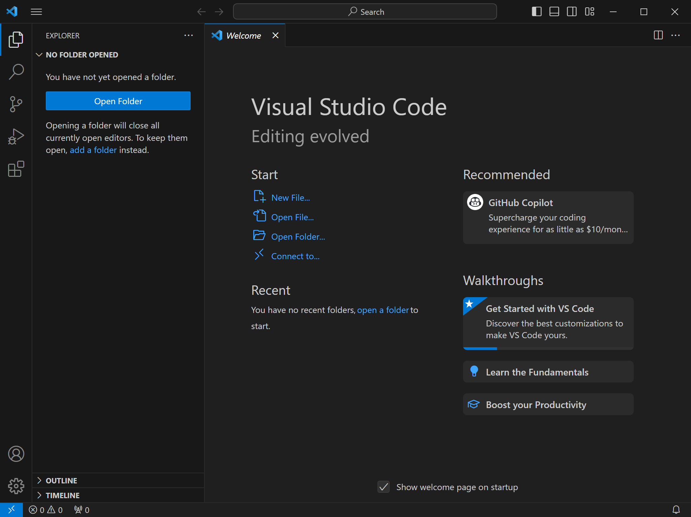
</div>

If we create a new file we will see the usual work environment, which is divided into 5 sections.

<div align="center">
    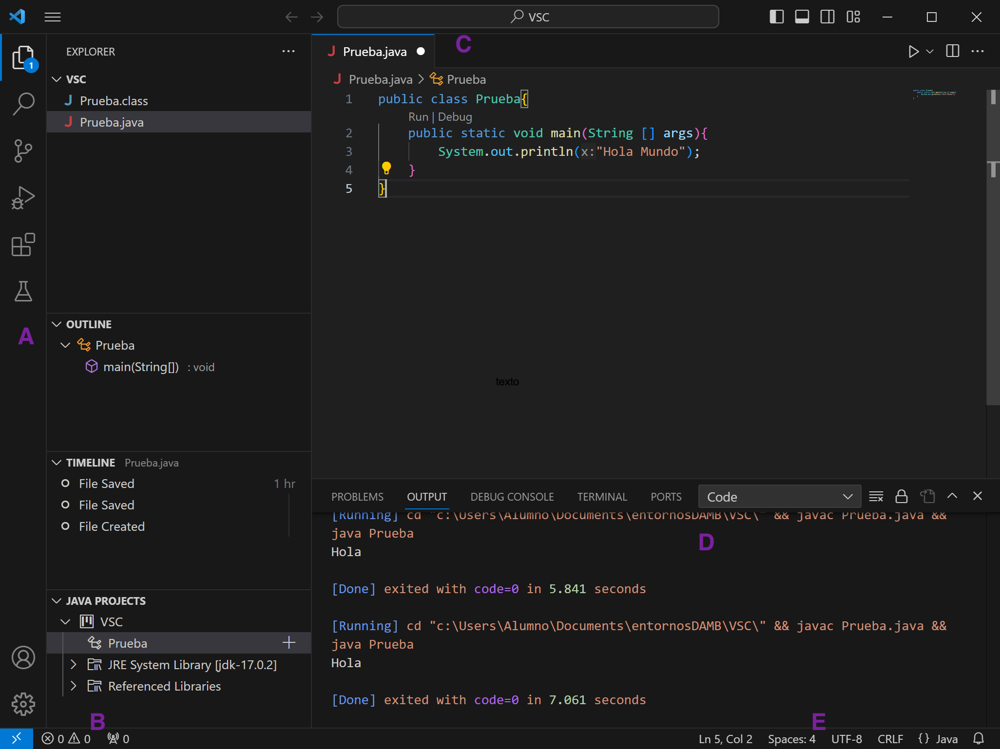
</div>

* **Editor** (C): Main edition area. You can open as many editors as you need.
* **Margin bar** (B): It contains some useful information about the file explorer, code errors or warnings, etc.
* **Status bar** (E): It shows information about current project, or currently open files.
* **Activities bar** (A): It has some options:
    * File explorer, to locate the files to be edited. This option shows/hides a left panel to browse current folder
    * Search tool, to look for some words or regular expressions in our source files.
    * Source code control (to communicate with version control tools, such as Git repositories)
    * Debugger
    * Extension manager, from which we can install new extensions to this IDE, and check/config the ones that are already installed.
*  **Panels** (D): Below the editor you can see some different panels, such as errors/warnings, or a terminal to type some commands from current folder. This panel can be moved to the right if we want to have more vertical space.

Every time we open Visual Studio Code, it shows the last snapshot before it was closed the last time, with the same open files and so on.

#### 1.1. Changing the color theme

If you want to change the default color theme for Visual Studio Code, you must go to *File/Preferences* menu (or *Code/Preferences* menu if you are running it under Mac OSX), and then choose the *Color Theme* option. Then, you can choose among a wide variety of options. The most popular ones are the Visual Studio's Dark or Light modes.

### 2. Installing extensions

One of the most outstanding features of Visual Studio Code is that we can improve its perfomance by installing additional extensions. Many of these extensions refer to a particular programming language, so we can enrich the IDE for a specific language(s).

If we want to start coding, we need to install the appropriate extension(s) for the language we are going to work with. To do this, we click on the extension icon in the activities bar (left bar), and we look for the desired language in the text field. For instance, if we want to work with Java programming language, we just type *Java* and then we will see a lot of extensions related with this language.

There is a useful extension called **Java Extension Pack**, from Microsoft, that contains the most common extensions to work with Java:

* Language Support for Java(TM) by Red Hat
* Debugger for Java
* Java Test Runner
* Maven for Java

<div align="center">
    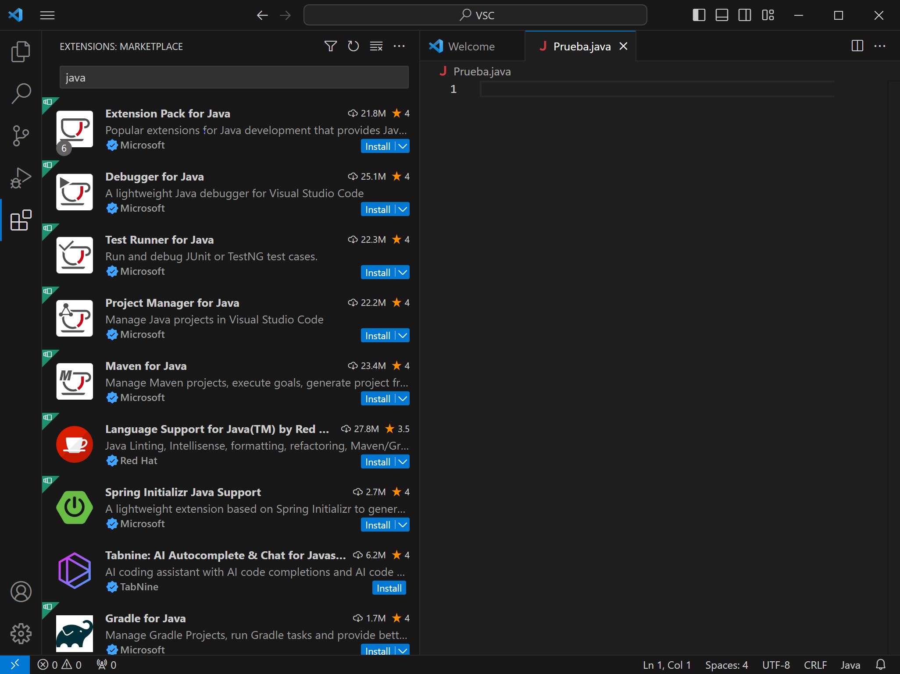
</div>

Besides, you may need the **Code Runner** extension, a general extension that lets us run programs written in many different programming languages, such as C, Python, Java and so on. You should also go to *File/Preferences/Settings* menu, go to the *Extensions* section and choose *Run Code configuration*. Then, look for *Run in terminal* option and check it.

<div align="center">
    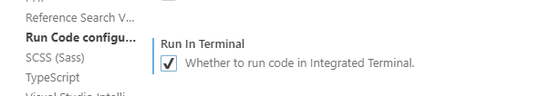
</div>

Next, we just need to open the folder in which we are going to store the source files. In the left panel, we will see the contents of this folder, and we will be able to open an existing file, or create a new one from the *File* menu.

<div align="center">
    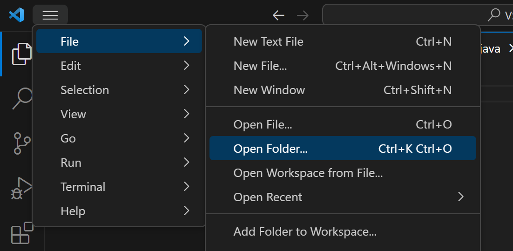
</div>

In order to run a single file, we can just right click on its source code and choose *Run Code* option from the context menu (this option is provided by the *Code Runner* extension, so you must install this extension in order to use this option).

In the same way that we have tried our Java example, we can run programs in many other languages, such as C, Python and so on. We just need to download the appropriate extension(s) to work with this language, and run the source files with *Code Runner*.

However, there are some concrete languages whose configuration is quite more difficult. This is the case of C#, for instance. We need to install the appropriate compiler (either Mono or .NET), but we need to follow some additional steps in each case in order to set up everything properly. In this case, it may be a better choice to use Geany for single source files, or Visual Studio for complex projects.

### 3. Other Visual Studio Code features

Visual Studio Code has the same features seen before with Geany regarding:

* Syntax highlighting
* Code folding
* Code auto completion through IntelliSense 
* XML/HTML tags auto closing
* etc.

The configuration can be changed in *File/Preferences/Configuration* (in MacOSX, this menu turns into *Code/Preferences/Configuration*).

But, besides these basic features, Visual Studio Code has some more advanced features that Geany has not.

#### 3.1. Side by side editing

This feature lets us edit two or more source files at the same time, having each one in a different column. This way, we can edit and compile them without having to close any of them. This option is activated by clicking on the 2 column icon in the upper right bar.

<div align="center">
    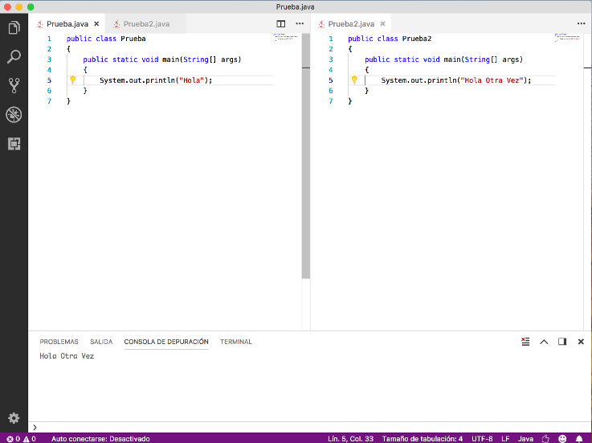
</div>

If we want to compile any of these files, as we have more than one active document, a popup menu will be shown to choose the file to be compiled.

<div align="center">
    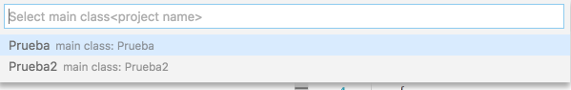
</div>

#### 3.2. Multi-cursor

We can also activate more than one cursor at the same time, by typing Alt + Clic in the position in which we want to add a new cursor. Once we have all the cursors set, everything that we type or delete will be added/removed at the same time to/from every cursor position.

<div align="center">
    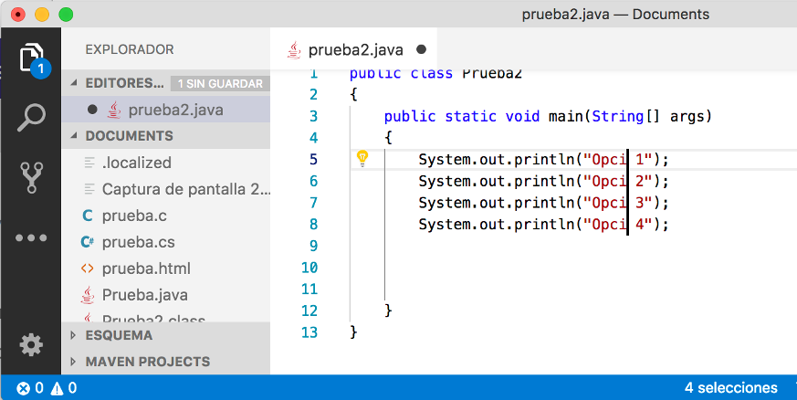
</div>

Whenever we want to remove all the additional cursors and leave just one of them, we must type *Escape*.

#### 3.3. Box selection

If we want to make this type of selection, we must hold Shift+Alt as we select the desired column(s) with the mouse.

<div align="center">
    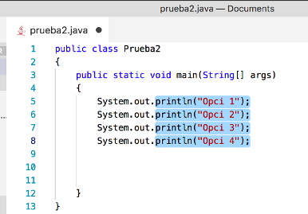
</div>

#### 3.4. Code formatting

There is an option to format the currently selected code (or the whole file). This option is in the context menu of the editor (by right clicking on the editor panel), with the name *Format Document*. It formats the code according to the language we are using. For instance, for a Java program we will have this format:

```java
public class Test {
	public static void main(String[] args) {
		System.out.println("Hello");
	}
}
```

We can see that the opening braces have been placed next to the line that creates the block (instead of putting them in the next line). This is the format that Java source files usually have.

#### 3.5. Other features

There are some other additional features that we could mention:

* **Auto-save**: by default, VS Code asks us to manually save our changes, but there is an option in the *File* menu called *Auto Save*. If it is enabled, the IDE will periodically save our work (or every time the editor loses the focus).
* **Hot exit**: every time we exit VS Code without saving changes, this state is automatically saved, and when we open the IDE again, we will keep all our unsaved changes.
* **Auto detecting indentation**: whenever we open a source file, its own indentation is automatically detected and used, instead of the one set by default in VS Code. This option is shown (and can be modified) in the status bar (*Tab size*).

<div align="center">
    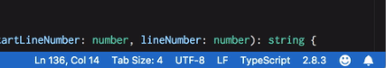
</div>

<div align="center">
    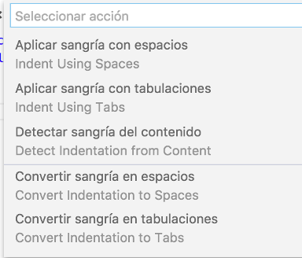
</div>

### 4. Keybindings

In the welcome screen we have a link with a complete list of shortcuts for VS Code. Some of them are similar to other editors, and some others are particular for this IDE.

<div align="center">
    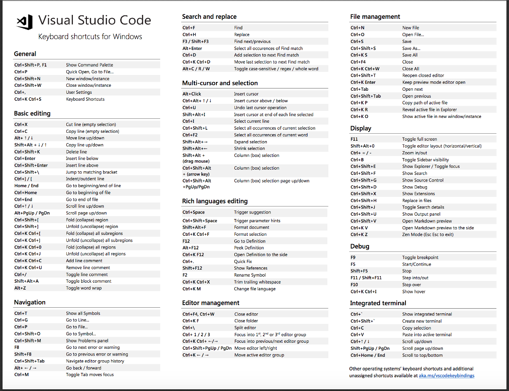
</div>

> **Exercise 1:**
>
> Open Visual Studio Code and create a new source file called `Test.java` with the following source code:

```java
public class Test
{
    public static void main(String[] args)
    {
        System.out.println("Hello");
    }
}
```

> See how VS Code highlights the code. Compile and run the program using *Code Runner* extension.

> **Exercise 2:**
> 
> Create a file called `test.c` with Visual Studio Code with the following contents. Compile and run the program using *Code Runner*.

```c
#include <stdio.h>

int main()
{
    printf("Hello");
    return 0;
}
```

> **Exercise 3:** 
> 
> Try some of the Visual Studio features, such as box selection or multi cursor, with any of the files mentioned in previous exercises.