# Integrated Development Environments

## Using IntelliJ IDEA

<div style="text-align: right">
<a target="_blank" href="slides/02d.html"></a>&nbsp;&nbsp;
<a target="_blank" href="02d.pdf"></a>
</div>


**IntelliJ IDEA** is a multi platform IDE developed by [JetBrains](http://www.jetbrains.com/). It was firstly released in 2001 as *IntelliJ*, and it was one of the first IDEs with advanced browsing and code refactoring. We can consider it a specific purpose IDE, since it focuses on a few group of programming languages.

It is available in two versions: *Community Edition* (free) and *Ultimate Edition* (commercial). The main difference between them can be found in the languages and version control systems supported. For instance, *Community* version does not allow PHP or Javascript. In our case, as we are going to work with Java Virtual Machine, we need to download the *Community* edition, which is free and open source. This is the [download page](http://www.jetbrains.com/idea/download/).

<div align="center">
    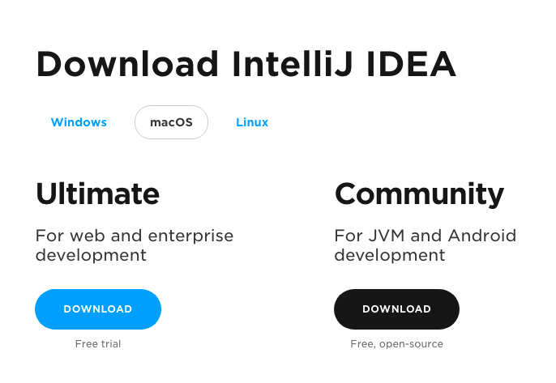
</div>

### 1. Installation and setup

Regarding the installation process:

* In **Windows**, we have a step-by-step wizard that guides us through all the installation process. We can choose the installation folder (or just leave the one set by default), and if we want to create a shortcut in the desktop. We can also check an option to add a context menu to open IntelliJ project from the explorer. This option can be very helpful.

<div align="center">
    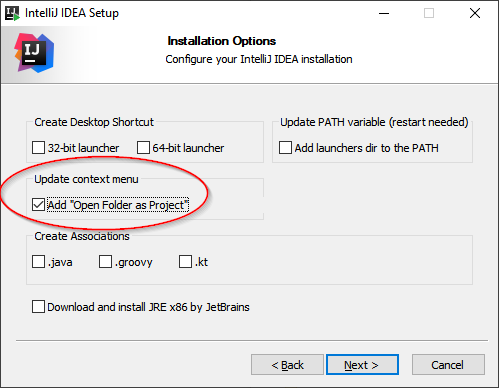
</div>

* In **Mac OSX**, we have an installer that asks us to drag the application into the *Applications* folder.
* In **Linux**, we download a *tar.gz* file that we must unzip. Inside the main folder there is a *bin* subfolder. We must get into this folder from a terminal and run the command `./idea.sh` to launch the IDE. The first time we run it, it will create a shortcut somewhere in the applications menu, so we can launch IntelliJ using this shortcut from then on.

The first time that we run *IntelliJ*, it lets us import previous settings, if we had any previous version installed. If not, we can just choose "*Do not import settings*". Next, we can choose the UI theme...

<div align="center">
    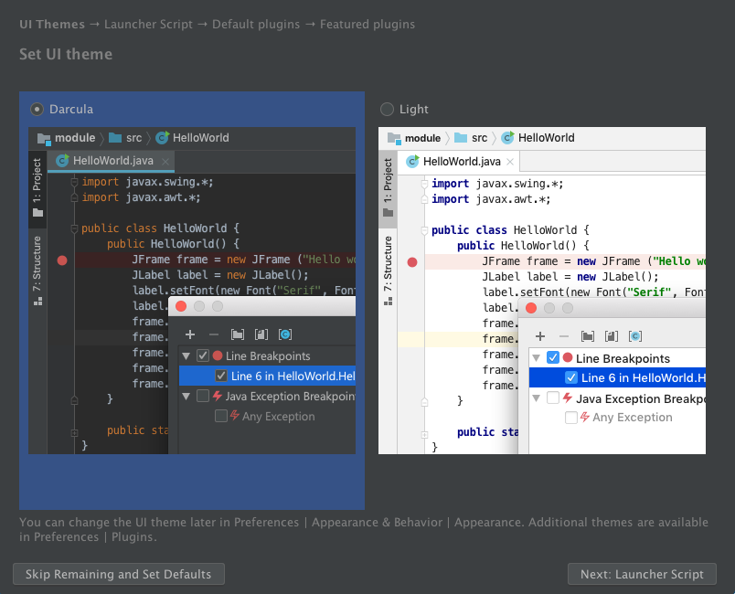
</div>

Next, it lets us define a script to launch programs from command line, but we can skip this step and move to the next one, in which we can choose to install some additional plugins. We can also leave this step with its default settings, and start using *IntelliJ*.

### 2. Creating Java projects

From the welcome screen, we can choose among:

* Creating a new project
* Open an existing project from our computer
* Get a project from a remote repository using version control systems (VCS)

So, if we want to create a new project, we choose the option *New Project*, and then specify that we want to create a Java project, from the left panel:

<div align="center">
    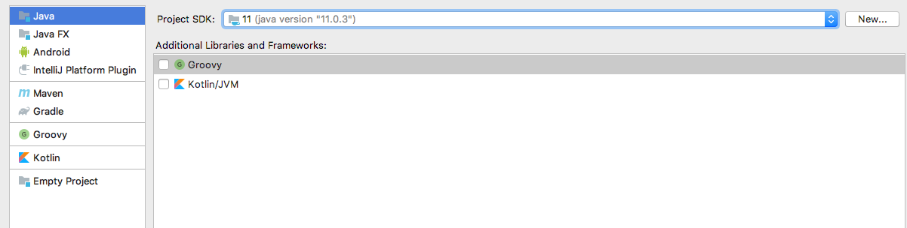
</div>

Next, we can choose a template for our project in order to generate some default code, but, as we don't have any previous template, we can skip this step, and move to the next one, in which we must specify a project name and location (we can leave the default location if we want to):

<div align="center">
    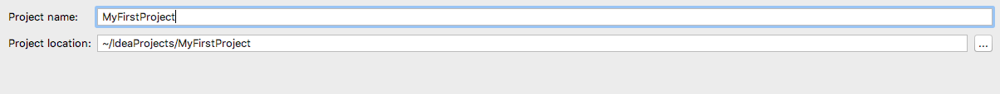
</div>

> **NOTE**: by default, IntelliJ stores the projects inside a folder called `IdeaProjects` inside our home folder. Each project is assigned a subfolder inside this main folder.

Then, we click on *Finish* and we will see our project. If we click on the project tab on the left, we can see the project folder structure, and create elements (source files) on it.

<div align="center">
    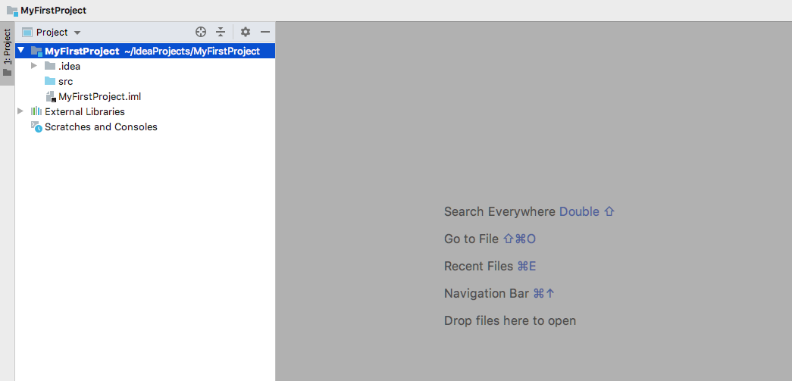
</div>

Now, let's create our first source file. Right click on the *src* folder and choose *New > Java Class*.

<div align="center">
    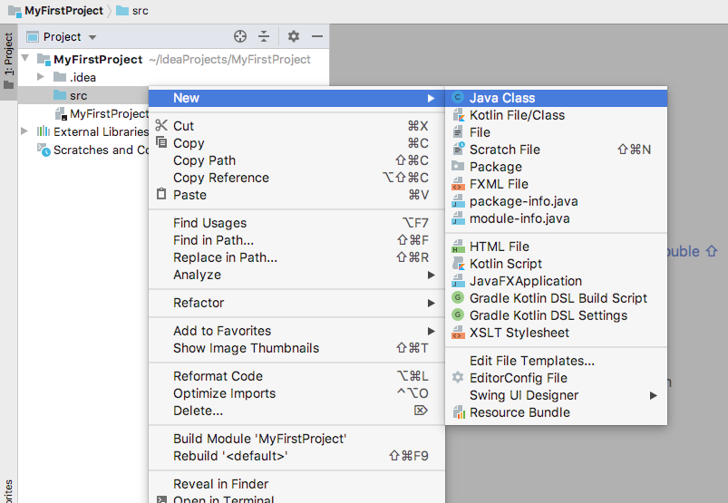
</div>

Then, we must specify the class name. For instance, `Hello`.

<div align="center">
    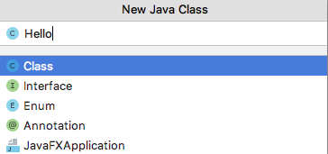
</div>

A new file will be created, and we can edit it in the main area. We can just leave a code like this one:

<div align="center">
    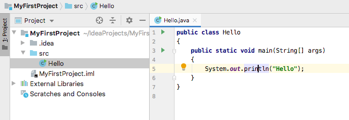
</div>

We can run the file by right clicking on it and choosing "*Run Hello.main()*" option:

<div align="center">
    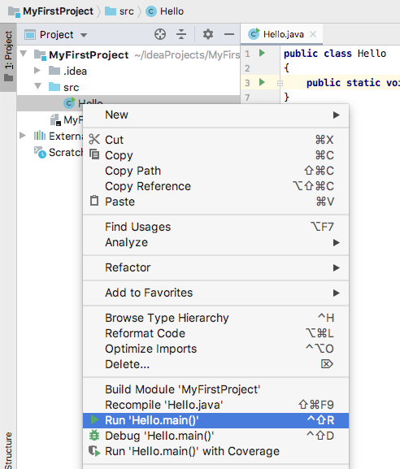
</div>

Then, we can check the results in the embedded terminal at the bottom of the window:

<div align="center">
    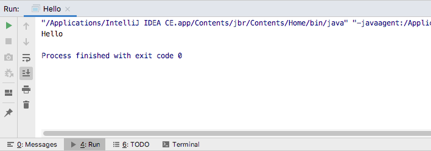
</div>

### 3. Keybindings

In the following table you can see some of the most common keybindings or shortcuts available for *IntelliJ IDEA* under **Windows** systems.

Shortcut                 | Action
-------------------------|-------------------------------------------------------
`Ctrl`+`Shift`+`N`       | Open new file.
`Ctrl`+`N`               | Open any class.
`Ctrl`+`Spacebar`        | Complete code.
`Ctrl`+`Shift`+`Spacebar`| Smart code completion.
`Ctrl`+`S`               | Save file.
`Ctrl`+`O`               | Overwrite methods.
`Ctrl`+`I`               | Implement all.
`Ctrl`+`/`               | Comment / Uncomment line.
`Ctrl`+`D`               | Duplicate line.
`Ctrl`+`Z`               | Undo last action.
`Ctrl`+`Shift`+`Z`       | Redo last undone action.
`Ctrl`+`F`               | Show search dialog.
`Ctrl`+`R`               | Show replace dialog.
`Ctrl`+`F9`              | Compile project.
`Shift`+`F10`            | Run project.
`Shift`+`F9`             | Debug.
`F7`                     | Step into function (in *debug* mode).
`F8`                     | Next line (in *debug* mode).
`F9`                     | Stop debug.
`Ctrl`+`F8`              | Create breakpoint.
`Ctrl`+`Shift`+`F12`     | Maximize editor panel.

Most of these shortcuts are also available under Linux. Regarding MacOSX systems, you must replace `Ctrl` key with `Cmd` key. You can find more shortcuts [here](https://shortcutworld.com/IntelliJ-IDEA/win/IntelliJ_Shortcuts).

> **Exercise 1:**
>
> Create a new Java project with IntelliJ called *Test* and copy this code in a class called `Test`. Then, run the application to check if everything is OK.

```java
public class Test
{
    public static void main(String[] args)
    {
        System.out.println("Hello");
        System.out.println("Have a nice day!");
        System.out.println("And learn a lot of Java :-)");
    }
}
```