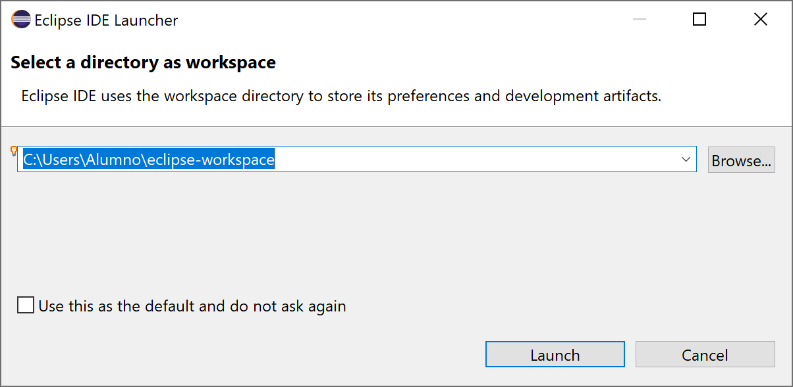
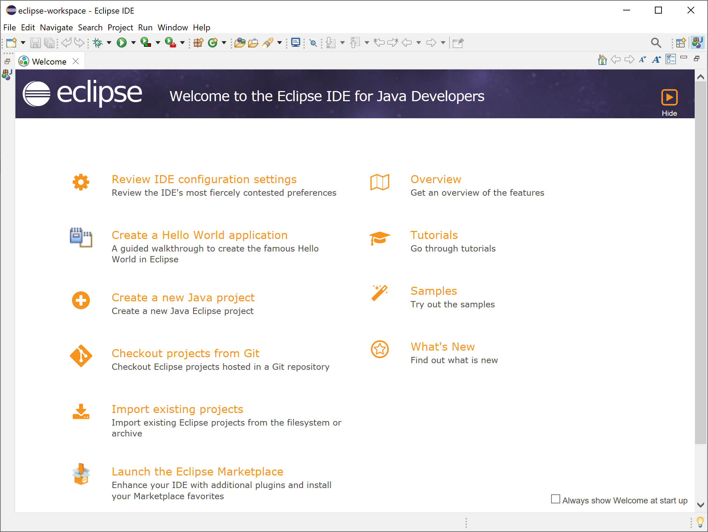
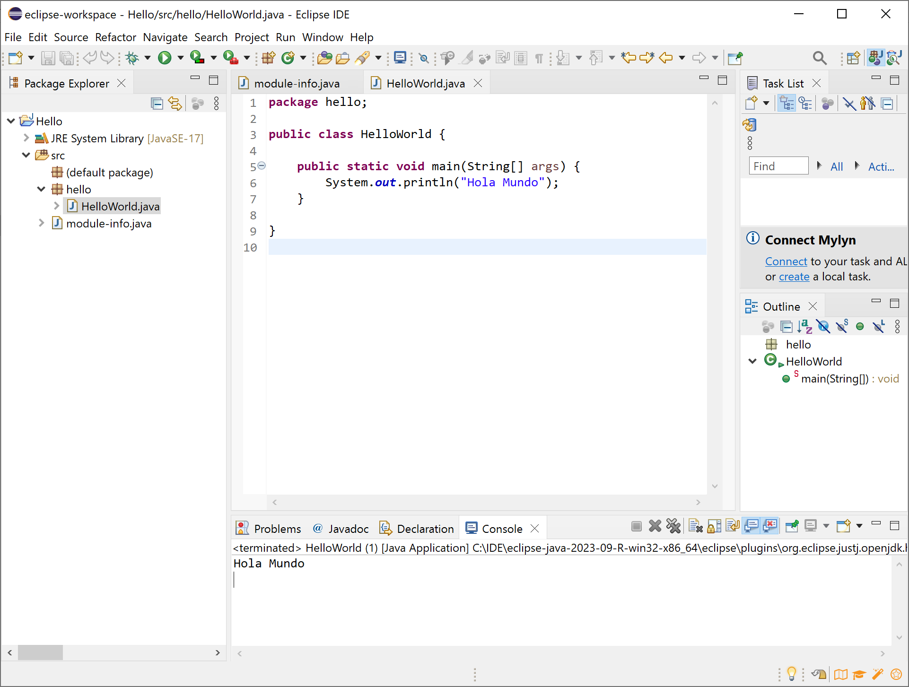

# Integrated Development Environments

## Using Eclipse

<div style="text-align: right">
<a target="_blank" href="slides/02f.html"></a>&nbsp;&nbsp;
<a target="_blank" href="02f.pdf"></a>
</div>


<!-- https://www.developer.com/java/eclipse-ide-review/ -->

The Eclipse integrated development environment is a popular choice for Java Developers. But it can be used with many other programming languages as well, including Python, PHP, C, and C++. It has a large feature set, customizable user interface, and can be extended through a large ecosystem of plugins that can be found in its [marketplace](https://marketplace.eclipse.org/). It benefits from the support of an active community of developers and the Eclipse Foundation, ensuring it remains stable and secure through frequent updates and enhancements.

Eclipse is a free, open-source IDE, and also powerful, making it a great option for solo developers and development teams on a budget.

Development environments include: 

* The Eclipse Java development tools (JDT) for Java and Scala, 
* Eclipse CDT for C/C++, 
* Eclipse PDT for PHP
* and others...

You can download the installer from the [Eclipse Packages page](https://www.eclipse.org/downloads/packages/). Please, start by downloading the **Eclipse IDE for Java Developers**. Eclipse installation process consist on extracting the contents fo the compressed file to a directory of our choice.


### 1. Work environment

In order to start Eclipse you should find executable file in the folder where de IDE was extracted and run it.

Eclipse will ask for the "Workspace", it is the directory where it will create the new projects.

<div align="center">
    
</div>

Here you have the welcome screen that you will find after the first eclipse execution:


<div align="center">
    
</div>

### 2. Main features


#### 2.5. Keybindings

There are many shortcuts or key bindings available in Eclipse, the following table shows some of the most useful.

| Shortcut Key Mac           | Shortcut Key Windows | Description                                                                                        |
|----------------------------|----------------------|----------------------------------------------------------------------------------------------------|
| Command + 3                | Ctrl + 3             | It puts the focus into Quick Access search box.                                                    |
| Command + S                | Ctrl + S             | Save current editor                                                                                |
| Command + 1                | Ctrl + 1             | Quickfix for errors and warnings, depends on the cursor position                                   |
| Control + Space            | Ctrl + Space         | Content assist and code completion                                                                 |
| Command + Shift + F        | Ctrl + Shift + F     | Format source code                                                                                 |
| Control + Q                | Ctrl + Q             | Moves cursor to the last edited position                                                           |
| Command + D                | Ctrl + D             | Deletes current line in the editor                                                                 |
| Command + Shift + O        | Ctrl + Shift + O     | Organize imports in the current java file                                                          |
| Command + 2 + L            | Ctrl +2 + L          | Assign statement to new local variable                                                             |
| Command + 2 + F            | Ctrl + 2 + F         | Assign statement to a field                                                                        |
| Command + O                | Ctrl + O             | Shows quick outline of the java class                                                              |
| Command + fn + F11         | Ctrl + F11           | Runs the current opened java class if main method exists or else run the last launched application |
| Command + Shift + R        | Ctrl + Shift + R     | Open / Search for resources                                                                        |
| Command + Shift + T        | Ctrl + Shift + T     | Open / Search for types, very useful in finding classes                                            |
| Command + E                | Ctrl + E             | To select an editor from the currently open editors                                                |
| Command + fn + F8          | Ctrl + F8            | Shortcut for switching perspectives                                                                |
| Command + [ or Command + ] | Alt + ← or Alt + →   | Go to previous/ next editor position in history                                                    |
| Fn + F3                    | F3                   | Move cursor to the declaration of the variable                                                     |
| Command + Shift + P        | Ctrl + Shift + P     | Move cursor to the matching bracket                                                                |
| Command + .                | Ctrl + .             | Go to the next problem                                                                             |
| Command + Shift + .        | Ctrl + ,             | Go to the previous problem                                                                         |
| Fn + F4                    | F4                   | Show type hierarchy of the variable                                                                |
| Command + K                | Ctrl + K             | Find next for search text in the opened editor                                                     |
| Command + Shift + G        | Ctrl + Shift + G     | Search for references in the workspace                                                             |
| Command + T                | Ctrl + T             | Shows type hierarchy of the current java class                                                     |
| Command + M                | Ctrl + M             | Maximize Java editor                                                                               |
| Fn + Shift + F2            | Shift + F2           | Shows the javadoc of the method, class                                                             |
| Command + Option + R       | Alt + Shift + R      | Rename of package, class etc                                                                       |
| Command + Option + T       | Alt + Shift + T      | Opens the quick refactoring menu                                                                   |


> **Exercise 1:**
> 
> Read this [report on the Java ecosystem](https://snyk.io/reports/jvm-ecosystem-report-2021/), please check the full report in PDF format and answer the following questions:
> 
> * ¿Which are the two most used IDEs in Java development?
> * ¿Which is the most used build system for Java?
> * ¿Which is the most popular Java framework?
> * ¿What JDK version is the most used in production?
> * ¿What JDK version is the most used in development?


> **Exercise 2:**
>
> Use Eclipse to create a java project. Run it. Debug it. Finally, check the project structure: finde where the .java and the .class files are stored.

```java
public class Test
{
    public static void main(String[] args)
    {
        System.out.println("Hello");
        for (int i = 0; i < 10; i++) {
			System.out.println(i);
		}
    }
}
```


<div align="center">
    
</div>


> **Exercise 3:**
> 
> Use Eclipse to create a C project. First you will need to install de **Eclipse C/C++ IDE CDT** from the **MarketPlace**. The MarketPlace can be found under de **Help** menu. After installing the CDT, eclipse will allow you to create new C/C++ projects (File->New Project->C/C++). Create a hello world project, run it and debug it.

```c
#include <stdio.h>

int main()
{
    printf("Hello");
    return 0;
}
```
