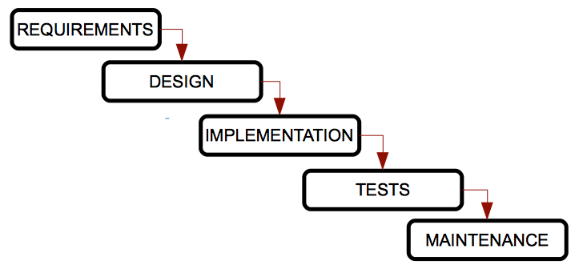
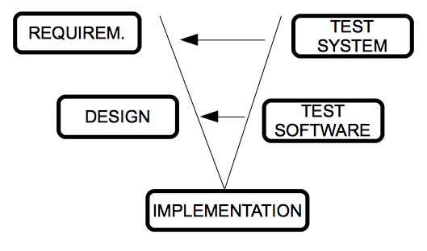
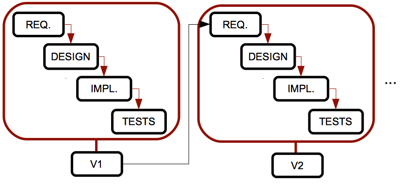
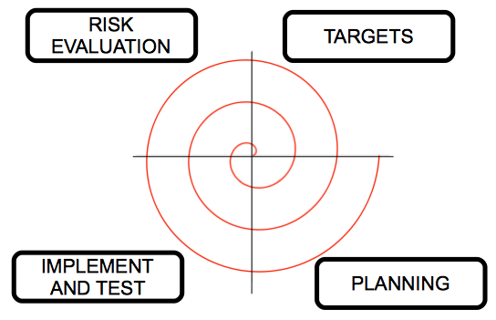

# Software methodologies

## Software lifecycles

&nbsp;&nbsp;

### 1. Software engineering

In order to develop software properly, we must follow some steps, or a given approach for this development. **Software engineering** is the branch of computer science that helps us follow these approaches and steps correctly.

#### 1.1. Stages in software development

In (almost) every software engineering process, we can follow these steps:

1. **Requirements analysis**: this stage includes the communication with the customer to clarify his needs, and an analysis stage to sketch out the main behaviour of the application. It can be divided into two stages:
   * **Requirements specification**: the communication with the customer, in which we will arrange some interviews or other ways of getting information. We must clarify the needs to be fulfilled, and once the requirements have been gathered, we write a document called *requirements specification*, that must be as complete as possible.
   * **Analysis**: from the requirements specification created in previous stage, we must now create a new document where we will use some helpful diagrams to represent the main functionalities of the application and their connections or dependencies.
2. **Design**: from the analysis documents set before, we can now determine how the software will work. Here we will use other diagrams that will help us implement the software.
3. **Implementation**: this stage should be started from previous design stage, using a specific programming language (or more than one).
5. **Testing**: once the product has been implemented, we must test it to check if it fulfills all the requirements and there is no bug. These tests should be checked by someone not involved in the implementation process.
6. **Maintenance**: this last stage consists in improving the performance of the software product, by adding new extensions, or fixing some bugs

To sum up these stages, we could say that software engineering provides an approach that helps us understand the problem to be solved (requirement analysis), design a possible solution, implement it, test it and then get a better quality or performance (maintenance).

However, all these steps may sometimes be an obstacle, since many developers think that software engineering is something too structured, that do not let them develop software quickly. But we must see sofware engineering as something adaptive, that provides different models and methodologies to be adapted to our development process, as we will see later.

### 2. Software lifecycles

A lifecycle is a list of stages through which a system (in this case, a software project) must go, from its birth until it is no longer used. In each lifecycle we set both the stages and the requirements to go from one stage to the next, including the inputs and outputs expected for every stage.

The products generated after each stage are called *deliverables* and they are either part of the input of the next stage or an evaluation of the project at a given point.

Some lifecycles are repetitive, this is, we can go through the same stage more than once, depending on the state of the product. This process is also known as *feedback*.

We are going to see some of the most typical lifecycles in software development, and their pros and cons. In all of them we will find the stages seen before (requirements analysis, design, implementation...), or any variation of them.

#### 2.1. Cascade or waterfall model

This is the oldest model, and the most widespread. It was created by W. Royce in the 70s, and it sorts the stages of software development rigurously, so that the beginning of a stage must wait for the end of the previous one.

    

It is called *cascade* model because the stages are placed one below the other, and the process flows from the upper stages to the lower ones, as if they were a cascade.

**Pros**:

* Suitable for small and well known projects, where all the requirements are perfectly set at the beginning
* Well structured, stages do not mix up
* Easy to use, because of its rigidity

**Cons**:

* We can't apply it to most of real life projects, since requirements are barely known at the beginning.
* We can't see any result until the end of the process, so customers must feel worried about that final result.
* It is not usual to have a stage perfectly finished before starting the next one.
* Failures are not detected until the test stage, at the end of the process.
  
**Variations**:

There are some variations of this model, like the **Sashimi model**, in which stages are overlapped, like Japanese fish does. In this model, there is some time overlap between two sequential stages; this way, we start the *design* stage while we finish setting the requirements (and we can change them as we go forward with the design), and we start implementing the system while we finish with the design (so that we can improve the design because of some issues detected during the implementation).

#### 2.2. V model

One of the main problems of the traditional cascade model is that failures are not detected until we reach the final stages of the process. With the V model, tests start as soon as possible, and they are performed in parallel by another work team. This way, tests are integrated in each stage of the lifecycle.

    

Left branch of the V represents the requirement analysis, design and implementation, and the right branch integrates the tests of each stage. We move along the left branch until we reach the bottom, and then we validate the tests of the right branch, from the most specific ones (unit tests to check some concrete modules of the product) to the most generic ones (integration and system tests). Every time we detect a problem, we go back to the associated stage of the left branch.

**Pros**:

* Easy to use
* There are some deliverables for each stage
* Higher probability of success, due to the tests plans associated to each stage of the process
* Useful for small projects with requirements that are easy to understand

**Cons**:

* It is also rigid
* User does not see any result until later stages, because we don't develop any intermediate prototype
* Sometimes it is hard to go from the right branch to the left branch to fix the problems

#### 2.3. Iterative model

The models seen so far are only suitable for projects with easy, well specified requirements, but this is not very usual in real software projects. In order to try to improve this, the iterative model repeats the cascade model, and generates an intermediate version or prototype after each iteration. This prototype can be then checked by the customer, problems can be detected earlier and then we can improve the system.

    

**Pros**:

* We don't need to specify all the requirements at the beginning
* Risks are better managed, because we deliver intermediate prototypes after each iteration

**Cons**:

* If we don't need to have all the requirements at the beginning, they may appear later unexpectedly, and they may affect the design or system architecture significantly.

**Variations**:

There are some interesting variations of this model, with other names and some particular features:

* **Incremental model**: each prototype only has some few improvements from previous one. This make the prototypes easier to test (we only have to test these small changes). However, we must have a lot of experience in order build these prototypes proportionally.
* **Prototype-based model**: it is based on developing prototypes of the application. At the beginning, we just gather some requirements quickly, make a simple design and have a basic prototype, so that customer can quickly check the application and give us his feedback. The main advantage of this model is that customer is involved in the process from the very beginning. But it may be very costly, since we may develop many useless prototypes. Besides, customer must feel disappointed if he checks some versions of the product that do not work as he expected, and the developer may be tempted to speed up the process to include everything the customer wants, eluding all the quality and maintenance patterns.
  
#### 2.4. Spiral model

This model was created by Boehm in 1988, and it tries to combine the cascade and iterative models. Stages are arranged in a spiral divided into four sections, so that each section does one task, and each spiral turn goes through all sections and tasks, generating one prototype after each complete turn.

This model manages the risks of software development. We start from the middle of the spiral, and in every loop we analyze all the development alternatives, we identify the most assumable risks and then perform a spiral cycle. If the customer brings new requirements or improvements, we then evaluate the risks again and perform another cycle, until the product is finally accepted.

    

* In the **targets** stage we set the final product to reach (requirements, analysis, etc.)
* In the **risk evaluation** stage we identify the possible risks of the project, and choose the options to reduce them as much as possible.
* In the **implement and test** stage we design, implement and test the product, according to the options chosen in previous stage.
* In the **planning** stage we check the product with the customer, and then we decide if we need one more spiral cycle to fix some problems or add some improvements.

**Pros**:

* Suitable for large and difficult projects
* Risks are minimized
* Implementation and maintenance are both integrated
* We develop prototypes from early stages, so that customer can provide his feedback along the process

**Cons**:

* We must have a lot of experience to evaluate the risks properly
* This model produces a lot of additional products (reports, prototypes...)
* It can be very costly
* It is not appropriate for small projects

> **Exercise 1:**
>
> Create a table like the one below (in a piece of paper, or in a text editor), and fill each cell with a YES or NO, depending on whether the specified feature is part of the corresponding lifecycle.
<table>
<tr>
    <th></th>
    <th>Cascade</th>
    <th>V</th>
    <th>Iterative</th>
    <th>Spiral</th>
</tr>
<tr>
    <td>It is simple and easy</td>
    <td></td>
    <td></td>
    <td></td>
    <td></td>
</tr>
<tr>
    <td>It generates intermediate versions of the product</td>
    <td></td>
    <td></td>
    <td></td>
    <td></td>
</tr>
<tr>
    <td>Suitable for projects with uncertain requirements</td>
    <td></td>
    <td></td>
    <td></td>
    <td></td>
</tr>
<tr>
    <td>It lets us evaluate the risks of the chosen solution</td>
    <td></td>
    <td></td>
    <td></td>
    <td></td>
</tr>
</table>

> **Exercise 2:**
> 
> Our team is going to develop an application to manage the accounting of a cinema company. The customer still doesn't know what he expects from the application, and we want to use a really new technology we don't control yet. According to this information, argue which lifecycle model(s) are the most suitable for our purpose, and which one(s) are NOT recommended.

> **Exercise 3:** 
> 
> A teacher from the Higher Polytechnic School of the University of Alicante wants to develop a program to help him correct his students' exercises. As he is very busy, he has asked a group of old students to do it for him. We assume that, as he is a computer scientist, he knows perfectly what he wants from the very beginning. It is a small project that should not take a lot of time. According to this information, argue which lifecycle model(s) are the most suitable.
