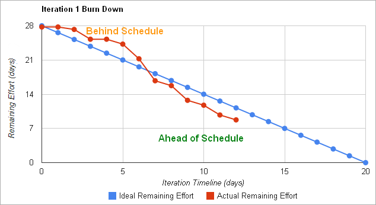

# Software methodologies

## Agile methodologies

&nbsp;&nbsp;

As developing software products is not an easy task, there are some different methodologies that we can follow for this development. A **methodology** is a set of techniques and methods that help us face each stage of a [lifecycle](03a). This way, we can: 

* Optimize the process and the final product
* Use guided protocols for the planning and the development
* Set what to do, how to do it and when, along all the project
  
Traditional methodologies are really useful for big projects (in terms of time and budget), but they have some drawbacks for projects not so big, or with a close deadline, or with uncertain requirements. For instance, they produce too much documentation, and they are overplanned. 

To face these other projects, many teams have tried agile methodologies, which are specially suitable for small projects, to be developed in a short time, with teams composed of less than 10 people. With these methodologies, we promote the teamwork, our own responsibility, the customer needs and the targets of his company. Face to face communication among the members of the team, and with the customer, is very regular. This way, team members share their progresses and problems, and they have a quick feedback from the customer.

In order to fulfill its purpose, agile development makes small project increments, with a minimum planning. Each increment performs a whole iteration over the software stages (requirements, design, implementation, tests...), in a short period of time (usually 1 - 4 weeks), which is known as *timebox*. This way, we minimize the general risk, and the project can be adapted to many changes along its development. Documentation is only generated when it is really needed, and the aim is to get a working prototype after each iteration, even though it has really reduced functionalities.

### 1. The agile manifesto

The agile manifesto is a specification created in 2001 that gathers the main principles that a methodology must have in order to let the team build a software project quickly and facing the changes that it may have in the future.

Some of the most important principles are:

* People are the main success factor of a project. It is better to create a good team and let it configure its own working environment, than building the environment and force the team to get used to it.
* We should not produce any documentation unless it is needed to make a decision immediately.
* There must be a constant interaction between the customer and the work team.
* The ability to face the changes that the project may have during the development is more important than to follow a rigid planning from the beginning.
* The main priority is to satisfy the customer through the continuous delivery of working software.
* Face to face conversation is the most efficient method to transmit information in a work team.
* Simplicity

### 2. Some usual practices

Besides the principles gathered in the agile manifesto, some agile methodologies use certain practices. Let's see some of them.

**Pair programming (PP)**

Pair programming is a technique that offers many advantages. Two programmers work together in the same computer. One of them is typing code (driver) and the other one is checking what is being typed (observer). Both swap their roles frequently (every 30 minutes, for instance). The observer is in charge of guiding the work of the driver, and providing any ideas to solve future problems.

The main advantages of this technique are:

* We produce shorter programs, with less errors and better designed (since code must be readable for both members of the team). 
* It is useful for learning, if one of the members is very experienced, and the other one is a newbie, or if both have different knowledge that can be transferred to each other. 
* If one of the members leaves the team, there can be another one who takes his place supported by the old member, so that the deadlines may not need to be modified.
* There are less interruptions along the process, as both members swap their tasks and they can work more continuously.

However, it also has some drawbacks:

* Some engineers prefer to work on their own.
* A newbie may feel intimidate if he works with someone which is more experienced than him, and vice versa (experienced workers may feel boring to help a newbie).
* It is more costly (we have to pay two salaries for a single job).
* There may be some annoying working habits in the team

**Test driven development (TDD)**

This is a technique that uses short iterations based on test cases previously written. This way, each iteration produces the code needed to pass these tests, and once they are passed, we integrate this code with the previous one and optimize it. So the process is as follows:

1. We add a new test to current set
2. We write the code to pass this last test
3. We run again the test set and check that every test is passed
4. We refactor the final code to optimize it
5. Go back to step 1

It is important to have a set of unit tests that can be launched automatically, so that we can add more tests from time to time, and we can re-launch it at every moment. We will see later in this module some techniques to define test cases and test sets.

So the main idea is to define the tests that the system must pass before writing the corresponding code, so that we make sure that the application can be checked, and we define tests for each feature. This way, we avoid writing unnecessary code (this is, code that is not bound to any test).

### 3. Example: Scrum

Scrum is an agile methodology that can be used in complex projects. It uses iterative and incremental processes, and can be applied to either software products or other scopes. Its name comes from the "melée" that rugby players do.

**Roles**

The main Scrum roles are:

* **ScrumMaster**, it is something equivalent to the *project manager*, although this role does not implicitly exist in Scrum, since the own work team is self-managed. His main task is to make sure that the Scrum method is used properly, and there are no external influences that may disturb it.
* **ProductOwner**, who represents the customer, although he doesn't need to be part of the customer's company. He may even be someone from the work team.
* **Team** of developers.

**Process**

To begin with, the work team must gather the user requirements from the customer (both managers and employees who are going to use the application). The application features are gathered through **user stories**, which are basically a set of paper cards in which the customer describes the features of the system. Each story must be understandable and concrete, so that the team can implement it in a few weeks. Each user from the customer company is asked to write what he expects from the application. The whole set of stories are packed in a collection called **backlog**. From this backlog, some stories will be finally part of the application (the rest will be discarded).

From this point, we start the development process, based on iterations called **sprints**. Each iteration takes 2 - 4 weeks to be completed, and produces a prototype or operative version of the product. In this increment, we add to the application some requirements extracted from the *backlog*. The set of requirements to be added in each iteration is decided in a planning meeting, where the *Product Owner* chooses some items to be added, and the team decides which ones can be added in next iteration. Then, during the iteration, the *backlog* freezes, this is, we can't change any previous requirement until next iteration begins.

Besides the meeting at the beginning of the iteration, there are also daily meetings in Scrum, where people discuss about the state of the project, what has been done and what is about to be done. There is also a final meeting at the end of the iteration to check the version or prototype obtained.

**Time estimation**

Every user story in the *backlog* is assigned a time, usually in hours, days, or even weeks. So, the total estimated time of a sprints is the sum of every user story chosen for that sprint.

In order to determine if total estimated time differs too much from real time, we can use some additional tools such as **burndown charts**, that graphically help us determine which measures can be taken to reduce this difference.

    

> **Exercise 1:**

> In [this video](https://www.youtube.com/watch?v=XU0llRltyFM) you have a summary of Scrum methodology. After watching it, try to answer to these questions:
> 
> 1. What is a *sprint* in Scrum?
> 2. Who is in charge of prioritizing the tasks to do in every *sprint*?
> 3. How can the final delivery date of a *sprint* be calculated?

### 4. Example: Kanban

Kanban is another agile methodology, which is really easy to apply. Its name is a combination of two Japanese words: *kan* ("visual") and *ban* ("card"), so we can figure out that the main component of this methodology consists in using cards, that represent the different tasks that we must complete in the development process.

The origins of Kanban methodology date back more than 60 years. In the late 1940s Toyota began to optimize its engineering processes, based on the same model used by supermarkets to optimize their stock. As inventory levels should match consumption patterns, the excess stock can (must) be controlled. This way, Toyota could align their inventory levels with their actual consumption of materials. Workers passed a *card* between teams when a bin of materials had been emptied, indicating the exact amount of material needed. The warehouse would have a new bin of material ready to be delivered to the factory, and then they would send a new kanban to the supplier to provide a new bin.

Applied to software development processes, Kanban allows teams to match the amount of *work in progress* (WIP) to the team's capacity. This gives teams more flexible planning options, faster output, and clearer focus.

**Process:**

The general term to refer to Kanban methodology is *flow*, since work flows continuously through the system instead of being organized in timeboxes, as Scrum does with its *sprints*.

Kanban uses visual mechanisms, such as **Kanban boards**, so that team members can see the state of every piece of work at any time. These boards can be either physical and/or virtual.

    

The main function of the Kanban board is to ensure that team's work is visualized and all blockers and dependencies are immediately detected. The most basic board has three sections (*To Do*, *In Progress* and *Done*), but we can add as many columns and states as we need for our particular case.

Any section or column of a Kanban board can be filled with **Kanban cards**. They reflect critical information about a particular work item, giving the whole team information about who is responsible for that item, a brief description of the job to be done and an estimation of how long it will take

**Principles:**

Some of the main principles of Kanban methodology are:

* **Limited *work in progress***, or *stop starting* and *start finishing*, this is, the team should not start another issue until the current one has been finished.
* **Guaranteed quality**: everything needs to go well at the first opportunity, there's no error margin. This way, speed is not as important as quality, because fixing bugs may be costly.
* **Waste reduction**: we must do just what we need, and do it well.
* **Flexibility**: next step is decided from the *backlog*, by choosing the next task to be completed. So we can prioritize the chosen task depending on the needs of each concrete moment.

**Kanban vs Scrum**

Kanban has some similarities with Scrum methodology, since they are both agile methodologies: both require collaborative and self-managed teams, and both focus on releasing software very often. However, there are some important differences between them:

|Kanban|Scrum|
|----|----|
|No prescribed roles|ScrumMaster, ProductOwner...|
|Continuous deliveries|Timeboxed sprints|
|Changes can be made at any time|No changes allowed during sprint|

Both methodologies can be applied at the same time. Scrum is more appropriate in giving feedback to the team, and in short-term planning, whereas Kanban can be used for day to day work, or in envinroments with a high degree of variability in priorities.

> **Exercise 2:**

> In [this video](https://www.youtube.com/watch?v=R8dYLbJiTUE) you have an example of Kanban methodology. Try to answer to these questions after watching it:
> 
> 1. What is the main function of WIP limits? What happens when we try to move a task to a column that exceeds this limit?
> 2. How can Kanban and Scrum be combined? Which is the main purpose of adding Scrum to Kanban?
