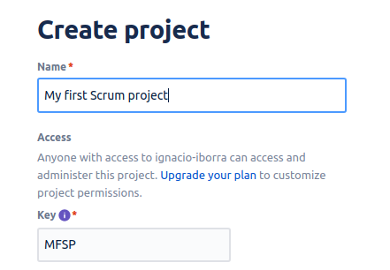
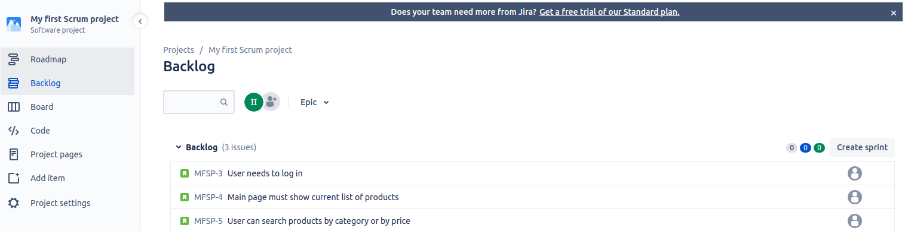

# Software methodologies

## Using JIRA

&nbsp;&nbsp;

JIRA is one of the most popular team management tools for agile development. It can be used online through its own [website](https://www.atlassian.com/software/jira). It has a free version for teams up to 10 members, with 2GB of storage and some other options that you can check [here](https://www.atlassian.com/software/jira/pricing).

We can sign up and log in with a Google account, for instance. Then, we can create projects, and for each project, we can choose if we want to manage it using Scrum or Kanban methodology.

For the project chosen, we need to set up some initial settings, such as project management (team or company), and the project name along with a project key (which consists in the project initials, by default).

    

Then, the main panel of the project will be shown. From the left menu, we can:

* Define the **Roadmap** of the project. We can define tasks (and also subtasks inside each task) and assign a period of time for each task to be done, and a responsible for the task (among the team members)

    

* If project is a Scrum project, we can add user stories to the **Backlog** and also assign stories to team members.
  

    

* From this *Backlog* section we can also create **sprints**, and drag inside each sprints the user stories that the team decides. When we decide to start the sprint, we can establish the starting and ending dates as well.

    

    

* When (at least) a sprint is started, we can manage the user stories involved through the **Board**. If project is a Kanban project, then this board is automatically available, without having to start any sprint. We can drag and drop stories or issues along the board, and also create new columns from the default board structure.

    

There are many other features available in JIRA, but we will not see them in this unit. To finish with this quick overview, you can also invite teammates to your project, and also create teams, through the *People* section in the upper menu.

    

> **Exercise 1:**
>
> Sign up in JIRA and create a Kanban project called *First Trimester*. Define some issues in the *Board* section that represent your different tasks for all the modules in this first trimester. Move each issue or task to the appropriate column in the board. Also, define your *Roadmap* with all the tasks and their estimated dates (start and end).

    

    

