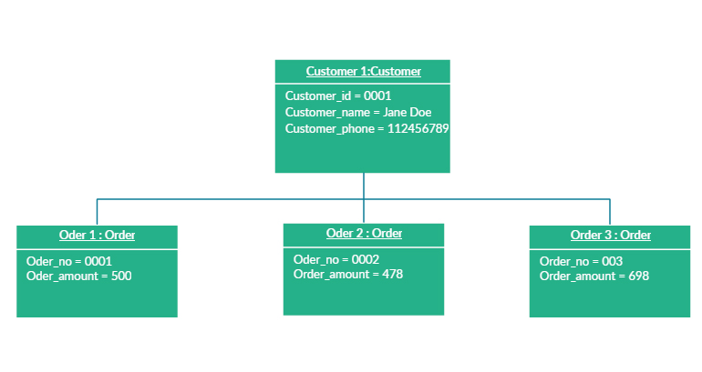

# Software analysis and design

## Introduction to UML. Tools

<div style="text-align: right">
<a target="_blank" href="slides/04b.html"></a>&nbsp;&nbsp;
<a target="_blank" href="04b.pdf"></a>
</div>

In the analysis stage of software development, we must finish with a clear idea of what the application must do. In order to help us get to this point, we can use many graphical representations or diagrams. In this section, we are going to rely on **UML**, which is part of a traditional methodology called RUP, but can be used in many other methodologies as well. There are many diagram types that are part of UML, so we are going to focus on some of them to have an overview as complete as possible of our application.

### 1. Introduction to UML

UML (*Unified Modeling Language*) is a standard modeling language that helps developers specify, visualize, build and document software applications. Besides, UML lets us scale these applications, and make them more secure and robust. It was originally conceived to apply the object oriented paradigm to the software analysis and design, grouping some other existing modeling languages. This way, UML 1.1 was firstly published in 1997. Its current version from 2015 is UML 2.5. 

This modeling language has two main types of diagrams: **structural** diagrams and **behavioral** diagrams. Each one contains its own subset of diagrams.

<div align="center">
    
</div>

Next, we are going to see an overview of all these diagrams. The images have been extracted from [this website](https://creately.com/blog/diagrams/uml-diagram-types-examples).

#### 1.1. Structural diagrams

They show the static structure of the system.

* **Class diagram**: it is the main diagram in terms of application building, for every object oriented application. It shows every class of the application with its attributes, methods and relationships.

<div align="center">
    
</div>

* **Composite structure diagram**: it shows the internal structure of a class.

<div align="center">
    
</div>

* **Component diagram**: it shows the structural relationship among the system components. It is used in complex systems with many components.

<div align="center">
    
</div>
  
* **Deployment diagram**: it shows the hardware and software of the system, and how the software is distributed in the hardware. It can be employed in systems where the software is distributed in many different hardware components.

<div align="center">
    
</div>

* **Object diagram**: it is similar to the class diagram, but it represent objects with example data on them.

<div align="center">
    
</div>

* **Package diagram**: it shows the dependencies among the different packages of the system.

<div align="center">
    
</div>

* **Profile diagram**: it lets us specify different stereotypes and tagged values to adapt the general system to specific platforms (for instance, how it should be in Java, or in .NET framework), or domains (for instance, a medical application).

<div align="center">
    
</div>

#### 1.2. Behavioral diagrams

They show the dynamic behavior of the system objects.

* **Activity diagram**: it shows the control flow of a given method or component. 
    
<div align="center">
    
</div>

* **Interaction diagrams**: some diagrams are included here:

    **Sequence diagram**: it shows the interaction among the objects of the system, and the order of these interactions.

    <div align="center">
        
    </div>

    **Communication diagram**: in UML 1 these diagrams were called *collaboration diagrams*. It is similar to the sequence diagram, but it is focused on the messages that are passed between objects.

    <div align="center">
        
    </div>

     **Interaction overview diagram**: it is similar to the activity diagram, but it shows the sequence of the interactions. 

    <div align="center">
        
    </div>

     **Timing diagram**: it is similar to the sequence diagram, but it shows the behavior of the components in a given moment.

    <div align="center">
        
    </div>

* **State machine diagram**: it is similar to the activity diagram, with a different notation and usage (it is often used to describe the behavior of objects which act in a different way depending on their own current state).

<div align="center">
    
</div>

* **Use case diagram**: it is the most popular behavioral diagram. It provides a general overview of the actors involved in the system, and the tasks that each one can do on it.

<div align="center">
    
</div>

### 2. UML tools

There are many different tools that we can use to create UML diagrams. In this chapter we are going to focus on a couple of them. We will explain the first basic steps with these tools, and see how to create a simple diagram, such as a use case diagram.

#### 2.1. Modelio

Modelio is an open source tool to create a wide variety of diagrams, including UML diagrams. We can get it from its [official web site](https://www.modelio.org/) for the three main platforms (Windows, Linux and Mac OS X), although there are some problems regarding Mac OS X, as we will see right now.

If we install it under **Windows**, we just need to run the *.exe* file, which is a step-by-step wizard that guides us through the installation process. 

Regarding **Linux** (Ubuntu, for instance), we first need to install some dependencies from *Synaptic* package manager (you can find Synaptic in the *System tools* section). You must check if these packages (and all their dependencies) are installed:

* `libwebkitgtk-1.0.0`
* `libwebkitgtk-3.0.0`

<div align="center">
    
</div>

Then, we download the *.deb* file from the official web site, and type this command from the terminal (from the folder where the file has been downloaded):

```
sudo dpkg -i <deb_file_name>
```

where `<deb_file_name>` is the full file name that you have downloaded (for instance, `modelio-open-source_4.1.0_ubuntu_amd64.deb`).

Finally, regarding **Mac OS X** it requires Java JDK 8 to run. Since Java 8 is becoming quite obsolete, we are not going to explain how to fix this bug, since it is a little bit tricky. We will use a different tool for Mac OS X instead.

Once the installation is done, we can start Modelio. This is the welcome screen:

<div align="center">
    
</div>

We need to create a new project (from *File > Create a project* menu) if we want to start using Modelio. Then, we choose a name for the project

<div align="center">
    
</div>

After creating the project, we can see it open at the left panel. Now, we need to unfold it and right click on its inner package to choose *Create diagram*. 

<div align="center">
    
</div>

Then, a new dialog with a list of diagrams will appear:

<div align="center">
    
</div>

We can choose *Use case diagram* (you should also give it a name in this dialog) and a new, blank diagram will be created. We can select (left click) the elements from the left section (actors, use cases, connections) and place them (left click) in the main drawing area. If we right click on any element, we can change some attributes, such as its name with the *Rename* option. 

<div align="center">
    
</div>

Once the diagram is created, we can just save it, or export it to an image file. To do this, we need to click on the *Save diagram in a file* button, in the toolbar above the drawing area:

<div align="center">
    
</div>

#### 2.2. Visual Paradigm (online)

Visual Paradigm is a commercial tool with a free community version, and also an online version that can be used with no installation required. We can either download the [free community edition](https://www.visual-paradigm.com/download/community.jsp) from the download page, or try the [online version](https://online.visual-paradigm.com/). We are going to focus on this last option, for which we need to sign up before using the tool.

Once we sign up and log in, we can choose between creating a diagram or a form (we choose a diagram, of course):

<div align="center">
    
</div>

Then, we must select which type of diagram are we going to create. In this case, we are going to choose a *Use case diagram*. We can do this either from the left list of diagrams, or from the large icons in the middle of the page.

<div align="center">
    
</div>

Next, we can start drawing the diagram, by clicking on the desired component on the left panel and dragging it on the main area. If we click on any element, we can rename it by just typing the new name.

<div align="center">
    
</div>

Finally, we can either export the diagram as an image file from *File > Export* menu, or we can save the diagram for later modifications, from the *File > Save* menu. In this case, we can save it on many targets, such as a Google Drive account, or a physical device (such as the hard drive).

<div align="center">
    
</div>

#### 2.3. Other tools

There are some other tools that we can use to create UML diagrams, such as:

* **StarUML** a commercial software with a free evaluation version with no time limit. You can get it [here](http://staruml.io/).
* **Dia** another tool for general purpose diagrams, including UML. You can get it [here](http://dia-installer.de/).
* **Draw io** another online editor for many types of diagrams. You can try it [here](https://www.draw.io/).

