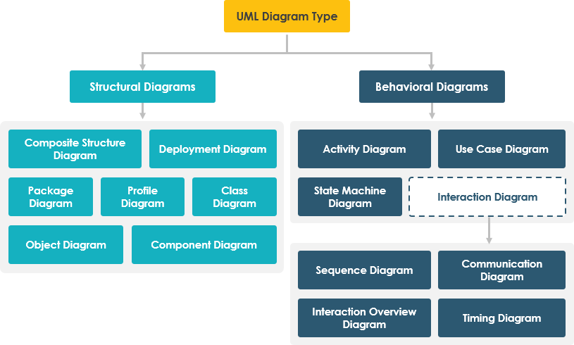
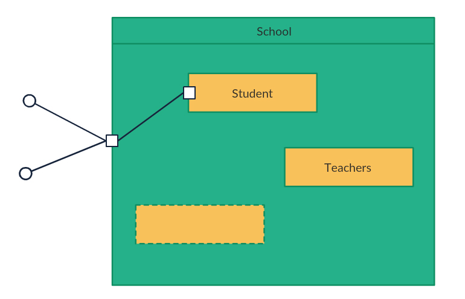
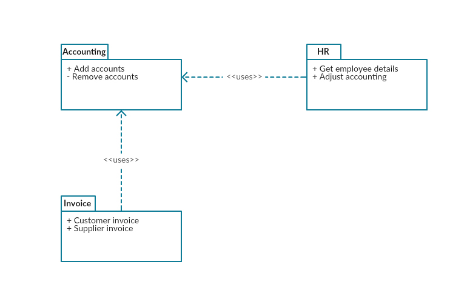
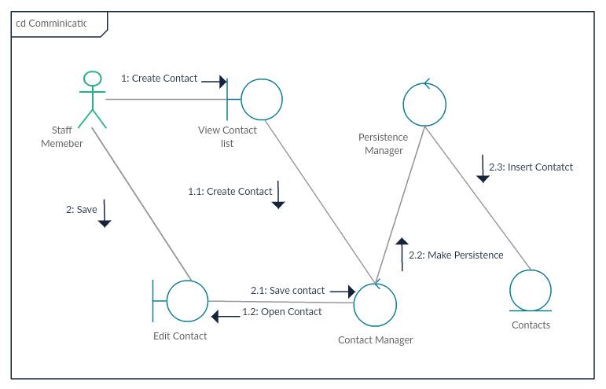

# Software Analysis and Design

## Introduction to UML. Tools

<div style="text-align: right">
<a target="_blank" href="slides/04b.html"></a>&nbsp;&nbsp;
<a target="_blank" href="04b.pdf"></a>
</div>

In the analysis stage of software development, we must end up with a clear understanding of what the application should do. To help us achieve this, we can use various graphical representations or diagrams. In this section, we will focus on **UML**, which is part of a traditional methodology called RUP, but can also be used in many other methodologies. There are many types of diagrams in UML, so we will focus on some to get a comprehensive overview of our application.

### 1. Introduction to UML

UML (*Unified Modeling Language*) is a standard modeling language that helps developers specify, visualize, build, and document software applications. Additionally, UML allows us to scale these applications, making them more secure and robust. It was initially created to apply the object-oriented paradigm to software analysis and design by combining several existing modeling languages. UML 1.1 was first published in 1997. [The current version](https://www.omg.org/spec/UML/) as of 2017 is UML 2.5.1. 

This modeling language includes two main types of diagrams: **structural** diagrams and **behavioral** diagrams, each containing its own subset of diagrams.

<div align="center">
    
</div>

Next, we will provide an overview of these diagrams. The images have been sourced from [this website](https://creately.com/blog/diagrams/uml-diagram-types-examples).

#### 1.1. Structural Diagrams

These diagrams depict the static structure of the system.

* **Class diagram**: This is the primary diagram for building object-oriented applications. It shows each class of the application along with its attributes, methods, and relationships.

<div align="center">
    
</div>

* **Composite structure diagram**: This diagram displays the internal structure of a class.

<div align="center">
    
</div>

* **Component diagram**: It shows the structural relationships among the system's components. This is particularly useful in complex systems with many components.

<div align="center">
    
</div>
  
* **Deployment diagram**: This diagram illustrates the hardware and software of the system and how the software is distributed across the hardware. It is commonly used in systems where the software is distributed over multiple hardware components.

<div align="center">
    
</div>

* **Object diagram**: Similar to a class diagram, but it represents objects with example data.

<div align="center">
    
</div>

* **Package diagram**: It shows the dependencies among the system’s different packages.

<div align="center">
    
</div>

* **Profile diagram**: This diagram allows us to specify stereotypes and tagged values to adapt the system to specific platforms (e.g., Java or .NET) or domains (e.g., a medical application).

<div align="center">
    
</div>

#### 1.2. Behavioral Diagrams

These diagrams depict the dynamic behavior of the system’s objects.

* **Activity diagram**: It shows the control flow of a specific method or component.
    
<div align="center">
    
</div>

* **Interaction diagrams**: Several types of diagrams fall under this category:

    **Sequence diagram**: It shows the interaction between system objects and the sequence of those interactions.

    <div align="center">
        
    </div>

    **Communication diagram**: In UML 1, these were called *collaboration diagrams*. It is similar to the sequence diagram but focuses on the messages exchanged between objects.

    <div align="center">
        
    </div>

     **Interaction overview diagram**: Similar to the activity diagram, but it shows the sequence of interactions.

    <div align="center">
        
    </div>

     **Timing diagram**: Similar to the sequence diagram, but it shows the behavior of components at a specific moment in time.

    <div align="center">
        
    </div>

* **State machine diagram**: This diagram is similar to the activity diagram but uses different notation and is often used to describe the behavior of objects that act differently depending on their current state.

<div align="center">
    
</div>

* **Use case diagram**: The most popular behavioral diagram. It provides a general overview of the system’s actors and the tasks each can perform.

<div align="center">
    
</div>

### 2. UML Tools

There are many tools available for creating UML diagrams. In this chapter, we will focus on a couple of them, providing basic steps and instructions for creating a simple diagram, such as a use case diagram.

#### 2.1. Modelio

Modelio is an open-source tool for creating a wide variety of diagrams, including UML diagrams. It can be downloaded from its [official website](https://www.modelio.org/) and is available for the three main platforms (Windows, Linux, and macOS), although there are some issues with macOS that we will discuss.

If installing it on **Windows**, simply run the *.exe* file, and a step-by-step wizard will guide you through the installation process.

For **Linux** (e.g., Ubuntu), you first need to install some dependencies using the *Synaptic* package manager (found in the *System Tools* section). Ensure the following packages (and all their dependencies) are installed:

* `libwebkitgtk-1.0.0`
* `libwebkitgtk-3.0.0`

<div align="center">
    
</div>

Then, download the *.deb* file from the official website and run the following command in the terminal (from the folder where the file was downloaded):

```
sudo dpkg -i <deb_file_name>
```

where `<deb_file_name>` is the full file name (e.g., `modelio-open-source_4.1.0_ubuntu_amd64.deb`).

On **macOS**, Modelio requires Java JDK 8 to run. Since Java 8 is becoming obsolete, we won’t explain how to resolve this issue as it is somewhat complex. Instead, we will use another tool for macOS.

Once installed, you can launch Modelio. This is the welcome screen:

<div align="center">
    
</div>

To start using Modelio, create a new project (*File > Create a project*) and give it a name.

<div align="center">
    
</div>

After creating the project, you will see it listed in the left panel. Right-click on the inner package to choose *Create diagram*.

<div align="center">
    
</div>

A dialog with a list of diagram types will appear:

<div align="center">
    
</div>

Select *Use case diagram

*, give it a name, and a blank diagram will be created. You can select elements (left-click) from the left panel (actors, use cases, connections) and place them in the main drawing area. Right-clicking on any element allows you to modify its attributes, such as renaming it.

<div align="center">
    
</div>

Once the diagram is created, you can save it or export it as an image file by clicking the *Save diagram in a file* button in the toolbar above the drawing area.

<div align="center">
    
</div>

#### 2.2. Visual Paradigm (Online)

Visual Paradigm is a commercial tool that offers a free community version and an online version that does not require installation. You can download the [free community edition](https://www.visual-paradigm.com/download/community.jsp) or try the [online version](https://online.visual-paradigm.com/). We will focus on the online version, which requires signing up before use.

Once signed up and logged in, you can choose between creating a diagram or a form (select *diagram*).

<div align="center">
    
</div>

Next, select the type of diagram to create. In this case, we will choose a *Use case diagram* from either the left list of diagrams or the large icons in the middle of the page.

<div align="center">
    
</div>

Now, begin drawing the diagram by clicking on the desired components in the left panel and dragging them to the main area. You can rename elements by clicking on them and typing the new name.

<div align="center">
    
</div>

You can export the diagram as an image file from the *File > Export* menu, or save it for later modification from the *File > Save* menu. In the latter case, you can save it to various locations, such as Google Drive or a local device.

<div align="center">
    
</div>

#### 2.3. Other Tools

There are several other tools available for creating UML diagrams, such as:

* **StarUML**: A commercial tool with a free evaluation version that has no time limit. You can get it [here](http://staruml.io/).
* **Dia**: A general-purpose diagram tool that includes UML support. You can get it [here](http://dia-installer.de/).
* **Draw.io**: An online diagram editor that supports various types of diagrams. You can try it [here](https://www.draw.io/).
