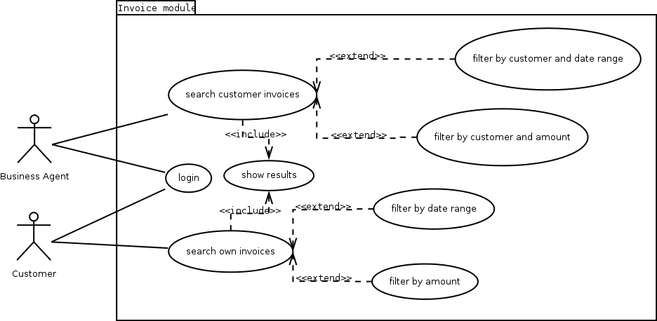

# Software analysis and design

## Use case diagrams - Exercise solutions

> **Exercise 1:**
> 
> Design the use case diagram for the following system requirements specification.
>
> *A customer asks us to develop a software for a snack vending machine. This machine has a two digit code for each product, and it has five shelves with eight products on each shelf. In the first shelf, products are numbered from 11 to 18, in the second shelf numbers go from 21 to 28 and so on. We must take into account that the machine will not accept the money until the user chooses the product first. The user can cancel the operation at any time before pressing the confirmation button, then his money will be returned. After pressing this button, the machine will move a spiral for the chosen product until it falls to the bottom of the machine, so that it can be taken by the user. Then, the user will be able to take his change back, if necessary.*

> *Solution:*

    

Keep in mind that:

* We can't show the sequence of use cases in a use case diagram, so we can't determine which operation comes first (insert money, choose product...). This must be done in other diagrams, such as activity or sequence diagrams.
* There is some information in the text that is useless for the use case diagram. For instance, we can't reflect that products have a two digit code from 11 to 58.

> **Exercise 2:** 
> 
> Design a use case diagram for this system requirements specification.
>
> *We want to implement an App to solve Sudokus. In order to start a game, the user must choose the "Start Game" option, and then he will choose the difficulty level. Once it is chosen, the game starts. Then, the user will iteratively choose an empty cell, and place a number from 1 to 9, until it completes the Sudoku. During the game, the user can press the "Check" button in order to check if he has solved the Sudoku, or if he has made any mistake. The app will show the message "Everything is OK, you have X cells left", or "Error in highlighted cells". In this last case, the cells with wrong numbers will be highlighted. Once the Sudoku is solved, the system will show the message "Well done!", and the user will see his stats and total time employed.*

> *Solution:*

    

> **Exercise 3:** 
> 
> Design a use case diagram adapted to the following system requirements specification.
>
> *We want to design an invoice checking module. This module can be accessed either by customers or by business agents, by logging in with their credentials (user and password). When a customer logs in the module, he will be able to search his own invoices, either by date range or by amount. In case a business agent logs in the system, he will be able to search for his customer's invoices, or by customer and date range, or by customer and amount. Once the search is completed, the module will show in the screen the results.*

> *Solution:*

    

An alternative solution:

    

> **Exercise 4:** 
> 
> Design a use case diagram for the following specification.
> 
> *A cultural organization is focused on the loan of two type of objects: music discs and books. We need an application that lets us add new objects to the system from both types. Besides, there are many users that come to this organization. They will need to log in with a user name and password. Then, they may be able to search any disc or book, either by object type (disk/book) and/or by object name (title). Once the object is chosen, they can ask for it if it is not available. Users can have up to 5 objects on loan simultaneously. As this organization is settled in a small town, we don't expect to have many users asking for books or disks at the same time, so we just need a single computer and a small database to store the information. In case a user does not remember his password, the system will send it by email to the same account that he entered when he registered.*

> *Solution:*

    

