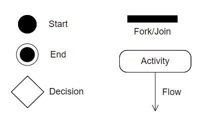
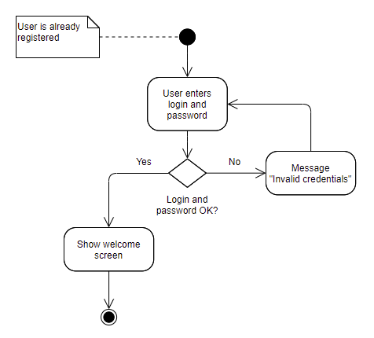

# Software analysis and design

## Activity diagrams

&nbsp;&nbsp;

Once the system requirements have been set, it's time to start modeling the application. In this stage we can use some graphical representations, such as UML diagrams. The first step would be to create a use case diagram from those requirements, and next, we could expand each use case using an activity diagram.

A flow diagram is a graphical representation of a given process. Each step of the process is represented by a symbol which has a short description. Symbols are linked by arrows that show the process flow. This method has been used since 1930 in industrial engineering, and it was also adapted by Goldstine and Von Neumann to computer engineering, in 1947. It has evolved in recent years to the UML activity diagram.

### 1. Components of an activity diagram

The main components of an activity diagram are:

    

* **Activities or Actions**: a step in the process. It is represented by a **rectangle** that may have rounded corners.
* **Decision node**: a bifurcation given by a condition. It is represented by a **diamond**. If both branches converge later in the process, then this merge is also represented by a diamond.
* **Control flows**: they connect the different steps of the diagram. We use **arrows** for this purpose.
* **Initial node**: it represents the beginning of the process. It is represented by a **black circle**.
* When some tasks happen **simultaneously**, we use a **bar**. If it generates two different flows, then it is a *fork*, and when it joins two different flows in one single flow, then it is a *join*.
* **Final node**: it represents the end of the process. It is represented by a **black circle within a circle**.
* There are some additional symbols, such as *notes*, that let us add some additional information that do not fit in any particular symbol of the diagram.

### 2. Examples

#### Validate user and password

    

First of all, there is a note explaining that the user must be previously registered before trying to validate himself/herself. Then, the logic of this process is as follows:

1. We ask the user to type his/her user and password
2. We validate if they are correct or not
    * If they are not correct, we prompt an error message and go back to step 1
    * Otherwise
        * We show an "ok" message
        * We show user data

#### Library management

    

This example shows the logic of searching and asking for a book in a library.

1. We search the book that we want
2. We check if it is available
3. If it is not available
    *  We show a message of "not available"
    *  End of the process
4. If it is available
    *  We check if the user is a member of the library
    *  If he is not a member
       *  We show a message of "not available"
       *  End of the process
    * If he is a member
       * We check if the user has more books on loan than allowed
       * If he has
          * We show a message indicating the excess of books on loan
          * End of the proess
       * If he still can loan the book
          * We register the loan with the information about the user and the book
          * We update the status of the book
          * End of the process
  
#### Orders

    

> **Exercise 1:**
> 
> Analyze the example of *Orders* shown above, and write the explanation of this diagram following the same pattern than in previous examples.

> **Exercise 2:**
> 
> Create an activity diagram for the following simple programs: 
>
> 1. A program that asks the user to enter a number and then tells if it is even or odd.
> 2. A program that iteratively asks the user to enter a number until he types an odd number.
> 3. A program that iteratively asks the user to enter a number until he types 0. Then, it will show the total amount of positive and negative numbers that the user has typed.
> 4. A program that asks the user to enter his username and password. If they are not correct, the program must ask again, up to 3 times. After the 3rd attempt, the program will show an error message and then, it will finish.

> **Exercise 3:**
> 
> Create the activity diagram of any use case from exercise about the cultural organization of previous section.
