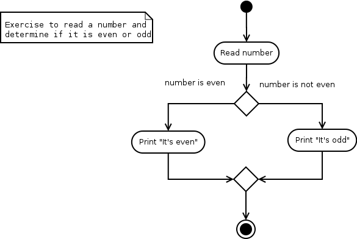
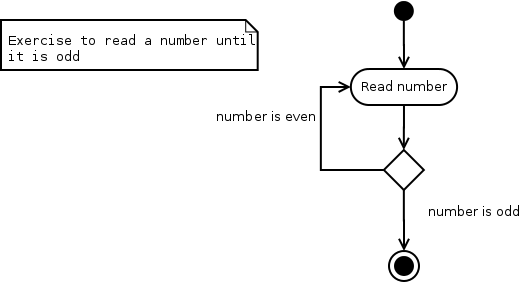
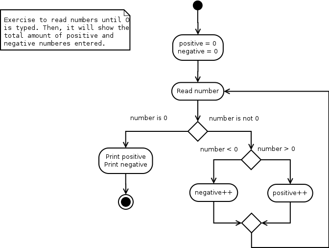
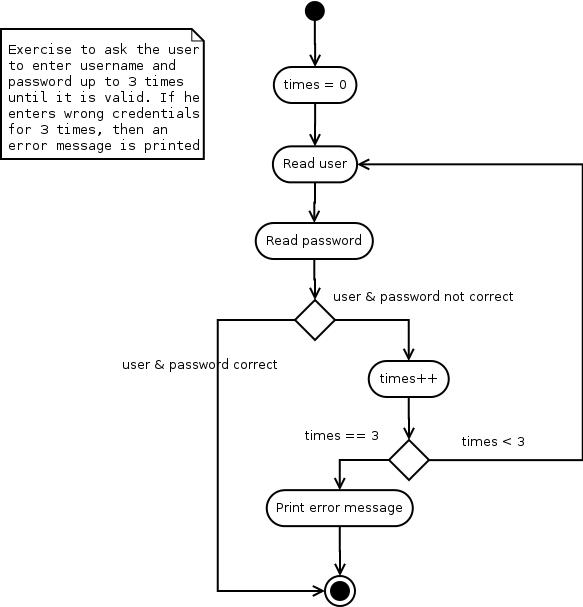
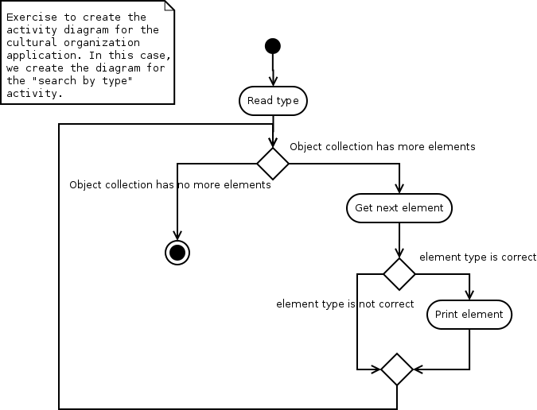

# Software analysis and design

## Activity diagrams - Exercise solutions
 
> **Exercise 1:** 
> 
> Analyze the example of *Orders* shown above, and write the explanation of this diagram following the same pattern than in previous examples.

> *Solution:*

In this example, we are dealing with an order from a customer. Once the order is received, the flow control forks, and the system performs two tasks simultaneously:

* From one branch, the order is filled and, depending on the order type (express or normal) it will require an express or normal delivery.
* From the other branch, an invoice is sent to the customer, and the corresponding payment is received.

> **Exercise 2:**
> 
> Create an activity diagram for the following simple programs: 

> 1. A program that asks the user to enter a number and then tells if it is even or odd.

> *Solution:*

    

> 2. A program that iteratively asks the user to enter a number until he types an odd number.

> *Solution:*

    

> 3. A program that iteratively asks the user to enter a number until he types 0. Then, it will show the total amount of positive and negative numbers that the user has typed.

> *Solution:*

    

> 4. A program that asks the user to enter his username and password. If they are not correct, the program must ask again, up to 3 times. After the 3rd attempt, the program will show an error message and then, it will finish.

> *Solution:*

    

> **Exercise 3:**
> 
> Create the activity diagram of any use case from exercise about the cultural organization of previous section.

> *Solution:*

We can create the diagram for the "search by type" activity, for instance:

    

