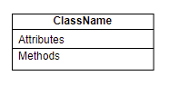
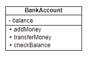
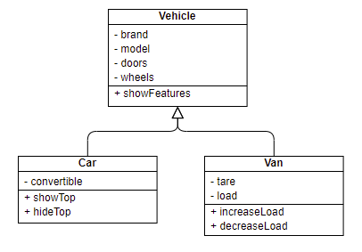
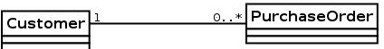
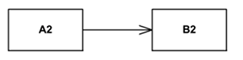
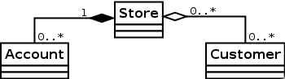
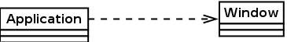
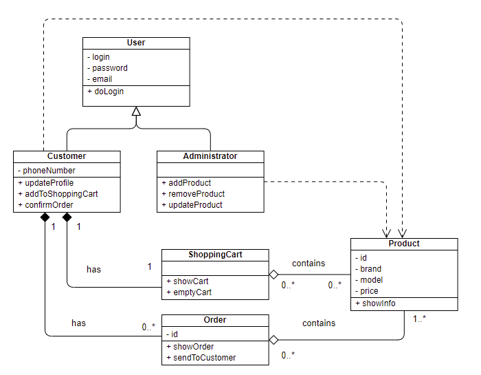

# Software analysis and design

## Class diagrams

&nbsp;&nbsp;

A class diagram is a graphical representation of the relationships between the classes of a software project. But, before going on, we need to clarify what a class is, and how to identify them in the system that we are going to develop.

### 1. Introduction to classes and objects

Let's suppose that we are going to implement an application for an online shop. This shop will have some *customers* registered, and will sell a list of *products*. So each customer can have his/her own *shopping cart*, make *orders* and so on.

We could define a use case diagram to specify the main functionalities of this application: customer can register, login, add products to his/her shopping cart, make orders... We could also have employees or administrators, who would be in charge of adding products to the shop catalog, and so on. But the purpose of the class diagram is different (and both diagram can be present in the analysis of the system). 

With a class diagram, we focus on the different types of elements that are involved in the application that we are going to develop. If we think about that, we can see that our application has customers, products, shopping carts, orders... These elements will be the **classes** of our application. 

From each element we need to store some essential information. For instance, for the customers we may need to store their login, password, e-mail... From each product, we need its identifier, brand, model, price... All these things are the **attributes** for each class.

When the application is running, there may be a real customer with login *john123*, password *johnny111*, and e-mail *john@gmail.com*. These specific data makes an **object** for the *customer* class. So an object is a specific instance of a class, with concrete information. There can be many objects of a class at the same time in the program (in our case, for instance, many customers of the shop entering at the same time).

As an object of our application needs to do something, we need to provide some additional functionality to this object. For instance, customers need to login, add products to their shopping carts... These operations are called **methods**.

Finally, the objects of the different classes can be connected between them. For instance, a shopping cart belongs to a given customer, and it contains one or more products of the shop. This way, we establish **relationships** among the different elements of the application.

### 2. Representing classes in a class diagram

Now, let's see how to represent classes in a class diagram. The class is the basic element of the diagram, and it includes all the information about a given class, so that every object that is created from this class will have this information and functionality.

    

In the upper part we will place the class name. Below this part, we will specify the attributes (also called *instance variables*) of the class. And last, in the lower part, we will add the methods that let the objects do some operations, or interact with other objects.

Let's see an example of a *BankAccount* class with some attributes and methods:

    

This class represents a bank account with an attribute called *balance* that stores the current amount of money that is available in the account. Besides, the class can do some operations: add money, transfer money or check the balance. 

**Access modifiers**

If we pay attention to the attributes and methods in previous example, we can see that they are preceded by a strange symbol. This symbol represents the **visibility** of the attribute or method. There are two main types of visibility:

* **public (+)**: it can be accessed from any other class.
* **private (-)**: it can only be accessed from within current class, and can only be used by current class' methods.

In previous example, *balance* attribute is private, so we can only access it from *BankAccount* class. This is very usual regarding attributes, so we can make sure that no other class will modify their values in a wrong way. Regarding the methods, they are public, which is also usual, because this way we can *invoke* this functionality from any other part of the program. So, to sum up, in general, attributes will be private, and methods will be public.

### 3. Relationships in a class diagram

Now that we know what a class is, let's see how we can establish relationships between different classes. We are going to talk about the three main types of relationships: generalizations, associations and dependency.

#### 3.1. Generalization

This relationship, also called inheritance, establishes that a given class called **subclass** or **child class** inherits the attributes and methods of another class also called **superclass** or **parent class**. Besides, subclass can also have its own attributes and methods.

    

In this example, we can see that classes `Car` and `Van` inherit from `Vehicle` parent class. `Car` class has all the features inherited from `Vehicle` (brand, model, doors, wheels... and also the methods) and an additional attribute *convertible*. Regarding `Van` class, it also inherits all the attributes from `Vehicle`, and adds its own new attributes *tare* and *load*.

So generalization lets us define subtypes of a given class, so that we don't need to specify again all the elements of parent class in this new class, just the new specific features of this subtype.

> **Exercise 1:**
> 
> Represent in a class diagram the following specification:
> 
> We must represent the main features and classes of ships. As attributes, we need to store the **name**, the number of **anchors**, the **material** with which it is built (wood, metal, fiberglass...) and its **length** (in metres). We are going to focus on four ship types:
> 
> * **Container ship**, for which we must also store its capacity in **TEU**, a unit of measurement which is equivalent to one container.
> * **Bulk carrier**, for which we need to know the number of load **hatches** (it is usually an odd number).
> * **Tanker**, for which we need to know if it has **double helmet** or not, and its **capacity** in tons.
> * **Fishing boat**, for which we will store the **type of fishing** (commercial, artisan or sport).

> **Exercise 2:**
> 
> Represent the following specification in a class diagram:
> 
> Let's suppose that we want to develop a video game, and we need to think about the characters of this videogame. We are going to define a **Character** class, that will have some attributes such as the **age**, **height**, **genre** and **life level**. Depending on the role of this character in the game, it can be:
> 
> * **Soldier**, whose additional attribute will be the **weapon** that he will be carrying (sword, bow...). There are two main types of soldiers:
>   * **Bowman**, whose additional attributes will be the **movement type** and the **damage** caused.
>   * **Knight**, with a **movement type**, **damage** caused and life level of its **horse**.
> * **Citizen**, whose single additional attribute will be his **tool** (hammer, hoe...).
>   * **Farmer**, whose additional properties will be the **movement type**, the **job** (gather, plant...) and the **work level**, that will indicate how much it will take to finish a task.
>   * **Miner**, whose properties will be the **movement type**, the **job** to be done (chop, demolish, extract...), and the **fatigue level**, that will tell us when he will be exhausted.

#### 3.2. Association

This relationship lets us link two classes that collaborate between them, so that an object of a class has an object (or some objects) of the other class. Related to this concept, we need to talk about the concept of **cardinality** of an association. Cardinality sets the dependency level of two classes, this is, how many objects of one class can be associated with one object of the other class. This must be indicated at both sides of the relationship. It can be: 

* **One to many**: specified as `1..*` or `(1..n)`
* **Zero to many**: `0..*` or `(0..n)`
* **Fixed number**: `m` (m is a given number)

In general, association is not a strong relationship, this is, the lifetime of one side does not depend on the other side. Let's see an example:

    

In this example we can see a **Customer** class that has many **Purchase orders** (or none). A purchase order can only be associated to one customer.

There can be an arrow at one of the edges of the association. In this case, the arrow indicates the **navigability** of the association. It indicates that we can only get the objects of the edge pointed by the arrow from the other edge (but not the opposite).

    

In the image above, class B2 is *navigable* from class A2, so we can access B2 object(s) contained in A2 class, but we can't get A2 elements present in B2. If the arrow is not present, then navigability is not specified: we can either navigate both sides of the association.

##### 3.2.1. Aggregation and composition

There are two special types of associations in which one class is a whole which contains the other class.

A **composition** is a special type of association in which the lifetime of an object depends on another object that includes it (there is a *strong* relationship between them). In other words, if we delete the main object that includes the other one, then the included object is also deleted. It is represented by a black diamond next to the main including class.

An **aggregation** is a special type of association in which an object is part of the other object (as composition is), but its lifetime does not depend on the main containing object (it is a *weaker* relationship). It is represented by an empty diamond next to the main including class.

    

In this example we can see a **Store** that has **Customers** and **Accounts**. The diamonds are next to the main containing class (*Store*), and there is a composition with the **Account** class (so, if the store is deleted, its accounts will also be deleted), and an aggregation with the **Customer** class (so that customers will not be deleted, and can be linked to other stores).

#### 3.3. Dependency, instantiation or usage

This is a usage relationship, this is, a class uses another class in some part of its code. This is the weakest relationship, and it is represented with a discontinuous arrow: , the direction of the arrow tells us which class is being used (the one pointed by the arrow).

    

This example shows how dependency works in a class diagram. **Application** class intantiates a **Window** object in some part of its code, so the instantiation of this object depends on the behaviour of the *Application* object.

### 4. A complete example

To finish with this section, let's see the complete class diagram of a simple online shop like the one that we introduced at the beginning of this document.

    

It has two types of users: customers and system administrators. Customers can have one current shopping cart and many orders. Every shopping cart or order is made of one or many products, and each product can belong to many different shopping carts or orders. Besides, both customers and administrators make use of *Product* objects in their code, since they need to add products to shopping carts, or to catalog, for instance.

Note that the relationship between *Customer* class and *ShoppingCart* or *Order* class is a composition: if customer is removed, the it makes no sense to store his/her shopping cart or orders. However, the relationship between *ShoppingCart* or *Order* and *Product* class is an aggregation: a shopping cart is composed by some products, but if we remove the shopping cart, the product can still be added to another shopping carts. The same happens with orders.

> **Exercise 3:**
> 
> Represent the following specification in a class diagram:
> 
> A blog has three types of users: administrators, editors and visitors. For all of them we will save their login and password. Administrators can register other users, editors can publish posts, and visitors can comment them. Besides, we will have an additional user type, called *author* which is a subtype of editor that can create and publish posts, but he must be always under the supervision of an editor.

> **Exercise 4:**
> 
> Represent the following specification in a class diagram:
> 
> A cultural organization is focused on the loan of two type of objects: music discs and books. For both of them we store some general information, such as the *id*, title and author. Regarding books, we also store the number of pages, and for music discs we are interested in the record company. There are many users that come to this organization, for whom we store its *id* (DNI) and name. They can ask for books and music discs (up to 5 objects simultaneously), for which we will store the start and end date.

