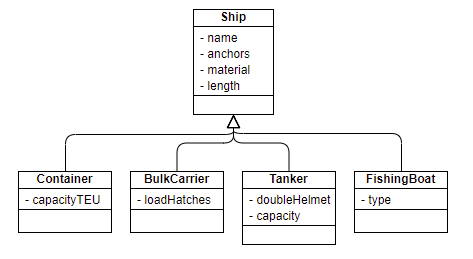
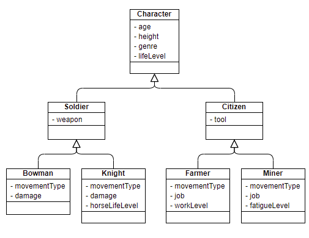
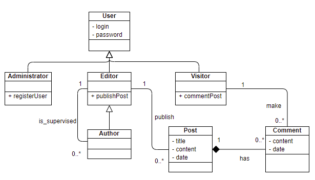
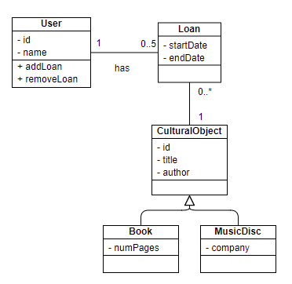

# Software analysis and design

## Class diagrams - Exercise solutions

> **Exercise 1:**
> 
> Represent in a class diagram the following specification:
> 
> We must represent the main features and classes of ships. As attributes, we need to store the **name**, the number of **anchors**, the **material** with which it is built (wood, metal, fiberglass...) and its **length** (in metres). We are going to focus on four ship types:
> 
> * **Container ship**, for which we must also store its capacity in **TEU**, a unit of measurement which is equivalent to one container.
> * **Bulk carrier**, for which we need to know the number of load **hatches** (it is usually an odd number).
> * **Tanker**, for which we need to know if it has **double helmet** or not, and its **capacity** in tons.
> * **Fishing boat**, for which we will store the **type of fishing** (commercial, artisan or sport).

> *Solution:*

    

> **Exercise 2:**
> 
> Represent the following specification in a class diagram:
> 
> Let's suppose that we want to develop a video game, and we need to think about the characters of this videogame. We are going to define a **Character** class, that will have some attributes such as the **age**, **height**, **genre** and **life level**. Depending on the role of this character in the game, it can be:
> 
> * **Soldier**, whose additional attribute will be the **weapon** that he will be carrying (sword, bow...). There are two main types of soldiers:
>   * **Bowman**, whose additional attributes will be the **movement type** and the **damage** caused.
>   * **Knight**, with a **movement type**, **damage** caused and life level of its **horse**.
> * **Citizen**, whose single additional attribute will be his **tool** (hammer, hoe...).
>   * **Farmer**, whose additional properties will be the **movement type**, the **job** (gather, plant...) and the **work level**, that will indicate how much it will take to finish a task.
>   * **Miner**, whose properties will be the **movement type**, the **job** to be done (chop, demolish, extract...), and the **fatigue level**, that will tell us when he will be exhausted.

> *Solution:*

    

Regarding this diagram, we could make some changes on it:

* Every final subtype of character (bowmans, knights, farmers and miners) have a common attribute, which is *movementType*, so we could move this attribute to top, parent class *Character*, unless we think that, in the future, there may be some additional character types without this attribute.
* Every subtype of soldier has a *damage* attribute, and every subtype of citizen has a *job* attribute. We could move these attributes to their respective parent classes (*Soldier* and *Citizen*), unless we think that there may be more character subtypes in the future without this information.

> **Exercise 3:**
> 
> Represent the following specification in a class diagram:
> 
> A blog has three types of users: administrators, editors and visitors. For all of them we will save their login and password. Administrators can register other users, editors can publish posts, and visitors can comment them. Besides, we will have an additional user type, called *author* which is a subtype of editor that can create and publish posts, but he must be always under the supervision of an editor.

> *Solution:*

    

Regarding this diagram, from the text we should be able to extract the different types of users (administrators, editors, visitors and authors), and also the posts and comments that are involved in the blog. Regarding the attributes of these two classes, they are not mentioned in the text, but it's easy to find out a couple of them.

> **Exercise 4:**
> 
> Represent the following specification in a class diagram:
> 
> A cultural organization is focused on the loan of two type of objects: music discs and books. For both of them we store some general information, such as the *id*, title and author. Regarding books, we also store the number of pages, and for music discs we are interested in the record company. There are many users that come to this organization, for whom we store its *id* (DNI) and name. They can ask for books and music discs (up to 5 objects simultaneously), for which we will store the start and end date.

> *Solution:*

    

