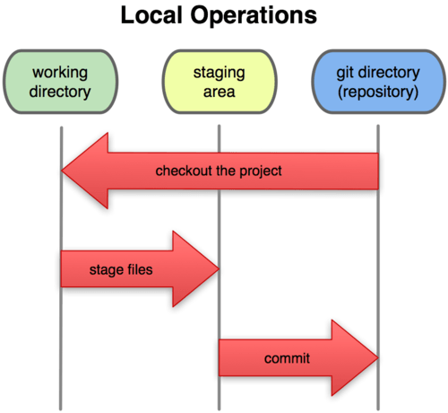

# Version control tools

## Introduction to VCS

&nbsp;&nbsp;

### 1. Version control systems

Version control systems (VCS) are tools that can register any change in any file or set of files over time, so that we can easily recover any older version. They can be used not only with source files, but also with any other file type.

A VCS lets us revert the state of any file or even of a whole project, and compare files over time, determine who changed the file at a given timestamp and much more. Besides, if any file gets damaged or lost, we can just go back to a previous version in history and recover it again.

#### 1.1. VCS types: Local VCS

VCS can be used either online or in local mode. This last mode is particularly useful because we can easily create a backup of a project and store it locally, so that we can restore it later if we need to (in case of an error, for instance) and go back to a stable version.

The main advantage of this is its simplicity, and the main drawback is that we must manage the version control manually, so we may make some mistakes in this process. For instance, we must forget that we are in the wrong folder, and then modify the backup file instead of the current one.

In order to face these problems, there are some interesting tools that help us manage the files and changes. One of the most popular ones is a system called *rcs*, which can still be found in many computers. This tool basically stores a set of patches or differences between files from one version to the next one. These changes are stored in a special file type, and then the system can recover any previous state of any file, by adding or substracting the corresponding patches.

	

#### 1.2. VCS types: Centralized VCS

Local VCS are not suitable when we need to collaborate with other team members. To solve this problem, there are also centralized VCS (CVCS). These systems are installed in a single server that contains all the files and their different versions. Then, many clients can connect to this server and download/upload changes to these files. This second way of controlling versions was a standard for many years, since it had a great advantages over the local CVS systems, but its main drawback is that, if server fails, we could lose the whole project.

	

#### 1.3. VCS types: Distributed VCS

Distributed VCS (DVCS) emerged to solve the main drawback of CVCS. In a DVCS (such as Git, Mercurial, Bazaar or Darcs), clients not only connect to the server, but also download the whole repository. So, if a server fails, any of the local repositories of the clients can be copied to the server again, and the project can be restored. Everytime we download anything from the repository, we are in fact making a complete backup of the data.

	

### 2. Git

*Git* was developed by the Linux team once they broke up the relationship with *BitKeeper*, the tool that they used for version control before. From the lacks seen in this tool, they decided some of the main targets of the new system to be developed:

* Speed
* Easy design
* Strong support to non-lineal development (thousands of parallel branches)
* Completely distributed
* Suitable for big projects (such as Linux core)
* Efficiency (in terms of speed and data size)

From its birth in 2005, Git has evolved and it has become more and more easy to use. It is really fast and efficient with big projects, and has an outstanding branching system.

#### 2.1. Git foundamentals

Let's see some of the basic concepts regarding Git version control system.

**Data modeling**

Git stores some kind of snapshot set of its file system, instead of storing a list of changes. Everytime we upload a new change, it basically takes a photo of every file at that moment, and stores a reference to this snapshot. If the file has not been modified, then Git does not save a copy of it, just a link to previous, identical version.

	

This is an important difference between Git and almost every other VCS, and it makes Git reconsider these aspects from previous generations of VCS. So it looks more like a small file system with some useful tools, rather than a VCS.

**Local work**

Most of Git functions just need local files and resources to work. As the project history is stored locally, many operations are immediate, and it lets us work in a project even if we are not connected to the Internet. Changes are stored locally and, as soon as we have a connection, the external repository can be updated.

**Integrity**

Git uses *hash* SHA-1 algorithm to store the information, so data is always verified and, in case it is changed, Git would notice.

**It only adds information**

Every Git operation consists in adding some information, so everything can be easily undone (information is not erased). After confirming a snapshot, information is stored safely.

**Project states**

Git has three main states in which every file of a project can be:

* **Modified**: data has been changed locally, but it has not been committed yet.
* **Staged**: data has been tagged to be sent in next commit.
* **Committed**: data is safely stored in a local storage

Therefore, there are three sections in Git:

* **Git directory**: where Git stores the metadata and the database of the elements of the project. This part is what we copy when we clone the repository from other computer.
* **Working directory**: it is a copy of a project version. These files are extracted from the Git database and placed in a folder, ready to be used.
* **Staging area**: it is a simple file stored in Git directory that contains information about the files that will be sent in next commit. It is also called *index*.

	

