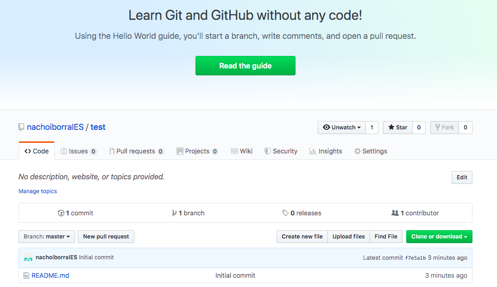

# Version control tools

## Basic GitHub management

&nbsp;&nbsp;

GitHub is an online tool that lets us manage projects using version control through Git. So we can make use of a DVCS, which is Git, and its source code management. Besides, GitHub provides some additional functionalities, such as access control, collaborative work, continuous integration, hosting for static web pages...

There are some alternatives to GitHub, such as BitBucket, or GitLab, but nowadays GitHub is the most popular one.

### 1. Signing up and first steps

In order to use this platform, we must go to the [official web site](https://github.com/) and sign up using the *Sign Up* button in the upper right corner. Once we sign up, we can see our main page:

    

We can distinguish some important areas in this main page:

* On the left we can see the list of our repositories. At the beginning this list will be empty. We will see now what a repository is, and how to create them.
* In the middle there's a list of your recent activity. Every last change that you've made to your repositories will be published here.
* In the upper bar there are some links and menus that can be useful: 
   * The icon in the top left will send you to this home page.
   * The link with the **+** symbol lets you add new elements to your account: repositories, organizations...
   * The last icon in the top right section is your profile, from which you can manage your personal information, repositories, organizations created, personal settings and so on.

### 2. Repositories

A VCS is normally used for storing projects that can be developed by many people. Either if we develop the project on our own or with other people, we may need to have a remote copy of it, so that we can restore it if there are any problems with our local copy. To do this, we need to have a repository where our remote copy will be stored.

We can create our repository in [GitHub](https://github.com), [Bitbucket](https://bitbucket.org/product) or other platforms. In this case, we are going to use GitHub, which is the most popular one. Besides, it lets us create both public and private repositories. Public repositories can be seen by anyone, but only allowed people can make changes to both public and private repositories.

If we want to create a GitHub repository (as long as we have already signed up), we must click on the *New* button on the upper left corner (or through the **+** link in the upper right, choosing *New repository* then), and specify the repository name and some of its general settings: if we want it to be public or private, and if we want to add an initial `README` file (recommended).

	

If we click on the repository name in the left panel of the main view, we can enter this repository. From this page we can, for instance, clone or download the repository, or see the commit history.

	

If we click on the *Settings* link, we can change some settings. From this page, we can add collaborators from the *Collaborators* menu on the left (this is, other GitHub users) to our project, so that they can also make changes on it. We can also delete the repository, or change its visibility (public/private).

	

#### 2.1. Adding contents manually

From the GitHub tool we can add or edit the files in our projet (although this is not the recommended way). For instance, if we have created the project with a `README.md` file, we can click on this file and open it. Then, we can click on the pencil tool to edit the contents.

    

Also, we can add new files to the repository from its main page, clicking on the *Add file* button.

    

Next, we need to specify the new file's name, along with the folders and subfolders where it will be placed (we can specify as many folders and subfolders as we want, separated by `/`, and they will be automatically created).

    

> **Exercise 1:**
> 
> Sign up in GitHub if you don't have an account yet. Then, create a new public repository called **MyFirstRepo**, with a README file. Next, do these steps:
> 
> * Edit `README.md` file and add this text: "This is my first repo"
> * Add a new file called `notes.md` and add some text about yourself: hobbies, interests... 
> 
> Remember to save changes after editing these files.