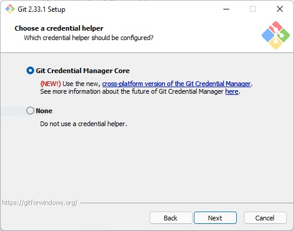
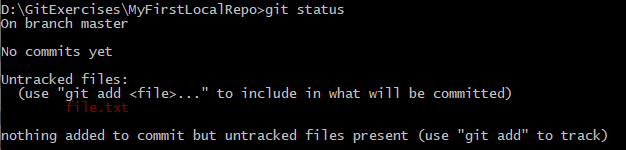
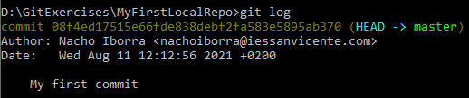

# Version Control Tools

## Using Git Commands

<div style="text-align: right">
<a target="_blank" href="slides/05c.html"></a>&nbsp;&nbsp;
<a target="_blank" href="05c.pdf"></a>
</div>

As discussed earlier, Git is a distributed version control system (DVCS) developed by the Linux team. It is widely used by various version control platforms, such as GitHub, BitBucket, and GitLab, for hosting projects remotely. To interact with these remote repositories from our local machine, we need to install Git and use its different commands. You can find a list of the most common Git commands in the [GitHub Git cheat sheet](https://education.github.com/git-cheat-sheet-education.pdf). This document will guide you through installing Git and using some basic commands.

### 1. Git Installation and Setup

Installing Git depends on the operating system.

* **Linux**: To install Git, simply run the appropriate command. For example, on Ubuntu, use:

    ```
    sudo apt-get install git
    ```


* **Windows and Mac**: Download the appropriate version from the [Git website](https://git-scm.com/downloads). On Mac, you can also install Git by installing Xcode. On windows


#### 1.1. Git Setup

Before using Git, it's necessary to configure some default settings to connect to servers and store credentials. The `git config` command is used to set these configurations at three levels:

* **System**: Using the `--system` option, the settings apply to all users on the system.
* **User**: With the `--global` option, the settings apply only to the current user. We'll use this option in this section.
* **Repository**: Specific to each repository, allowing unique settings per project.

Start by setting your full name with the command below (replace *John Doe* with your actual name):

```
git config --global user.name "John Doe"
``` 

Next, configure the email associated with your GitHub account:

```
git config --global user.email yourEmail@server.com
```

Optionally, specify a default text editor for Git. This is useful if Git needs to open a text file. For example, on Windows, you could use:

```
git config --global core.editor notepad
```

To avoid typing your credentials every time you connect to a repository, set up a credential helper. The general command is:

```
git config --global credential.helper <helper>
```

where `<helper>` depends on the operating system:

* **Windows**: Use `wincred`
* **Linux**: Use `cache`
* **Mac OSX**: Use `osxkeychain`

For GitHub, follow [these instructions](https://docs.github.com/en/get-started/getting-started-with-git/caching-your-github-credentials-in-git) to use the recommended **Git Credential Manager**, included by default with Git for Windows.

<div align="center">
    
</div>

Alternatively, to configure a different credential helper in Windows, you could run (Not recommeded):

```
git config --global credential.helper wincred
```

Now, Git is ready to use, even from different IDEs. To view the current configuration, use:

```
git config --list
```

To check the installed version of Git, use:

```
git version
```

### 2. Basic Local Git Commands

Here are some commands for working with local projects (without connecting to a remote repository). These commands are useful for both local projects and remote projects that have been downloaded for offline work.

#### 2.1. Creating a Local Repository

To initialize a new local repository, first create the project folder, then run:

```
git init
```

This initializes the folder as a Git repository by creating a hidden `.git` subfolder for the repository database. You don't need to worry about this subfolder.

Files in the repository will be in one of three states: committed, staged, or modified. You can change file states using various commands. To check the repository's status at any time, use:

```
git status
```

> **Exercise 1:**
> 
> Create a folder called **GitExercises** on your system. Inside, create a subfolder named **MyFirstLocalRepo**, navigate into this folder, and run `git init` to initialize it as a Git repository.

#### 2.2. Adding or Editing Files

After adding a new file to the repository folder (e.g., *file.txt*), run `git status`. Git will show that there are files to be added.

<div align="center">
    
</div>

To stage files, use `git add`. For a single file:

```
git add file.txt
```

To stage all changes at once, use:

```
git add .
```

Repeat the `git add` command after making changes. To unstage a file, use:

```
git rm --cached file.txt
```

#### 2.3. Committing Changes

After staging changes, commit them to the repository database with:

```
git commit -m "My first commit"
```

The `-m` option allows you to add a commit message, which is required for tracking changes.

Alternatively, use `-a` to stage and commit changes in one step:

```
git commit -a -m "Your commit message"
```

**Viewing Commit History**

To view the commit history, use:

```
git log
```

<div align="center">
    
</div>

Each commit has a unique label, which can be used to reference the commit later.

**Viewing Changes**

To see changes between versions, use:

* `git show`: Shows changes in the last commit
* `git show cb1fd6f8`: Shows changes in a specific commit
* `git diff`: Shows changes not yet committed

> **Exercise 2:**
> 
> Perform the following steps in *MyFirstLocalRepo*:
> 
> - Create a file named `file.txt` with the text "My first text file."
> - Stage the file with `git add .`
> - Commit the changes with the message "My first commit"
> - Edit `file.txt` and add a second line with your name
> - Stage and commit the changes with `git commit -a -m "My second commit"`
> - View the commit history using `git log`

#### 2.4. Undoing Changes

To revert to a previous commit, use `git reset`:

```
git reset --hard 0305afd
```

Replace *0305afd* with the commit label prefix.

#### 2.5. The *.gitignore* File

Add a `.gitignore` file to specify which files or folders to ignore. For example, to skip all `.exe` files:

```
*.exe
```

To skip multiple file types or folders:

```
node_modules/
*.exe
*.tmp
```

> **Note**: `.gitignore` does not exclude files already committed.

### 3. Working with Remote Repositories

Next, let's see how to connect to a remote GitHub repository to upload/download changes.

#### 3.1. Cloning Repositories

To clone a remote repository, use:

```
git clone https://github.com/username/repo-name
```

#### 3.2. Updating Local Repositories

To update your local repository with changes from the remote, use:

```
git pull
```

#### 3.3. Pushing Changes to Remote Repositories

To upload local changes, follow these steps:

1. Make changes
2. Stage changes with `git add .`
3. Commit with `git commit`
4. Push with `git push`

> **Exercise 3:**
> 
> Clone the *MyFirstRepo* repository. Then:
> 
> 1. Add a new file called *shopping_list.txt*
> 2. Push the file to the remote repository
> 3. Verify the file on GitHub
> 4. Clone the repository in another folder
> 5. Add a file called *to_do.txt* and push it
> 6. Pull the changes from the original *MyFirstRepo* folder to see the *to_do.txt* file.

