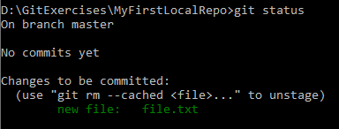
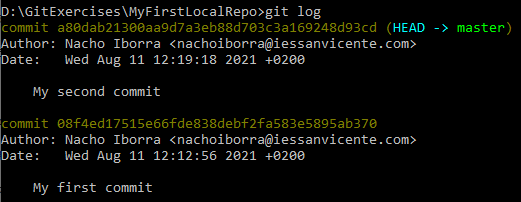
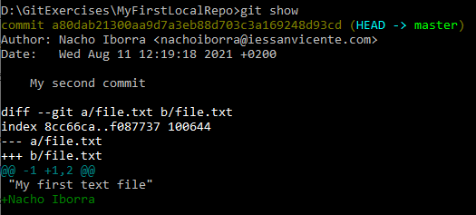
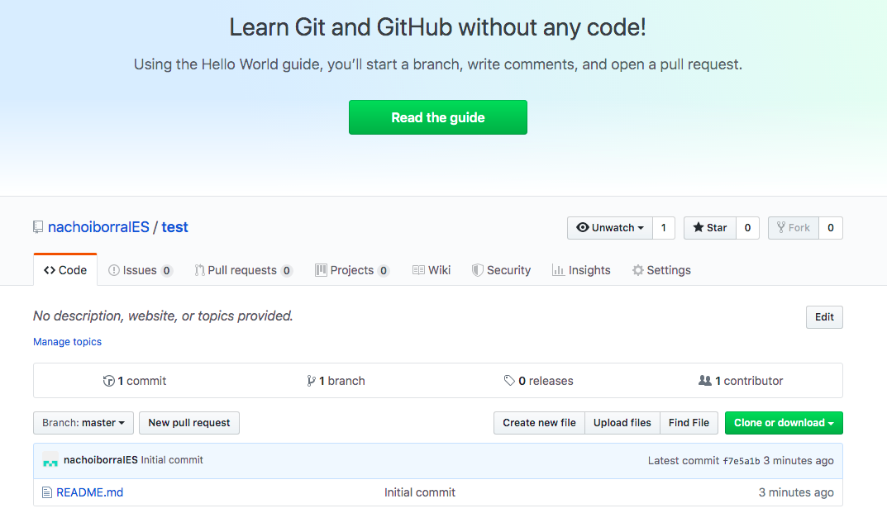

# Version control tools

## Using Git commands

<div style="text-align: right">
<a target="_blank" href="slides/05c.html"></a>&nbsp;&nbsp;
<a target="_blank" href="05c.pdf"></a>
</div>

As we have seen before, Git is a distributed version control system (DVCS) created by the Linux team. It is currently used by many version control servers, such as GitHub, BitBucket or GitLab, to store projects remotely. But, if we want to interact with these remote projects or repositories from our local machine, we need to install Git locally, and make use of the different commands provided by Git. A list of the most used git commands can be found [in the Github Git cheat sheet](https://education.github.com/git-cheat-sheet-education.pdf). In this document we'll learn how to install Git, and how to use some of the basic commands provided.

### 1. Git installation and setup

Git installation depends on the operating system in which we want to install it.

* For **Linux** systems, we just need to run the specified command to install Git. For instance, in Ubuntu systems we need to run this command:

```
sudo apt-get install git
```

* For **Windows** and **Mac**, we need to go to [Git web site](https://git-scm.com/downloads) and download the appropriate version. Regarding Mac, you can also install Git by installing XCode.

#### 1.1. Git setup

Before using Git commands, we should set up some default variables in our system, so that we can easily connect to server and store our credentials for later connections. We are going to use `git config` command to store these variables, and we can store them in three different levels:

* **System**: using `--system` parameter, the configuration applies to every user in our system.
* **User**: using `--global` parameter, the configuration applies only to current user in the system. This is the option that we are going to use in this section.
* **Repository**: each repository would store its own Git configuration parameters.

First of all, let's define our full name through this command (replace *John Doe* with your real name):

```
git config --global user.name "John Doe"
``` 

Next, we specify the e-mail with which we created our GitHub account:

```
git config --global user.email yourEmail@server.com
```

Then, we can specify Git default editor. This step is not necessary, but if Git needs to open a text file to show some information, this will be the editor that we will use. For instance, we can use Notepad in Windows this way:

```
git config --global core.editor notepad
```

Finally, we need to specify the way Git is going to store our credentials, so that we don't need to type them every time we need to connect to the repositories. The helper that we use in order to store our credentials depends on the operating system in which we are using Git, but the general command is like this:

```
git config --global credential.helper <helper>
```

where `<helper>` depends on the operating system:

* For **Windows** we use `wincred`
* For **Linux** we use `cache`
* For **Mac OSX** we use `osxkeychain`

So if we want to set up the credentials helper in Windows, for instance, we type something like this:

```
git config --global credential.helper wincred
```

This way, we are ready to go using Git, even from different IDEs, as we will see in other sections. We can check current configuration using `git config --list` command. Also, we can check the version that we have installed currently with the command `git version`.

### 2. Basic useful local commands

Let's have a look now at some commands that we can use to deal with local projects (without connecting to any remote repository or server). These commands are useful either for local projects and for remote projects that we have previously downloaded, if we want to work locally with them for a while.

#### 2.1. Create a local repository

If we want to initialize or create a new local repository, first we need to create the folder in which this project is going to be stored. Then, we can initialize it as a Git repository with this command (from inside project folder):

```
git init
```

This will initialize this folder as a Git folder, by creating a hidden subfolder called `.git`, where the repository database will be stored. We don't need to care about this subfolder.

Every file inside this repository will be in one of the three states mentioned in previous sections (committed, staged or modified), and we can change the state of every file by typing some of the commands that we will see now. We can also check the status of the repository at any time with the command `git status` (we must run it from the root folder of the repository). It will let us know if everything is committed, or if there is any file with unsaved changes.

> **Exercise 1:**
> 
> Create a folder called **GitExercises** in your system. We are going to store some repositories on it. To begin with, create inside this folder a new subfolder called **MyFirstLocalRepo**, get inside this folder and run the command `git init` to initialize this folder as a Git repository.

#### 2.2. Add or edit files in the repository

If we add any new file to the repository folder (for instance, a file called *file.txt*) and run `git status` command, Git will show that there are some files that must be added to the repository.

<div align="center">
    
</div>

These files are in *modified* state. If we use `git add` command, the file(s) will be marked as *staged*. If we just want to add a single file, we specify this new file as a parameter:

```
git add file.txt
```

However, there can be many changes in our repository. If we want to add them all at once, we use `.` as parameter:

```
git add .
```

After every new change that we make in the repository (either adding, editing or removing files), we need to repeat this command to stage the changes. Once the changes have been added, this is the result of `git status` command:

<div align="center">
    
</div>

As you can see in the image above, we can use `git rm` command to unstage this file if we want to:

```
git rm --cached file.txt
```

#### 2.3. Saving or committing changes

After adding or staging the changes we need to do one final step in order to update our repository database. This operation is *commit*, and we can do it through `git commit` command. We can run it after one or many `git add` operations that have added one or more files to the staging area.

This is the general structure of `git commit` command:

```
git commit -m "My first commit"
```

Parameter `-m` lets us specify a commit message. This message is compulsory in order to save the commit, so that, if we want to retrieve it later, we can identify this message in the commit list. After committing changes, if we run `git status` we should see that there's nothing to commit:

```
On branch master
nothing to commit, working tree clean
```

Alternatively, we can also use `-a` parameter to automatically add or stage changes before committing. This command joins a `git add .` and a `git commit` command:

```
git commit -a -m "Your commit message"
```

**Showing commit history**

If we want to see the commit history of our repository, we can type this command:

```
git log
```

<div align="center">
    
</div>

Note that every commit has a **label** which consists in a large sequence of digits and letters. In previous example, our commit has been labeled as *08f4ed1751...*. This label will be useful in order to check the commit later, although we don't need to remember all these characters, just the starting prefix.

**Showing changes**

We can also see the changes between two consecutive versions of the repository. There are many ways of doing this:

* `git show`: this shows the changes made in the last commit
* `git show cb1fd6f8`: this shows the changes made in the comit labeled with label starting with *cb1fd6f8* (as you can see, we don't need to type the whole label).
* `git diff`: this shows the changes made in the last version that has not been committed yet.

> **Exercise 2:**
> 
> Make these changes in the repository *MyFirstLocalRepo* that you have created in previous exercise:
> 
> - Create a new file called `file.txt` with the text "My first text file". Save changes in this file
> - Run `git add .` command to stage this file
> - Run `git commit` command with the message "My first commit" to save the changes in the database
> - Edit `file.txt` and add a second line with your name
> - Run `git commit -a -m` to automatically stage the changes and commit them, with the message "My second commit".
> - Run `git log` command to see the commit history. You should see something like this:

<div align="center">
    
</div>

> - Run `git show` command to see the changes made in last commit. You should see something like this:

<div align="center">
    
</div>

> New changes are shown in green if they are added (in this case, your name at the end of the file contents), or in red it they have been removed.

**Labeling commits**

We can manually add labels to a given commit, so that we can easily find it later when we want to show its changes. We use `git tag` command, followed by the tag name:

```
git tag v1.0
```

This applies to the last commit sent. Then, we can show the changes of this commit with this command:

```
git show v1.0
```

If we want to tag a commit that is not the last one, then we must specify the previous label of this commit (or its initial prefix), after the new label that we want to assign to it:

```
git tag v1.0 cb1fd6f8
```

#### 2.4. Undoing changes

What if we want to go back to a previous commit and undo the changes made in last commit(s)? We can use `git reset` command. This command can be used in many ways, but here we will explain one of them: we need to identify the label of the commit that we want to set as our current one, and then type this command:

```
git reset --hard 0305afd
```

where *0305afd* is the prefix of the label for the commit we want to set as our current, active status.

#### 2.5. The *.gitignore* file

In every Git repository, we can manually add a file called `.gitignore`. It's just a text file containing a list of files and folders that must be ignored when uploading new changes. For instance, if we are working in a C# project, we don't need to upload *exe* files to the repository, since we can just recompile the project again. So we can edit this file and specify this:

```
*.exe
```

This will skip every *.exe* file in the main folder of the project. In the same way, we can add as many files and folders as we need in this file. For instance:

```
node_modules/
*.exe
*.tmp
```

This skips *node_modules* folder and every *.exe* or *.tmp* file in the root folder. [Here](https://github.com/github/gitignore) you can find typical *.gitignore* files ready for many different project types, such as Node projects, Laravel projects and so on.

> **NOTE**: `.gitignore` file does NOT exclude files that have been already commited previously. For instance, if we tell this file to ignore *.exe* files but we have previously commited an *.exe* file to the repository, this file will not be removed from it.

### 3. Working with remote repositories

Now that we have learned how to add and edit content in a local repository, let's see how to connect to a remote GitHub repository to download/upload the changes. First of all, if we want to work with remote repositories stored in GitHub, we need to create this remote repository there.

#### 3.1. Cloning repositories

Once we have our repository created in GitHub, we need to copy it into our local machine. This operation is commonly called a **clone** operation, and we do it through `git clone` command, specifying the URL of the repository, which can be retrieved from the *Clone or download* button in the repository itself.

<div align="center">
	
</div>

For instance, this could be the appropriate command to clone the repository in the image above:

```
git clone https://github.com/nachoiborraIES/test
```

This command will create a folder called *test* in the directory from which we are running this command, so make sure you are running it inside the folder you want to place your project in.

#### 3.2. Updating remote changes in local

Now that we have our repository cloned locally, whenever we work in a team, or if we are managing the same repository from different computers, we may need to download the latest changes of this repository to our local copy. This step is *essential* in order to update our contents before making new changes.

To do this, we can just use `git pull` command from the repository folder:

```
git pull
```

This automatically downloads the latest changes and updates the affected files.

#### 3.3. Updating local changes in remote

If we have our local repository up to date and make new changes to any file, we can upload these changes to the remote repository. The required steps are:

1. Make changes to the desired file(s)
2. Tag them as staged through the `git add .` command that we have seen before
3. Commit your changes locally through the `git commit` command that we have also seen before
4. Upload this commit (or last commits, if there's more than one) with `git push` command.

> **Exercise 3:**
> 
> Clone the GitHub repository *MyFirstRepo* that you should have created in previous document. Clone it inside the same main folder in which you are creating the rest of local repositories in this document, so you will see a new folder called *MyFirstRepo* containing all the elements of your remote repository. Then, apply these changes:
> 
> 1. Add a new file called *shopping_list.txt* with a list of items that you want to buy.
> 2. Upload this file to the remote repository (remember, first *add* the changes, then *commit* them and finally *push* them)
> 3. Go to GitHub and check that the new file has been uploaded successfully
> 4. Go to another different folder of your computer and clone a new copy of the same repository.
> 5. From this second folder, add a new file called *to_do.txt* and add some tasks that you have pending for these next weeks. 
> 6. Upload the changes to the remote repository
> 7. Go back to your original *MyFirstRepo* folder and do a `git pull` command. Check if the new file *to_do.txt* has been downloaded to this local copy.

