# Version control tools

## Using Git through IDEs

<div style="text-align: right">
<a target="_blank" href="slides/05d.html"></a>&nbsp;&nbsp;
<a target="_blank" href="05d.pdf"></a>
</div>

In this section we are going to learn how to use Git through some of the most popular IDEs and version control tools, so that we don't need to rely on the command line. But keep in mind that, in order to use all these applications, we MUST have Git installed in our system, following the steps provided in previous sections.

### 1. Git GUIs: GitKraken

First of all, let's talk about graphical user interfaces (GUI) that we can use to deal with Git commands. **GitKraken** is a free git tool that can be run under Windows, Linux or Mac OSX. It has also a commercial version, if we want to deal with private repositories, or we need some advanced features.

It can be downloaded from its [official website](https://www.gitkraken.com/). After the installation, we can start the application. The first time that we launch it, it will ask us to register, either with our GitHub account (if we already have one), or by creating our own GitKraken account. We can follow this option if we don't have any GitHub account, but if we sign up with GitHub, we can easily clone our GitHub repositories later. If we choose this option, then GitKraken will ask you to connect to GitHub from its main web site.

<div align="center">
	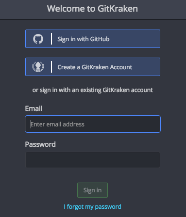
</div>

After singing up, we can see the welcome screen:

<div align="center">
	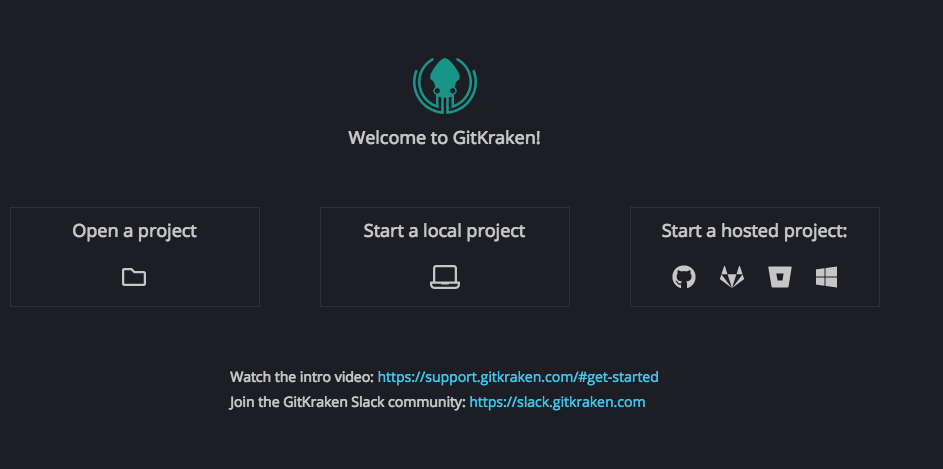
</div>

* From the left option (*Open a project*) we can connect to a remote repository (from GitHub or Bitbucket, for instance), and download it.
* From the middle option (*Start a local project*) we can start a new, local project and create files on it. Then, we will be able to commit and upload the changes to a remote repository.
* From the right option (*Start a hosted project*) we can create a remote repository in one of the allowed platforms (GitHub, Bitbucket and some other), so that it connects to this repository and downloads it as well.

Let's assume that we have already created a remote repository, so we choose first option (*Open a project*). Then, we must choose the git platform to connect with. In our case, we choose GitHub, so we must click on the corresponding button.

<div align="center">
	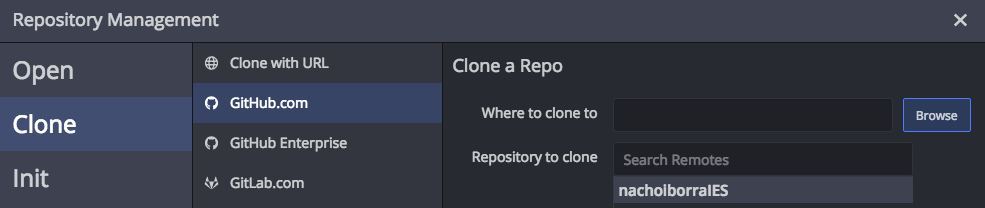
</div>

We must choose the repository to clone, and the folder where we want to download the project, in the right panel. Then, we can click on the *Clone the repo!* button in the bottom right corner.

<div align="center">
	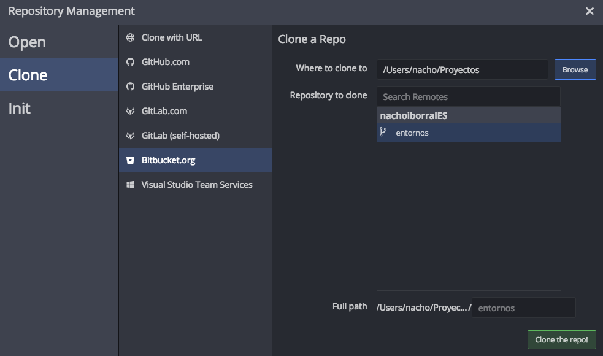
</div>

Once our repo is cloned, we can explore it from the *Open a project* option, or by clicking on the folder icon in the upper left corner of GitKraken window.

<div align="center">
	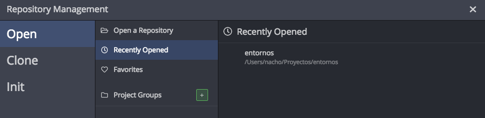
</div>

After choosing the project folder (or the project itself if we have opened it recently), we can see its contents:

<div align="center">
	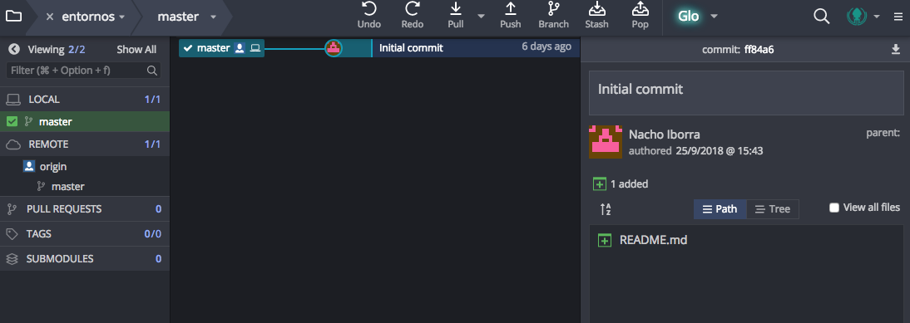
</div>

In the right panel we can see the project contents (files and folders). We can see them as paths or as a tree, by clicking on the corresponding buttons of this right part. In the middle panel we have the history of operations over the repository (commits and so on.). Finally, in the left panel we have a list of available branches.

#### 1.1. Committing new changes

If we add new content to the project (or edit/remove existing content), then all the changes will be shown in the right panel automatically. For instance, if we add a new source file, we can see it this way:

<div align="center">
	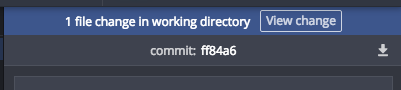
</div>

Then, we need to click on the *View Changes* button to see the file(s) that have changed. We can stage them individually (i.e. mark them to be committed in next commit operation), or stage all of them at once by clicking on the *Stage all changes* button.

<div align="center">
	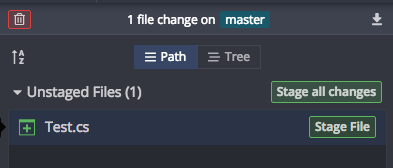
</div>

Next step consists in committing the changes. We must add a commit comment (explaining what's new in this commit) and then click on *Commit changes* at the bottom.

<div align="center">
	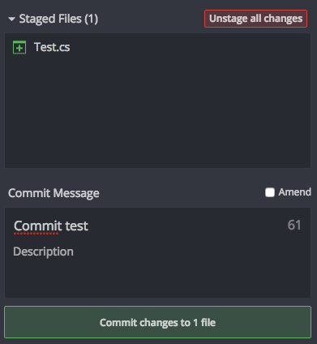
</div>

Finally, we need to push the changes to the remote repository. To do this, we go to the middle panel, choose the commit that we want to push and then click on the *Push* button in the upper toolbar.

<div align="center">
	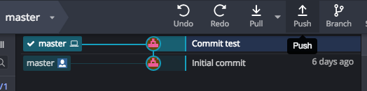
</div>

#### 1.2. Pulling new contents from the server

If we are working in a team, or if we just want to update the changes to another computer, we may need to pull the contents from the repository. For instance, if someone has uploaded new files to the repository (or changed existing files), we can click on the *Pull* button from the upper toolbar. Then, we can choose the corresponding commit in the list (middle panel) and then view all the affected files in the right panel.

<div align="center">
	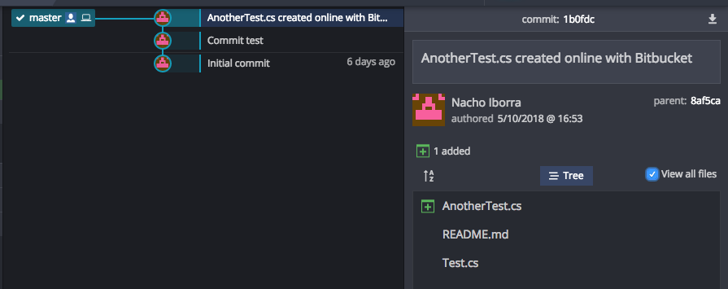
</div>

#### 1.3. Alternatives to GitKraken

There are some other Git tools that we can use instead of GitKraken to deal with GitHub or BitBucket repositories with a graphical environment. Here you can see some of them:

* [SourceTree](https://www.sourcetreeapp.com/)
* [GitHub Desktop](https://desktop.github.com/)

These tools are available for Windows and MacOSX, but we can't use them under Linux systems. That's why we have talked about GitKraken instead.

> **Exercise 1**:
> 
> Create a public repository called **CppPrograms** in your GitHub account. Clone it into a local folder using GitKraken. Then, copy the following program in a source file called *hello.cpp* inside that folder.

```Cpp
#include <iostream>

using namespace std;

int main()
{
    cout << "Hello world";
    return 0;
}
```

> Once you have finished copying the file, follow these steps:
> 
> - Commit and push the changes to the remote repository.
> - Make some changes to previous source file. For instance, change the text that is being printed in the ```cout``` line. Then, make a second *commit* and its corresponding *push* to update the changes.
> - Optionally, you can share your project with a classmate, and ask him/her to update some of the files. Then, update these files in your local repository through a *pull* operation.

### 2. Using Git in Visual Studio Code

Most of current IDEs lets us use Git internally, so we can perform the main Git operations (commit, push, pull and so on) from the IDE itself. Let's see how it works with Visual Studio Code.

First of all, we must clone our remote repository. We open the command palette (`Control+Shift+P`, or `Cmd+Shift+P` in Mac systems) and we type "clone". Then we will see the `git clone` command, we select it and then we will be asked to enter the remote URL of the repository. We must paste there the URL of our remote GitHub or BitBucket repository (we can see it by clicking on the *Clone* button).

<div align="center">
	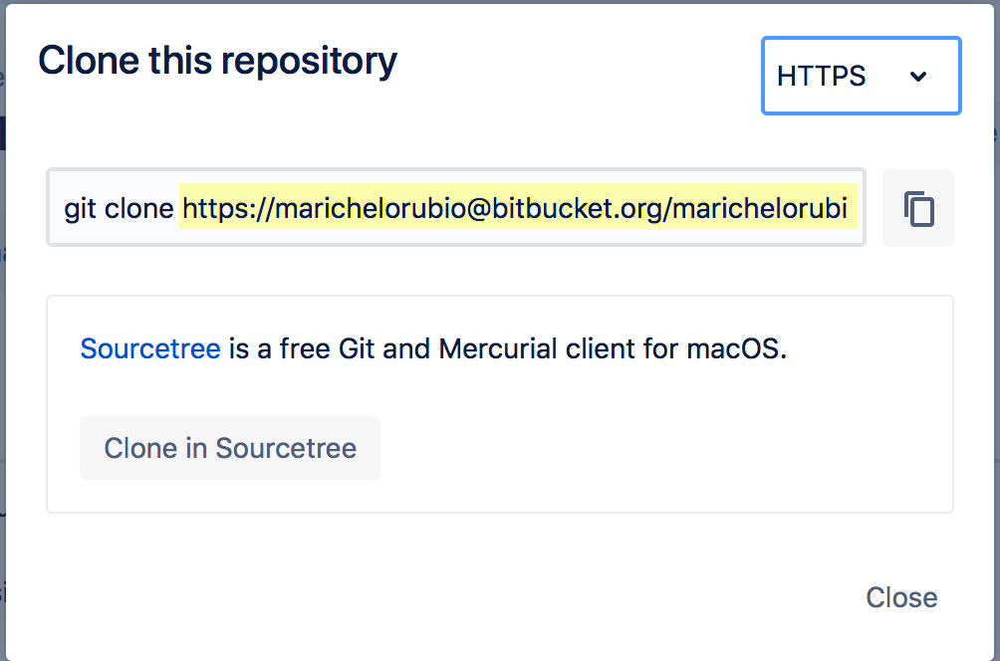
</div>

> **NOTE**: if `git clone` command is not recognized by VS Code, then you have not installed Git in your system properly (see previous sections of this course).

Then, we will see the repository files under Visual Studio Code, and if we make any change to any file, it will be automatically marked with an 'M' next to the file name. This means that the file has been modified from the last version uploaded to the repository. Then we can stage the file by clicking on the *Source Control* icon (see next image). This way, we can see the changes made and the Git options.

<div align="center">
	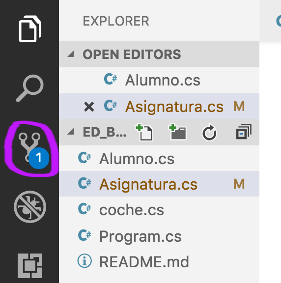
</div>

Regarding the options, we have *stage* (+), undo changes, *commit* (&#10003;) and more general options in the upper menu.

<div align="center">
	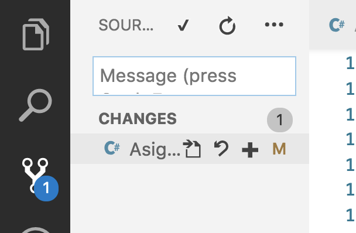
</div>

If we want to push or pull the changes to/from the repository, we must click in the *more options* button (`...`) in the upper left toolbar, and choose the appropriate option.

<div align="center">
	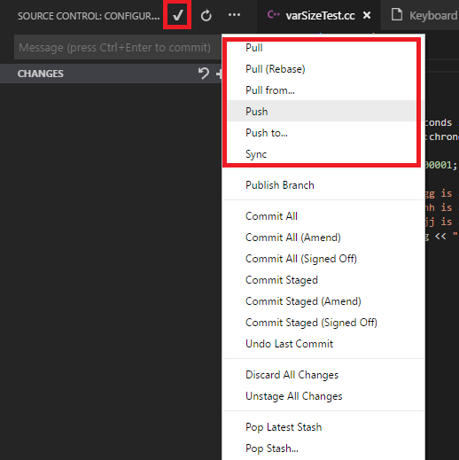
</div>

> **Exercise 2:**
>
> Create a new public repository called **CppProgramsVSCode** in your GitHub account, and then clone it from VS Code. Then, repeat the steps made in Exercise 1 inside this new repository.

### 3. Using Git in IntelliJ

The integration of *IntelliJ* with Git repositories is really easy:

* If we want to **clone or download a remote repository** with an existing IntelliJ project to start working on it, we just go to *VCS > Get from Version Control* menu. Then, we can login in our GitHub account through the *GitHub* option on the left, and choose among our available repositories.

* If we want to **create a new, remote repository**, we must create the *IntelliJ* project first, and then choose *VCS > Share project on GitHub*. Then, we will be asked to choose the project name (and whether it's private or public) and the file(s) to be uploaded at the initial commit.

* Whenever we want to **commit** new changes, we choose *Git > Commit...* menu, and then choose which changes we want to commit, and the comment associated to this commit.

* If we want to **push** a commit, or **pull** the changes from the remote repository, we can find these options inside *Git* menu.

> **Exercise 3:**
>
> Create a new local Java project called **IntelliJGit**, and then share this project in your GitHub account. Then, add a new class called `Test`, and commit and push these changes.

### 4. Using Git in Visual Studio

Visual Studio has an option to deal with Git repositories. First of all, we may need to install GitHub extension for Visual Studio, from *Extensions > Manage extensions* menu:

<div align="center">
    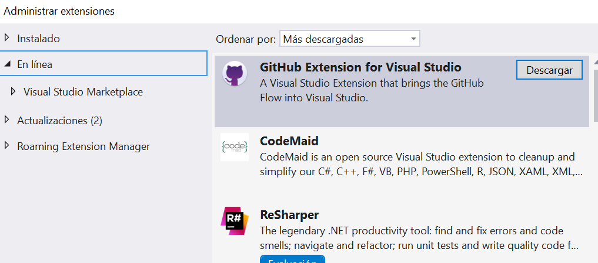
</div>

Then, if we want to communicate with a remote repository, we need to go to *Team > Manage connections* menu. The first time we choose this option, we will need to log in to GitHub to give some permissions to Visual Studio. Then, we can either create a local Git repository, or clone a remote one.

<div align="center">
    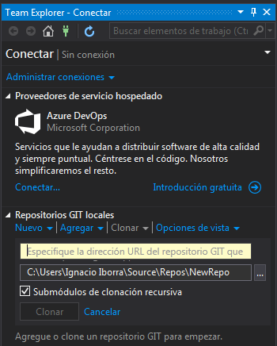
</div>

If we choose the *Clone* option, we need to specify the remote URL to be cloned, and the local folder to download it. Then, we can add project(s) to this repository, and make changes. Every time we want to upload these changes, we need to double-click on the repository:

<div align="center">
    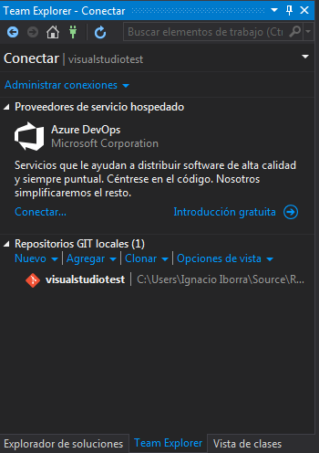
</div>

Then, we can click on the *Changes* option to see all the changes that are pending to be uploaded. We can add a comment for all of them and confirm the commit:

<div align="center">
    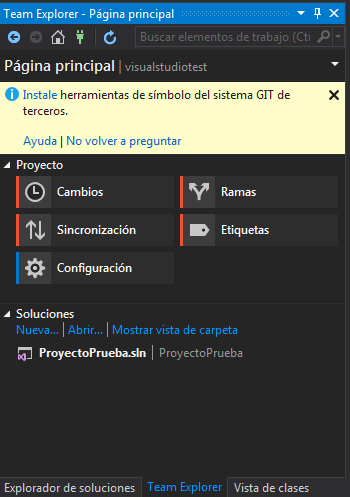
    &nbsp;
    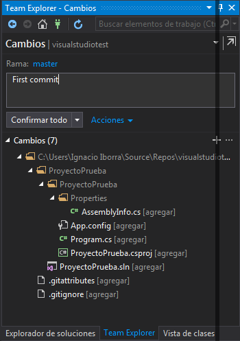
</div>

Finally we need to choose the *Synchronize* option to upload (*push*) the changes to the remote repository. We may be asked to enter our credentials to let us push the contents. 

We can also use this option at the beginning of our session, to download (*pull*) the updated contents from the remote repository, so that we can make our changes and upload them from a previously updated version.

> **Exercise 4:**
>
> Create a new remote repository in your GitHub account called **VisualStudioTest**. Clone it in Visual Studio, add a new project on it and upload the changes from Visual Studio to the remote repository.
