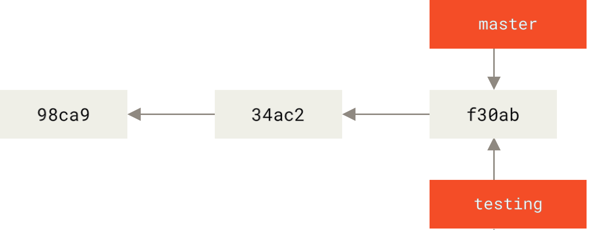
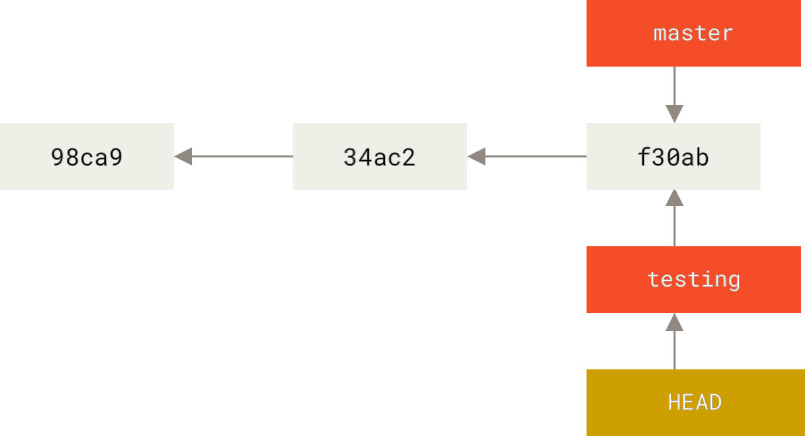
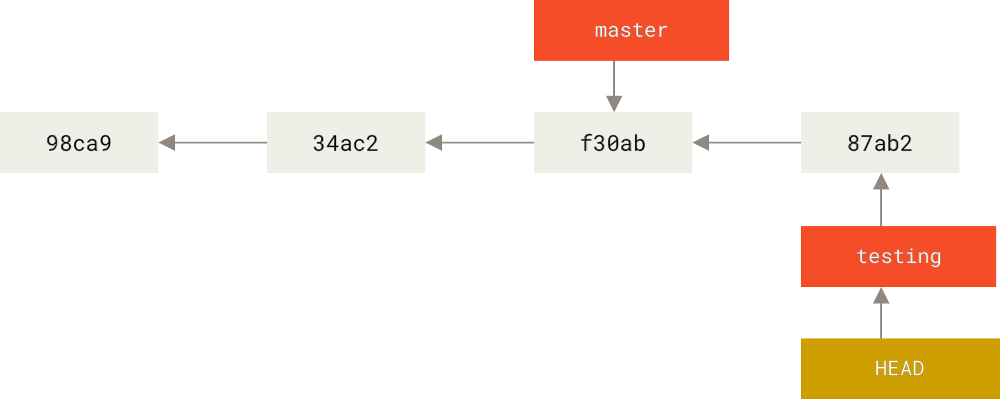
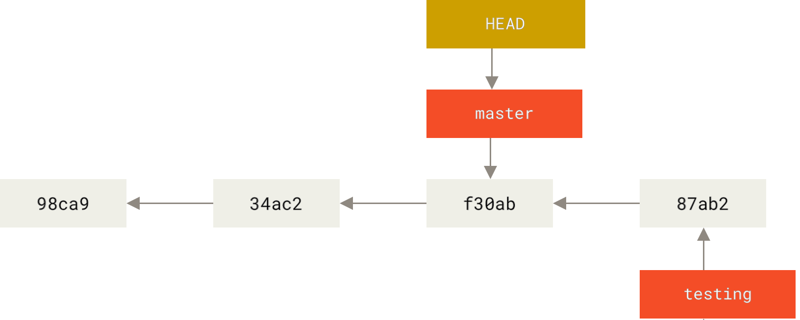
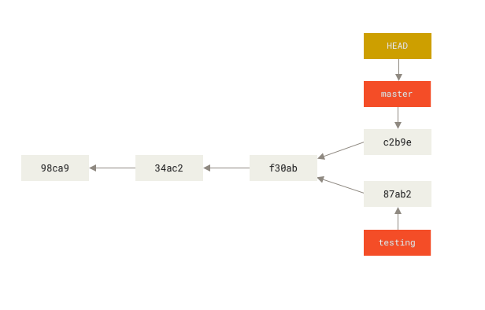

# Version control tools

## Git branching

<div style="text-align: right">
<a target="_blank" href="slides/05c.html"></a>&nbsp;&nbsp;
<a target="_blank" href="05c.pdf"></a>
</div>

VCS systems usually offer some kind of branching support. Branching allows divergent lines of development to be handled in parallel. In this manner, we can keep the main branch in a stable status while we develop new and untested features in a different branch.

Traditionally branching has been expensive operation in other VCSs, but in Git implementation of branches really lightweight, making branching operations almost instantaneous, allowing to switch between branches simple and fast.

This document explains the commands used to create new branches and also the commands used to merge two branches.

### 1. Branches

As we've already seen, every commit made using Git generates a snapshot.

A branch in Git is simply a **lightweight movable pointer to one of these commits**. The default branch name in Git is **master**. As you start making commits, you’re given a master branch that points to the last commit. Every time a new commit is made, the master branch pointer moves forward automatically.

#### 1.1 Creating a branch

The following command creates a new branch called *testing* that points to the same commit you’re currently on. This command does not switch to the new *testing* branch.

```
git branch testing
```

<div align="center">
	
</div>

#### 1.2 Checking the current branch

How does Git know the current work branch? Git uses **HEAD**, a special pointer to the current local branch. The git branch command only created a new branch. Git didn’t switch to the new branch, so we are still on *master*. We can check the current branch using `git log`.

```
git log --oneline --decorate
```

#### 1.3 Switching Branches

To switch to an existing branch, we use the `git checkout` command. Let’s switch to the new *testing* branch:

```
git checkout testing
```

After running the command, the HEAD pointer points to the new *testing* branch.

<div align="center">
	
</div>


Now we are working on the testing branch, if we make a new commit the testing branch and HEAD will point to the new commit. So we **make some changes to the files and commit them**:

```
git commit -a -m "new commit"
```

<div align="center">
	
</div>

Please notice that *testing* branch has moved forward, but the *master* branch
still points to the previous commit. 
Let’s switch back to the master branch:

```
git checkout master
```

The result is that HEAD points again to *master*, and also all the files in our working directory have been reverted to the state they were in before creating the new *testing* branch. **Switching branches changes files in your working directory.**

<div align="center">
	
</div>

We can now **do some changes and commit** again in the master branch. Our Git repository will have two divergent branches.

<div align="center">
	
</div>

We can change between both branches once and again. And develop changes independently. In order to see the divergent branches easily we can use the following command:

```
git log --oneline --decorate --graph --all
```

You'll get something like:

```
* c2b9e (HEAD, master) Make other changes
| * 87ab2 (testing) Make a change
|/
* f30ab Add feature #32 - ability to add new formats to the central interface
* 34ac2 Fix bug #1328 - stack overflow under certain conditions
* 98ca9 Initial commit of my project
```


#### 1.4 Merging branches

Once the development on a specific branch is finished, it is possible to merge the changes into another branch. Following the previous example we might want to merge the *testing* branch into the master *branch*. To do it, we must `checkout` the master branch and then use the `git merge` command.

```
git checkout master
git merge testing
```

If everything goes as expected, Git will create a new commit with the merge result.

**Deleting merged branches**

If the merging did go well, we might want to delete the testing branch because all the changes are also moved to the master branch. To do it we would use the following command:

```
git branch -d testing
```

**Basic Merge Conflicts**

Sometimes conflicts arise when merging branches, if the same file part was modified on both branches you might see something like:

```
$ git merge testing
Auto-merging index.html
CONFLICT (content): Merge conflict in index.html
Automatic merge failed; fix conflicts and then commit the result.
```

In this case Git was not able to merge the branches automatically, and requires user intervention to solve the conflict. In order to know which are the conflicted files you can run `git status`. You'll see something like this:

```
$ git status
On branch master
You have unmerged paths.
(fix conflicts and run "git commit")
Unmerged paths:
(use "git add <file>..." to mark resolution)
both modified: index.html
no changes added to commit (use "git add" and/or "git commit -a")
```

Anything that has merge conflicts and hasn’t been resolved is listed as unmerged. Git adds standard
conflict-resolution markers to the files that have conflicts, so you can open them manually and
resolve those conflicts. Your file contains a section that looks something like this:

```
<<<<<<< HEAD:index.html
<div id="footer">contact : email.support@github.com</div>
=======
<div id="footer">
please contact us at support@github.com
</div>
>>>>>>> testing:index.html
```

This means the version in HEAD (your master branch, because that was what you had checked out
when you ran your merge command) is the top part of that block (everything above the `=======`),
while the version in your *testing* branch looks like everything in the bottom part. In order to resolve the conflict, you have to either choose one side or the other or merge the contents yourself. For instance, you might resolve this conflict by replacing the entire block with this:

```
<div id="footer">
please contact us at email.support@github.com
</div>
```

This resolution has a little of each section, and the `<<<<<<<`, `=======`, and `>>>>>>>` lines have been
completely removed. After you’ve resolved each of these sections in each conflicted file, **run git add on each file to mark it as resolved**. Staging the file marks it as resolved in Git.

> **Exercise 1:**
> Create a local Git repository. Commit a small web page. Create a branch called `hotfix` to apply some changes, make some commits on the new branch. Finally, merge the branch into the master branch.
>
> Test what happens when you modify the same part of the same file in different branches when trying to merge those branches together. Try to solve the conflict.
> 