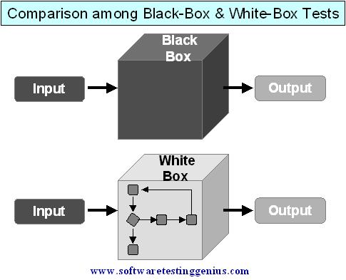
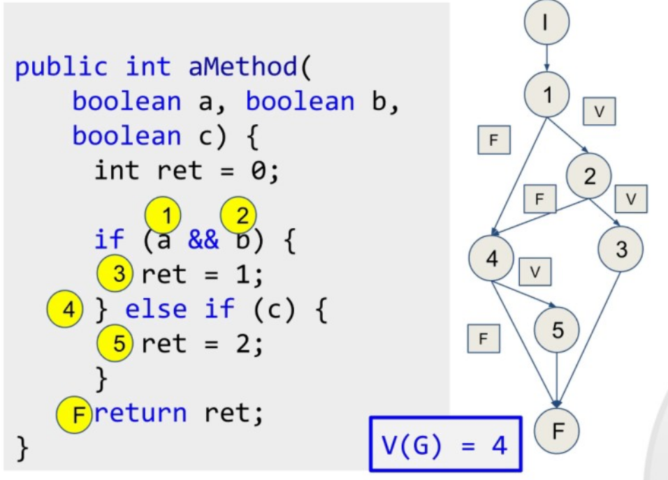

# Software testing

## Unit test design

<div style="text-align: right">
<a target="_blank" href="slides/06b.html"></a>&nbsp;&nbsp;
<a target="_blank" href="06b.pdf"></a>
</div>

Unit tests are an essential part of software testing, in which we must check if every unit of our application (class or set of functions) works as expected. In order to check this, we need to plan a strategy to define the set ot test cases as complete as possible.

There are three approaches to design these unit test cases:

* **Structural** approach or **white box**, in which we focus on the inner working of the units that we are testing.
* **Functional** approach or **black box**, in which we focus on the interface of the units that we are testing, this is, their inputs and outputs, but not in their inner behavior.
* **Random** approach, which consists in using statistical models to generate the possible input for the program. This way, we generate the test cases.

<div align="center">
    
</div>

### 1. White box tests

White box tests focus on the inner working of a program. This is the first tests that we must apply to a system, so that we can find basic shortcomings that are not related with user interface.

There are several types of white box tests, as we are going to see right now. We can apply one or many of the following approaches in order to complete these type of tests.

#### 1.1. Basic path tests

This method was focused on determining the complexity of a piece of code, so that we use this complexity to establish how many execution paths can be achieved.

It relies on a principle that sets that every procedural design can be represented as a flow graph. The **cyclomatic complexity** of this graph determines the number of independent paths. Each one of these paths corresponds to a new set of sentences or a new condition. Let's have a look a this short piece of code and the possible paths that can be run with it:

<div align="center">
    
</div>

If we want to properly test this piece of code, we need to test the following paths:

* 1,2,3,F
* 1,4,5,F
* 1,2,4,5,F
* 1,2,4,F

Which correspond to the following tests:

* a=true, b=true, c=true
* a=false, b=*,c=true
* a=true, b=false, c=true
* a=true, b=false, c=false

So we should define 4 test cases, each one corresponding to an item of previous list, with the appropriate values for the input params *a*, *b* and *c*.

 **Exercise 1:**
> 
> Design the white box test set for the following piece of code, using the *Basic path test* approach explained above. Determine the corresponding paths to be tested, and the test cases to test each path.

```java
if (num1 > 10)
{
    if (num2 > 10)
        System.out.println("Both are greater");
    else
        System.out.println("First is greater");
} else {
    if (num2 > 10)
        System.out.println("Second is greater");
    else
        System.out.println("None is greater");
}
```

#### 1.2. Condition tests

This method is similar to the previous one: it evaluates every possible path of the code, but it only focuses on the conditions of the code. Let's have a look at this example:

```java
public boolean isLeapYear(int year)
{
    boolean result = false;
    if(year % 4 == 0)
    {
        result = true;

        if(year % 100 == 0)
        {
            result = false;

            if(year % 400 == 0)
            {
                result=true;
            }
        }
    }
    return result;
}
```

Conditions:

* `if(year % 4 == 0)` : **C1**
* `if(year % 100 == 0)`: **C2**
* `if(year % 400 == 0)`: **C3**

From this set of conditions, we need to build the truth tables to check every possible combination:

|N|C1|C2|C3|Result|
|--|--|--|--|---------|
|1|true|true|true|true|
|2|true|true|false|false|
|3|true|false|true|true|
|4|true|false|false|true|
|5|false|true|true|false|
|6|false|true|false|false|
|7|false|false|true|false|
|8|false|false|false|false|

As we can see, cases 3 and 4 lead to the same result regardless of the value of C3. And the same thing happens with cases 5 to 8 (condition C1 determines the final result regardless of the other two conditions). So the tests needed for this function are:

|N|C1|C2|C3|Result|
|--|--|--|--|---------|
|1|true|true|true|true|
|2|true|true|false|false|
|3|true|false|true|true|
|4|false|true|true|false|

Again, we need to design 4 test cases associated to the 4 rows of previous table.

> **Exercise 2:**
> 
> Repeat previous exercise using now the *Condition tests* approach.
 
#### 1.3. Loop tests

This test evaluates the possible paths for loops. For every loop with n iterations, we must check if:

* The loop is never iterated
* The loop is iterated only once
* The loop is iterated twice
* The loop is iterated m times, being m < n
* The loop performs n and n-1 iterations.

If we have any nested loop, we must start exploring the inner loops and then go to the outer ones.

For instance, let's have a look at the following code that checks if a given number (previously entered by the user) is primer or not:

```java
boolean result = true;
if (number == 0 || number == 1)
    result = false;
int i = 2;
while (i <= number / 2 && result)
{
    if (number % i == 0)
        result = false;
    else
        i++;
}
```

The loop is expected to run up to *N = number / 2 - 1* times as much. From the *loop test* approach, we must design test cases in which:

* Loop is never iterated. For instance, if *number* is 2, it is automatically prime, no iteration is performed
   * We could also test the case of 0 and 1, that are covered with the first *if* clause
* Loop is iterated once. This can be achieved with *number = 3*
* Loop is iterated twice. For instance, with *number = 9*
* Loop is iterated *m* times < *N*. For instance, for *number = 25* the loop is iterated 4 times.
* Loop is iterated *N* times and/or *N-1* times. In order to reach *N* times, we just need a primer number, such as 23. In order to iterate *N-1* times, we need a non-prime number that is not found out until the last iteration. In this case, we could use *number = 4*, although it's a quite simple test case.

So we could build this table for the test cases:

|ID|Name|Data|Expected result|Actual result|
|---|---|---|---|---|
|U0|BasicCases|1|false||
|U1|NoIterations|2|true||
|U2|OneIteration|3|true||
|U3|TwoIterations|9|false||
|U4|MIterations|25|false||
|U5|N-1Iterations|4|false||
|U6|NIterations|23|true||

> **Exercise 3:**
> 
> The following piece of code checks if a number has its digits in ascending order:

```java
boolean result = true;
while (number >= 10 && result)
{
    int lastDigit = number % 10;
    number /= 10;
    int newLastDigit = number % 10;
    if (lastDigit < newLastDigit)
        result = false;
}
```

> You are asked to design a test case table for every possible loop iteration, according to previous example.

### 2. Black box tests

These tests focus on the input and output of the application or module to be tested, and we don't need to pay attention to the inner code of this module. There are also some different techniques that we can apply to these tests. 

#### 2.1. Equivalent partition

It consists in dividing the possible inputs of the application in groups called *equivalence classes*. Some input values will be valid inputs and some other will be not valid, so we must design test cases to check both valid and invalid equivalence classes.

For instance, if we have a method to determine the total amount of a sale, given the concept (string starting with letter), product amount (integer other than 0) and product price (double greater or equal than zero), the possible equivalence classes are:

|Input condition|Valid class|Invalid class|
|--|--|--|
|Concept not empty starting with letter|string=letter+*| empty string OR string starting with number OR string starting with special character|
|Amount integer other than 0|amount other than 0|amount 0 OR not integer
|Price double greater or equal than 0|price>=0|price<0 OR not numeric|

Once we define the equivalence classes, we can design the test cases:

|ID|Name|Preconditions|Steps|Data|Expected result|Actual result|
|----|------|--------------|-----|----|------------------|--------------|
|U1|Valid|*SalesList* object exists|Enter valid classes for concept, amount and price|concept="screw", amount=2,price=2|0, a new element is added||
|U2|NotValidConcept1|*SalesList* object exists|Enter empty string as concept|concept="", amount=2, price=2|-1, no element added||
|U3|NotValidConcept2|*SalesList* object exists|Enter string starting with number|concept="2screw", cantidad=2, precio=2 |-1, no element added||
|U4|NotValidConcept3|*SalesList* object exists|Enter string starting with special char|concept="@screw", amount=2, price=2|-1, no element added||
|U5|ValidAmount|*SalesList* object exists|Enter negative amount|concept="screw", amount=-2, price=2|0, a new element is added||
|U6|NotValidAmount|*SalesList* object exists|Enter amount of 0|concept="screw", amount=0, price=2|-1, no element added||
|...

> **Exercise 4:**
> 
> You have been asked to implement the tests for a class called *SalesList*, whose attribute is a `HashMap<String,Double>`. The string is the product description, and the number is the total amount of sales over this product. The class has the following methods:
> 
> * `addSale(String concept, int amount, double price)`: it adds a new element to the *HashMap* with the specified concept as product description. The incomes will be calculated by multiplying the amount and the price. It will return 0 if everything is OK, and -1 if there is any error. We will not be able to add sales with amount = 0 or price < 0, but we can add sales with negative amounts (but not negative prices).
> * `getTotal()`: it will return the total sum of the incomes of the HashMap.
> * `getAverage()` : it will return the income average.
> 
> Design the possible test cases for every method of the class. Regarding `addSale` method, you just have to complete the table shown in previous example. For `getTotal` and `getAverage` methods, you just need to set the preconditions to get the desired result, since they have no parameters.

#### 2.2. Analysis of limit values

In order to design the test cases, we take into account input and ouput conditions:

* If the input condition is a range, we must design test cases for the limits of this range.
* If the input condition is a finite and consecutive set of values, we must define the test cases for the minimum and maximum value, along with the *minimum + 1* and *maximum - 1* values.
* We must apply these same rules for the output conditions.

For instance, let's suppose that we are testing a function that checks the average of a list of marks that must contain between 3 and 9 marks. In this case, we should define these test cases to check the **input values**:

- Lists of 2, 3 and 4 marks
   - Regarding the case of 2 marks, it should produce an error
- Lists of 8, 9 and 10 marks
   - Again, regarding the case of 10 marks, it should also produce an error

Regarding the **output values**, the average must be between 0 and 10, so we should also define cases for:

- Final averages of -1, 0 and 1
- Final averages of 9, 10 and 11

Depending on the internal code of the function to be tested, sometimes some of these cases are impossible to reach. For instance, if we make sure that marks are all values between 0 and 10, we will never get an average < 0 or > 10.

A possible test case table for this example could be this one:

|ID|Name|Data|Expected result|Actual result|
|---|---|---|---|---|
|TC1|2Marks|[2, 6]|Error||
|TC2|3Marks|[4, 5, 6]|5||
|TC3|4Marks|[7, 7, 9, 9]|8||
|TC4|8Marks|[1, 2, 3, 4, 6, 7, 8, 9]|5||
|TC5|9Marks|[2, 3, 4, 5, 6, 7, 8, 9, 10]|6||
|TC6|10Marks|[1, 2, 3, 4, 5, 6, 7, 8, 9, 10]|Error||
|TC7|Average-1|[-2, -1, -1]|Error||
|TC8|Average0|[0, 0, 0]|0||
|TC9|Average1|[0, 1, 2]|1||
|TC10|Average9|[8, 9, 10]|9||
|TC11|Average10|[10, 10, 10, 10]|10||
|TC12|Average11|[10, 11, 12]|Error||

> **Exercise 5:**
> 
> Let's test a function that gets as input the day of a month (integer between 1 and 31) and a month number (integer between 1 and 12) and returns how many days are left in this month (an integer between 1 and 30, depending on the month). 

```java
int getDaysLeft(int dayOfMonth, int monthNumber) { ... }
```

> Think of the possible test cases to cover all the limit values.