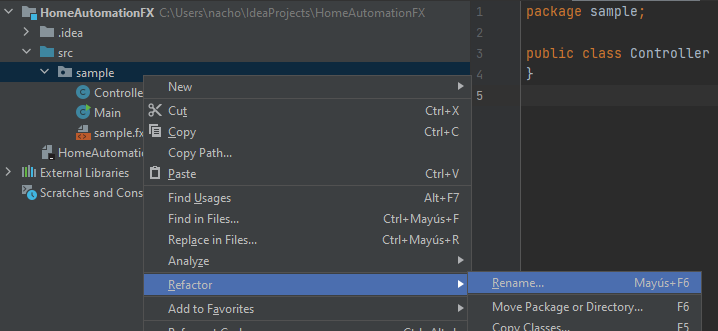
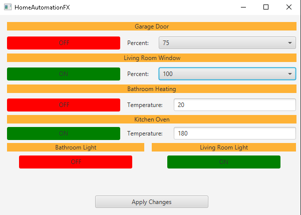

# Block 3 - Exercise for Unit 3

In this exercise, we are going to implement a JavaFX application based on a simplified version of the *HomeAutomation* project implemented in a previous exercise. This time, you are going to create a new JavaFX project called **HomeAutomationFX**. Let's have a look at the packages and classes that it must have.

## 1. Project packages and classes

The project is going to have two different packages:

* The default `sample` package must be renamed to `automation.fx`. In order to rename an existing package, just right click on it, go to *Refactor* > *Rename* option and choose the new name for the package:

<div align="center">
    
</div>

* The second package is going to be called `automation.data`, just like the one created in previous project. Inside this package, you must copy and paste all the classes of the same package in previous project (*HomeAutomation*, *Blind*, and so on). The only class that we are not going to need now is `Awning` class. You can remove it from this new package.

> **IMPORTANT NOTE**: you MUST use the classes from the solution provided by us, instead of your own classes, just in case there are important differences between them.

### 1.1. What's new in *automation.data*?

Apart from removing `Awning` class, we just need to rewrite `toString` methods in every class from `automation.data` package, so that information is going to be shown separated by semicolons. For instance, for a *GarageDoor* object, we can show its name, its status (locked/unlocked) and its percent value:

```
Garage Door;locked;50
```

## 2. Application layout

The appearance of our main application (in `sample.fxml` file) must be more or less like this:

<div align="center">
    
</div>

The window has a total width of 600 pixels, and a total height of 400 pixels. Inside the window, you can use an *AnchorPane* as main container, and place some labels, buttons, combo boxes and text fields on it.

* The orange elements are labels, whose text is centered (*Alignment* property), with a background color of *#feb236*, as you can see in this snapshot:

<div align="center">
    
</div>

* Red/Green elements are buttons, whose background color is dynamically changed, according to the current status of each element. You must define an action event over each button to change this property, using a code similar to this one (replace *yourButtonName* variable name with your own button variable name):

```java
yourButtonName.setText("ON");
yourButtonName.setStyle("-fx-background-color: green");
```

* The rest of elements are either plain labels (*Percent*, *Temperature*) combo boxes (for the garage door and window blind) or text fields (for the temperatures).

## 3. Application behaviour

All the logic of the application is going to be placed in our `Controller` class.

### 3.1. Controller setup

We need to add a private attribute for every FXML control that needs to be accessed (combo boxes, text fields and some labels). Also, we need to implement `Initializable` interface and override `initialize` method. Inside this method, we are going to populate both combo boxes with values 0, 25, 50, 75 and 100.

Besides, we are going to manage an array of 6 `AutomationElement` objects (this array must be a private attribute of `Controller` class as well). Inside `initialize` method we are going to initialize this array with some default values:

* Position 0 is going to store a `GarageDoor` object with name "Garage Door"
* Position 1 is going to store a `Window` object with name "Living Room Window"
* Position 2 is going to store a `Heating` object with name "Bathroom Heating"
* Position 3 is going to store an `Oven` object with name "Kitchen Oven"
* Positions 4 and 5 are going to store two `Light` objects, with names "Bathroom Light" and "Living Room Light", respectively

The rest of attributes of each object can have an initial value of your choice.

### 3.2. Application startup

At the beginning (in the `initialize` method, after defining the combos and the `AutomationElement` array), we are going to read a text file called **status.dat**, located at the project's root folder, with the information of every automation element (in the same order that we have created them in the array). This is an example of what this file could contain:

```
Garage Door;unlocked;75
Living Room Window;locked;100
Bathroom Heating;off;20
Kitchen Oven;on;180
Bathroom Light;off
Living Room Light;on
```

If file is not found, then the array will remain initialized with its default values. Once the file is read, the `AutomationElement` array must be updated with the corresponding values, and the graphical elements (buttons, combo boxes and text fields) must be also updated with these values.

### 3.3. User interaction

Every time user presses a red/green button, the status of this button must be switched (ON - green color / OFF - red color). Besides, user can select any blind level from the garage door or window blind, and set any temperature for the heating and oven (we assume that user is going to introduce valid temperatures).

No change will take effect in the `AutomationElement` array until user presses **Apply Changes** button. When this button is pressed, then every change reflected in the application window must be translated to the array. For instance, if "Bathroom Light" button is red, then the element at position 4 of the array ("Bathroom light") must be switched off. Besides, after updating every element, we are going to save the changes in **status.dat** text file, so that, if we restart the application, the changes will be preserved. 

> **IMPORTANT NOTE**: changes in **status.dat** file will only take place when we press *Apply Changes* button. Every partial change when interacting with other buttons, combos or text fields will not be reflected until we press the button.

## 4. What to deliver?

A ZIP/RAR file containing the whole IntelliJ project (including *status.dat* text file, if it has been created).

## 5. Evaluation criteria

This exercise will be evaluated as follows:

* `automation.data` changes (regarding `toString` methods): 1 point
* JavaFX application design: 1,5 points
* Controller setup (private FXML attributes, *initialize* method and array definition): 1,5 points
* **status.dat** file management (loading data at the beginning and saving data through *Apply Changes* button): 2 points
* User interaction (label colors and texts update): 1 point
* Synchronization between `AutomationData` array and graphical controls: 2 points
* Code cleanliness and reusability: 1 point

> **VERY IMPORTANT**: every exercise that does not compile will be automatically evaluated to 0.